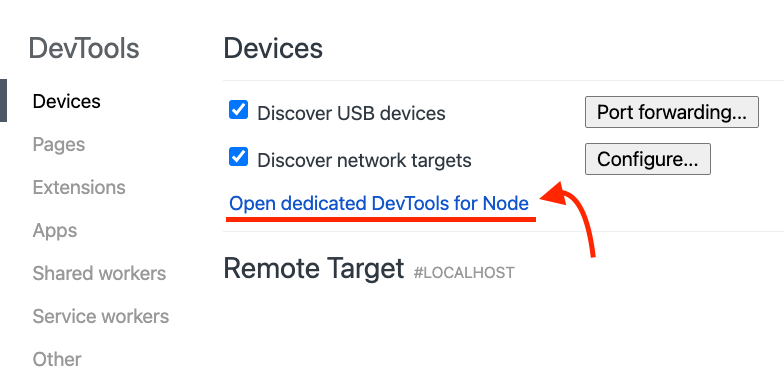

Welcome, you probably searched how to debug your test with Jest. I am glad you
found this blog post because you are about to learn 7 ways to debug Jest tests
inside your terminal. Everybody knows that you can do it easily with an IDE
like VSCode or WebStorm, but what if you are not using them? How do you go about
debugging them? Spoiler alert - it is not with `console.log()`.


<div class='photo-caption'>
Photo by <a href="https://unsplash.com/@nikolalsvk?utm_source=unsplash&utm_medium=referral&utm_content=creditCopyText">Nikola Đuza</a> on <a href="/s/photos/bugs?utm_source=unsplash&utm_medium=referral&utm_content=creditCopyText">Unsplash</a>
</div>

## 1. The Standard Way

If you search Jest docs for a way to do it, it will tell you the following:

1. Go to a Chromium-based browser and open `chrome://inspect`.
2. Click "Open dedicated DevTools for Node" like in the screenshot below:
   
3. Put a `debugger` statement somewhere in your code (testing or production one).
4. Run `node --inspect-brk node_modules/.bin/jest --runInBand [any other arguments here]`.

And voilà, your tests should run and stop at the debugger in the DevTools you
opened in step 2. Actually, the process will be stopped as soon as you run it
because of the `--inspect-brk`, but we will get to that later.

Often in projects, you are not using the raw Jest command. Sometimes it is
wrapped in some other library, or uses some extra configuration to get it
started. If that is the case with you, let's dive in and find out different
ways to debug and inspect our tests.

> 💡 Leave the dedicated DevTools for Node window open as we follow through other ways of debugging

## 2. Without an Initial Break

If you take a look, most of the magic here is done by the Node Inspector.
What is cool about the Node Inspector is that when you do `node --inspect`, a
Node.js process listens for a debugging client on `127.0.0.1:9229`. This change
got [introduced in 2016.](https://github.com/nodejs/node/pull/6792) and allowed
everyone to inspect their processes easily.

In our example in the previous section, we used `node --inspect-brk ...`. Using
the `--inspect-brk` flag will break before the user code starts. In my case, I
didn't care about my tests stopping as soon as they start and just resorted to
the plain `node --inspect`. `node --inspect` will break in the place where you
put your `debugger` instead of doing it immediately on launch. Let's move with
that from now on. Our debugging command will be:

```bash
$ node --inspect node_modules/.bin/jest --runInBand
```

Since the `node_modules` location can depend on the operating system, we can
make it agnostic and use `yarn bin` or `npm bin`. In my case, I will use `npm bin` like so:

```bash
$ node --inspect $(npm bin)/jest --runInBand
```

## 3. Debugging TypeScript Tests

If you are using TypeScript these days, if you try to run:

```bash
$ node --inspect $(npm bin)/jest --runInBand
```

You might get an error because TypeScript tests are not transpiled to
JavaScript. Make sure you configured Jest in `jest.config.js` similar to the following configuration:

```js
module.exports = {
  roots: ["<rootDir>/src"],
  testMatch: [
    "**/__tests__/**/*.+(ts|tsx|js)",
    "**/?(*.)+(spec|test).+(ts|tsx|js)",
  ],
  transform: {
    "^.+\\.(ts|tsx)$": "ts-jest", // The important part right here
  },
}
```

We tell Jest to transform `.ts` and `.tsx` files using `ts-jest`. If you don't
have `ts-jest`, you can install it with `npm install -D ts-jest`, and you should
be good to go. I made a sample repo where you can try it out [right here](https://github.com/nikolalsvk/abacus).

## 4. Best Way To Debug ™️

OK, so the title of this section promises a lot, and bear with me. If you
didn't hear about Jest watch mode, you are going to love this. Most of the
time I am writing code, I have `jest --watch` running. What is excellent about the
watch mode is that it will watch for any changes you made, and run the
related tests. To debug your tests in watch mode, you can type the following:

```bash
$ node --inspect $(npm bin)/jest --watch --no-cache --runInBand
```

Let's break down the Jest arguments a bit here:

- `--watch` launches the watch mode from Jest, which is pretty cool.
- `--no-cache` will make sure our code is properly reloaded. You can try without it, but the watch mode might not work properly.
- `--runInBand` - OK, this flag has been following us from the start. It is there to make sure all tests run serially in one process instead of creating child processes. Having one process makes it possible for `node --inspect` to "inspect" tests properly.

You can also combine other Jest commands like running a single test:

```bash
$ node --inspect $(npm bin)/jest --runTestsByPath src/index.test.ts --runInBand
```

But do not forget to attach the `--runInBand` or just `-i` to make sure the
Node.js inspector works its magic.

## 5. What About CRA?

If you use create-react-app (CRA) and have your test script use react-scripts
test, debugging will be a bit different for you. A recommended way is to add a
new script to `package.json` like so:

```json
"scripts": {
  ...,
  "test:debug": "react-scripts --inspect test --runInBand --no-cache"
}
```

Now, whenever you run `npm run test:debug`, the Jest will run in watch mode and
stop in the place where you put `debugger`. Of course, you need to have a
dedicated DevTools for Node.js open, as we described in the first section.

## 6. Debugging From the Command-Line

OK, so you got the initial debugger working with Chromium-based browser and
DevTools. But, if you are a command-line aficionado, you probably are thinking
of a way to do it without the DevTools. Good news for you, it can be done.
Luckily, we have `node inspect` to launch a command-line debugger for us. Try
running just the following command:

```bash
$ node inspect $(npm bin)/jest --runInBand
```

I ran this in the example repo I made, and this is what I got:

```bash
$ node inspect $(npm bin)/jest --runInBand
< Debugger listening on ws://127.0.0.1:9229/be2d3410-48ad-46fb-a345-bb37339b5e38
< For help, see: https://nodejs.org/en/docs/inspector
< Debugger attached.
Break on start in node_modules/jest/bin/jest.js:9
  7  */
  8
> 9 const importLocal = require('import-local');
 10
 11 if (!importLocal(__filename)) {
debug>
```

The inspector stopped at the first line inside `node_modules/jest/bin/jest.js:9`. We can go ahead and continue the debugger by typing `cont` or just `c`:

```bash
$ node inspect $(npm bin)/jest --runInBand
< Debugger listening on ws://127.0.0.1:9229/be2d3410-48ad-46fb-a345-bb37339b5e38
< For help, see: https://nodejs.org/en/docs/inspector
< Debugger attached.
Break on start in node_modules/jest/bin/jest.js:9
  7  */
  8
> 9 const importLocal = require('import-local');
 10
 11 if (!importLocal(__filename)) {
debug> cont
break in src/index.test.ts:6
  4 test("add", function () {
  5     var result = index_1.add(1, 2);
> 6     debugger;
  7     expect(result).toEqual(3);
  8 });
debug>
```

Now the inspector stopped at the `debugger` statement in our test code. We
can type `help` and get acquainted with all the commands we can type
there. I won't go over all of them, but I will mention the `repl` command. By
typing the `repl` while inside the debugger, you will enter the
Read-Eval-Print-Loop (REPL) mode, where you can evaluate variables. If I do that
in my example, I will get the following:

```bash
$ node inspect $(npm bin)/jest --runInBand
< Debugger listening on ws://127.0.0.1:9229/be2d3410-48ad-46fb-a345-bb37339b5e38
< For help, see: https://nodejs.org/en/docs/inspector
< Debugger attached.
Break on start in node_modules/jest/bin/jest.js:9
  7  */
  8
> 9 const importLocal = require('import-local');
 10
 11 if (!importLocal(__filename)) {
debug> cont
break in src/index.test.ts:6
  4 test("add", function () {
  5     var result = index_1.add(1, 2);
> 6     debugger;
  7     expect(result).toEqual(3);
  8 });
debug> repl
Press Ctrl + C to leave debug repl
> result
3
>
```

And those are the basis of inspecting your code from the command-line. The
developer experience (DX) might not be as great as the one with DevTools open,
where you can get values of variables by hovering over them, but it's still a
nice alternative.

## 7. All-In-One solution - ndb

ndb is a library for improving the debugging experience for Node.js. You can
install it globally with `npm install -g ndb` or locally with `npm install -D ndb`. I tried it on my [Abacus repo](https://github.com/nikolalsvk/abacus) with
the global command like:

```bash
$ ndb $(npm bin)/jest --watch --no-cache --runInBand
```

And it works great. As soon as you type it, it will open up DevTools for you.
It also performed more quickly than plain `node --inspect`. What is great about ndb is that you can run your scripts for `package.json` easily. I managed to run the following:

```bash
$ ndb npm run test -- --watch --no-cache --runInBand
```

I believe the approach with using ndb will be most appealing to folks that want
to do everything from the command line. It saves you from going to your browser
to open DevTools for Node.js. The ndb does it for you.

## Final Thoughts

That's it for now, folks. Thanks for tuning in, and be sure to subscribe to the
[newsletter](/newsletter) and follow me on [Twitter](https://twitter.com/nikolalsvk) for new blog posts and tips. If you find the post useful, consider sharing it on Twitter with your friend and co-workers:

Until next one, cheers.
