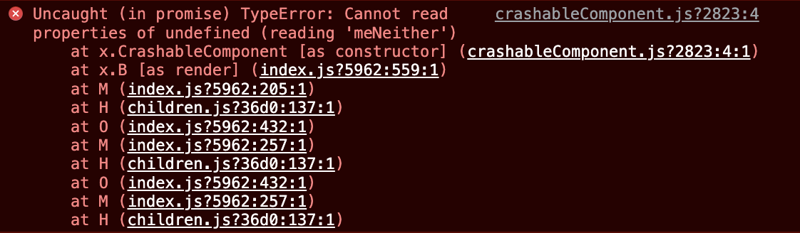
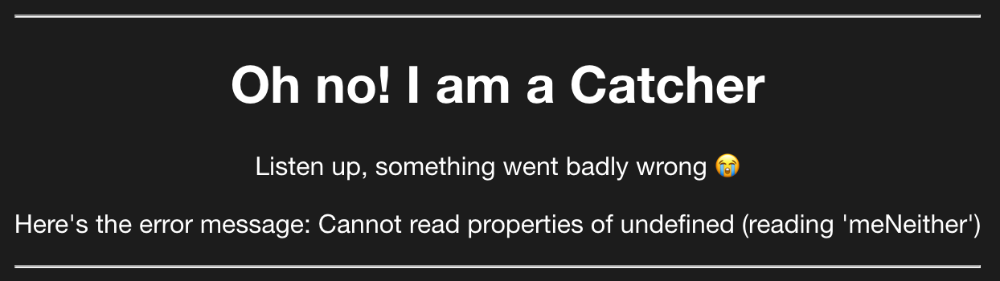
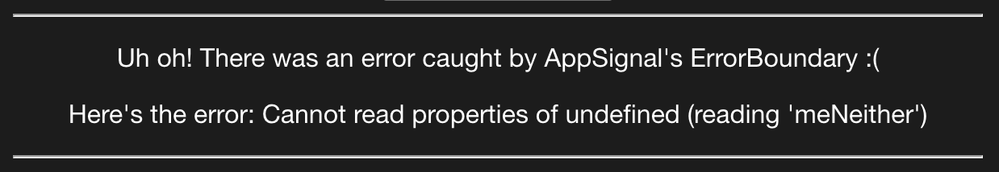

To err is human. It happens all the time. If we don't account for errors on our websites, then our users will get an awful browsing experience. That's why it is better to plan for errors.

In today's post, we'll go through different ways of handling errors in Preact applications.

Let's get going!

## Catching Rendering Errors in Preact

Since Preact is a lightweight React alternative, [similar rules to the React world](/how-to-hande-errors-in-react/) also apply here. You can't use the classic `try...catch` method of resolving errors while rendering because it's meant to handle imperative code.

But what is a typical rendering error, you're probably asking? Imagine a component like this:

```jsx
import { h } from "preact"

const CrashableComponent = (props) => {
  return <>{props.iDontExist.meNeither}</>
}

export default CrashableComponent
```

Trying to render `CrashableComponent` on its own will break the page, leaving the user stranded. We also get an error in the browser console like this one:



So the classic `try...catch` method won't do us any good here. What will do the job and ensure the page is still usable when an error like this happens? To properly handle rendering errors in Preact, you can use these two approaches:

1. `componendDidCatch`
2. `useErrorBoundary` hook

We'll go through both in the following sections.

### 1. Catch Rendering Errors Using `componentDidCatch`

One way to handle errors is to create a class component that implements the `componentDidCatch` lifecycle method. It can look something like this:

```jsx
import { h, Component } from "preact"

class Catcher extends Component {
  constructor() {
    super()
    this.state = { errored: false, error: null }
  }

  componentDidCatch(error) {
    this.setState({ errored: true, error })
  }

  render(props, state) {
    if (state.errored) {
      return (
        <>
          <h1>Oh no! I am a Catcher</h1>
          <p>Listen up, something went badly wrong 😭</p>
          <p>Here's the error message: {state.error.message}</p>
        </>
      )
    }

    return props.children
  }
}

export default Catcher
```

Then, we need to wrap our problematic component (or components) with the `Catcher` component, like so:

```jsx
<Catcher>
  <CrashableComponent />
</Catcher>
```

Now, when we render the page, it will work and show the fallback code we defined in the `Catcher` component:



Error handling using `componentDidCatch` will work for any error in the child components. Some folks use a global error catcher that wraps most of the application as a root or near-root component.

What is great about this approach is that you can write any logic you want in `componentDidCatch`. It's a good idea to push the error to an error-tracking service like AppSignal. Here's an example:

```
componentDidCatch(error) {
  appsignal.sendError(error)
}
```

Now let's see how we can handle rendering errors in Preact with the `useErrorBoundary` hook.

### 2. `useErrorBoundary` Hook to Catch Rendering Errors

Preact exports a hook you can use to catch and easily retry an error. The hook is called `useErrorBoundary`, and can go within a component:

```jsx
const [error, resetError] = useErrorBoundary()
```

To better illustrate this, let's create a functional component in Preact that handles errors for us:

```jsx
import { h } from "preact"
import { useErrorBoundary } from "preact/hooks"

const CatcherWithHook = (props) => {
  const [error, resetError] = useErrorBoundary()

  if (error) {
    return (
      <>
        <h1>Oh no! I am a CatcherWithHook</h1>
        <p>Something went badly wrong and useErrorBoundary was used 😭</p>
        <p>Here's the error message: {error.message}</p>

        <button onClick={resetError}>Try again</button>
      </>
    )
  }

  return props.children
}

export default CatcherWithHook
```

We get the `CatcherWithHook` component, which is leaner than the original `Catcher` with the `componentDidCatch` implementation. Also, using the `useErrorBoundary` is more convenient because it takes care of the `resetError` part for you. With `componentDidCatch`, you have to take care of and reset the state manually.

To make sure errors are caught, we need to wrap the problematic code with the new component we've made:

```jsx
<CatcherWithHook>
  <CrashableComponent />
</CatcherWithHook>
```

Now, when we render the page, it will show a fallback message and a button to retry the rendering, like so:


The same rule applies here — any rendering error in a child component of `CatcherWithHook` will be caught, and a fallback UI will be shown.

An important thing to note is that you can leverage an optional callback for monitoring purposes and pass that as the first argument to `useErrorBoundary`. So if you want to report the error to a service like AppSignal, here's how to do it:

```jsx
const [error] = useErrorBoundary((error) => appsignal.sendError(error))
```

Awesome - we covered all of Preact's features for handling errors! But we have to be aware that `componentDidCatch` and `useErrorBoundary` won't catch all errors. They do not catch errors for:

- Event handlers
- Asynchronous code (e.g., `setTimeout` or `requestAnimationFrame` callbacks)
- Errors that are thrown in the error boundary itself (rather than its children)

You still need to use the `try...catch` statement for these cases. So let's go ahead and show how you can do that.

## Preact Error Catching in Event Handlers

As mentioned before, tools like `componentDidCatch` and `useErrorBoundary` can't help us with errors in event handlers. For those scenarios, we should go back to the old-fashioned `try...catch` block:

```jsx
import { h } from "preact"
import { useState } from "preact/hooks"

const CrashIfClicked = () => {
  const [error, setError] = useState(null)

  if (error) {
    return (
      <>
        <p>An error happened, sorry!</p>
        <button onClick={() => setError(null)}>Try again</button>
      </>
    )
  }

  return (
    <>
      <p>This is a component that will crash the app.</p>

      <button
        onClick={() => {
          try {
            throw new Error("Crash!")
          } catch (e) {
            setError(e)
          }
        }}
      >
        Crash!
      </button>
    </>
  )
}

export default CrashIfClicked
```

If we try to render this crashable button and interact with it, this will happen:


A similar thing happens with errors in `setTimeout` calls.

## Error Catching in setTimeout Calls

Imagine a similar component, but it has a `setTimeout` call in the event handler. Here it is:

```jsx
import { h } from "preact"
import { useState } from "preact/hooks"

const CrashAfterAWhile = () => {
  const [error, setError] = useState(null)

  if (error) {
    return (
      <>
        <p>An error happened, sorry!</p>
        <button onClick={() => setError(null)}>Try again</button>
      </>
    )
  }

  return (
    <>
      <p>
        This is a component that will crash after 1 second within clicking the
        button.
      </p>

      <button
        onClick={() => {
          setTimeout(() => {
            try {
              throw new Error("I crashed after 1 second!")
            } catch (e) {
              setError(e)
            }
          }, 1000)
        }}
      >
        Crash after 1 second!
      </button>
    </>
  )
}

export default CrashAfterAWhile
```

When we interact with the button, it will throw an error after 1000 milliseconds. Then, we will catch the error and show a fallback message. Here's how it looks:


That's nice and dandy! Our app is catching errors and showing messages and retry buttons to our users instead of blank screens.

There's also one other way to handle errors — by using AppSignal's Preact integration.

## Tracking Errors in Preact with AppSignal

AppSignal has a [@appsignal/preact package](https://docs.appsignal.com/front-end/integrations/preact.html) that requires Preact 10.0.0 or higher. You can add it to your project with these commands:

```
yarn add @appsignal/javascript @appsignal/preact
npm install --save @appsignal/javascript @appsignal/preact
```

Then in the code, you can use the `ErrorBoundary` provided by `@appsignal/preact` like so:

```jsx
import { h, Component } from "preact"
import Appsignal from "@appsignal/javascript"

import { ErrorBoundary } from "@appsignal/preact"

export const appsignal = new Appsignal({
  key: "YOUR FRONTEND API KEY",
})

const FallbackComponent = ({ error }) => (
  <>
    <p>Uh oh! There was an error caught by AppSignal's ErrorBoundary :(</p>
    <p>Here's the error: {error.message}</p>
  </>
)

class AppSignalCatcher extends Component {
  render(props) {
    return (
      <ErrorBoundary
        instance={appsignal}
        tags={{ tag: "value" }}
        fallback={(error) => <FallbackComponent error={error} />}
      >
        {props.children}
      </ErrorBoundary>
    )
  }
}

export default AppSignalCatcher
```

To make sure errors are caught, we need to wrap the child components with the new component we've made:

```jsx
<AppSignalCatcher>
  <CrashableComponent />
</AppSignalCatcher>
```

Then we should see the fallback errors message in our app like so:



Here's an example of how this error looks in AppSignal:


Using `ErrorBoundary` provided by AppSignal is great because you can:

- Catch rendering errors
- Show fallback UI for users
- Report any mishaps to AppSignal so they can be tracked

## Wrapping Up

Thanks for reading this blog post about handling errors in Preact.
Thanks for reading this blog post about handling errors in Preact. [Check out this GitHub repo](https://github.com/nikolalsvk/preact-error-handling) for all the code, with examples.

In summary, Preact features like the `componentDidCatch` lifecycle method and `useReactBoundary` hook are great for catching errors in declarative code (e.g., inside their child component tree).

For other cases, you need to use a `try...catch` statement (e.g., async calls like `setTimeout`, event handlers, and errors thrown in the error boundary itself).

That's all, folks. Thanks for reading, and catch you in the next one!
