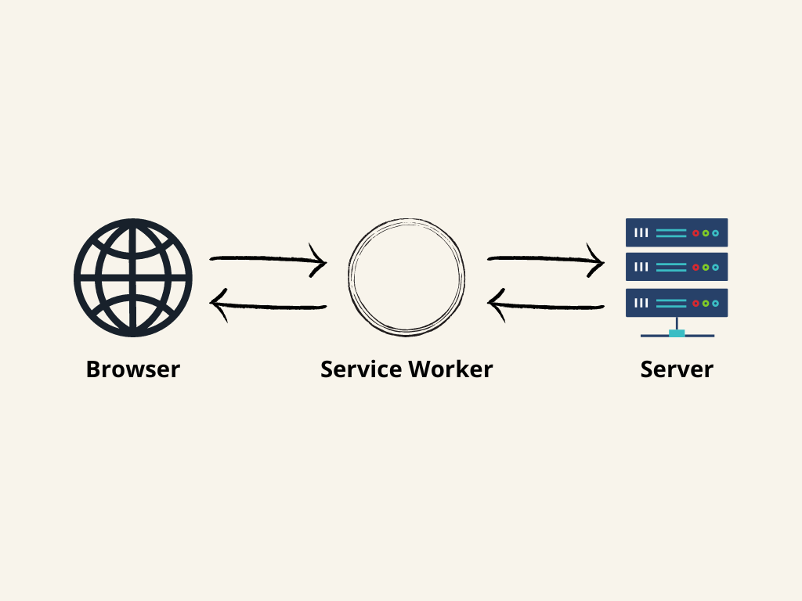
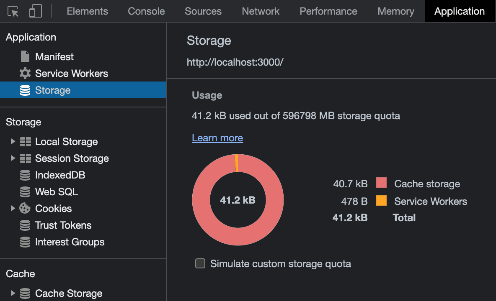
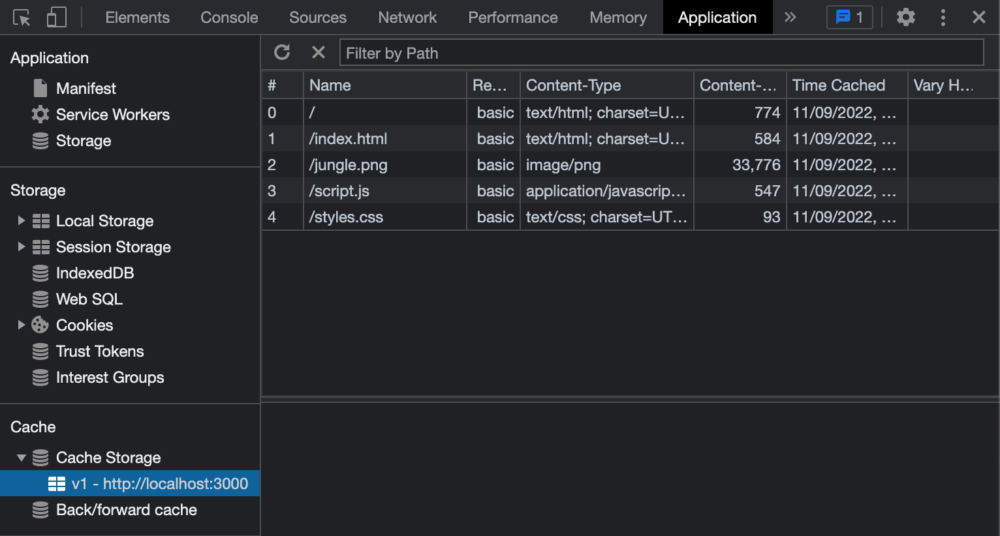
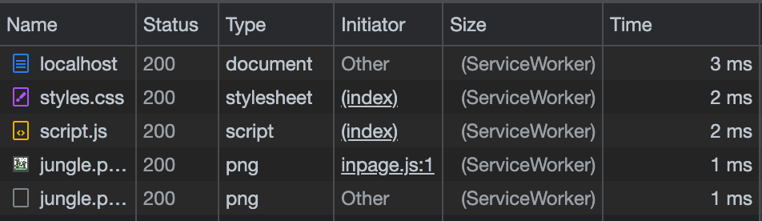

Web developers or anyone involved in web development can tell you they know of “workers” in browsers. However, the problem is that most folks think of either web workers in general, or service workers (or even shared workers) when they say “workers.” These terms can be confusing, especially if you didn’t come across them.

That is why today, we will dive into service workers. We’ll see why you’d want to use service workers, what they are, how they work and explain the difference between service workers and other workers in the browser.

Before we start, let’s dive in and see what the web workers are in general.

## What are web workers?

A [web worker](https://developer.mozilla.org/en-US/docs/Web/API/Worker) is a background task defined via script — a JavaScript file. Web workers can communicate back and forth with their creator. A web worker runs in a separate thread from the main JavaScript thread. To see how they work and get a small introduction to the world of web workers, let us go through a simple example.

You can create a web worker in the application code like so:

```js
const myAwesomeWorker = new Worker("/path/to/worker.js")
```

Then, you can communicate with the worker:

```js
myAwesomeWorker.postMessage("Hi there, love you")
```

Inside the web worker, you can accept the message and respond back to the caller:

```js
// /path/to/worker.js

onmessage = function (e) {
  // do some magic here
  postMessage("I am all done, back to you, main application code.")
}
```

Then, the caller can listen to the messages from the web worker:

```js
myAwesomeWorker.onmessage = function (e) {
  console.log("Message received from myAwesomeWorker")
  console.log(e.data)
}
```

Above is a trivial example of how web workers work, but it should be a great start to our topic where we will explore a specialized worker — service worker. To summarize, a web worker is a JavaScript file that runs in a different thread, but still can communicate with our application code. We can communicate with the web worker back and forth, and it can be a great helper when we want to delegate work away from the main thread of our application.

Now that we got over the basics, let’s see what service workers are.

## What are service workers?

A service worker is a mediator between the web application, the browser, and the network. The service worker is like a proxy server that sits between your application and the network, intercepting requests and serving the corresponding responses.

You can also envision a service worker as a middleware for your site. Any request from the site and any response it gets goes through the service worker. Besides being a middleware, service workers also have access to a cache, where they can save responses and assets.



All this makes a perfect scenario if you’re planning to add exceptional offline support to your website. A service worker can decide if it should serve a resource from the cache or the network, as it would happen without a service worker. However, it is important to note that not all browsers support service workers. We should make service workers an enhancement rather than a requirement for our website.

One more use case can be the ability to use [Push API](https://developer.mozilla.org/en-US/docs/Web/API/Push_API) to receive notifications from the server. This API provides the option for developers to deliver asynchronous messages and updates to users who opt in, resulting in better engagement with timely new content. For example, you can build a service worker that will update users when a new app is available.

OK, now that we understand the concept of service workers, let’s see what a typical lifecycle of a service worker is.

## The service worker lifecycle

To fully understand how service workers behave, we must understand the different states they can exist in. To use a service worker, we have to register it on the client side. Here’s how we can do it:

```js
if ("serviceWorker" in navigator) {
  navigator.serviceWorker.register("/myServiceWorker.js")
}
```

First, we do a simple check to see if service workers are supported in the user’s browser. Then, we call `navigator.serviceWorker.register` with the path to our service worker JavaScript file.

Then, we have to distinguish two use cases:

1.  When we register a service worker for the first time
2.  When we update the existing service worker

### 1. Registering a service worker for the first time

In the first scenario, where the page doesn’t have any service workers, the client will attempt to download the service worker we registered. After the download, the browser will try to install the service worker. After successful installation, the service worker is then activated and ready to perform.

To sum up the first case, the lifecycle looks like this:

1.  Download (parse, and execute)
2.  Install
3.  Activate

### 2. Updating existing service worker

Now, in the second use case where we want to update the existing service worker, we might get into an extra state between installing and activating. If an existing service worker is available, the installation for the new worker is done in the background. Once the installation is complete, the new worker is not yet activated.

The worker now needs to wait for when there are no longer any pages loaded that are still using the old service worker. As soon as there are no more pages to be loaded, the new service worker activates (becoming the active worker). You can skip the waiting for the new worker using [`ServiceWorkerGlobalScope.skipWaiting()`](https://developer.mozilla.org/en-US/docs/Web/API/ServiceWorkerGlobalScope/skipWaiting).

So when the service worker is updated, this is how its lifecycle looks:

1.  Download
2.  Install
3.  Wait
4.  Activate

We talked about how to register a service worker, and how browsers later activate it. But how does the lifespan of a service worker end?

It’s important to note that service workers don’t live indefinitely. While exact timings differ between browsers, service workers will be terminated if they’ve been idle for a few seconds, or if they’ve been busy for too long. If a service worker has been terminated and an event occurs that may start it up, it will be restarted.

All in all, the service worker lifecycle can be shown in one diagram:

<figure>
  

  <figcaption class='photo-caption'>Service worker lifecycle</figcaption>
</figure>

OK, now that we got through the basics on how to register a service worker and its whole lifecycle in the browser, let’s go on and see how it works. We’re going to create a service worker that caches our requests.

## Using service worker to cache requests

One of the most common use cases for service workers is that they are used to cache assets and requests on your website. They are a fundamental part if you’re looking into making a [Progressive Web App](https://web.dev/progressive-web-apps/) (PWA). As we mentioned before, when registered, the service worker acts as a layer between your website and the network. The worker intercepts every request from your website out to the world.

In addition to being a middleware between your website and the world, a service worker can utilize the [Cache Storage API](https://developer.mozilla.org/en-US/docs/Web/API/CacheStorage). In this example, we will use just that — a simple service worker that caches requests in the browser’s cache. This API works similarly to the browser’s standard cache, but it is specific to your domain. You have full control over the API, meaning you can control when the keys expire and add new keys. It’s important to mention that the service worker’s storage is independent of the browser HTTP cache to ensure we don’t mix the two.

Without further ado, let us go into how we can cache our resources with service workers.

## Caching assets on service worker’s installation

Before our service worker is fired, we need to register it on a page. We will use a similar code we used in the lifecycle section:

```js
const registerWorker = async () => {
  if ("serviceWorker" in navigator) {
    try {
      const registration = await navigator.serviceWorker.register("/worker.js")
      console.log("Service worker registration succeeded:", registration)
    } catch (error) {
      console.error(`Registration failed with ${error}`)
    }
  }
}

registerWorker()
```

First, we will check whether service workers are supported in the context where our code runs with `'serviceWorker' in navigator` check. After that, we’ll do `navigator.serviceWorker.register('/worker.js')` which will register the _worker.js_ file as our service worker. After that, we’ll write to the browser console, to ensure everything gets set up correctly. If there were an error somewhere, our try/catch block would take care of that.

Also, it is good to note that every service worker has a configurable scope. You can set scope when registering a script to be a service worker like so:

```js
navigator.serviceWorker.register("worker.js", { scope: "/some-scope" })
```

If you omit scope, it will use the default value. The default value of the scope depends on where the service worker got registered. If you register a service worker under _domain.com/index.html,_ the worker will control _domain.com/index.html_ and all pages underneath. If you change the scope to something else like below:

```js
navigator.serviceWorker.register("worker.js", { scope: "/blog/" })
```

And, if you register the service worker in the _domain.com/index.html,_ then it will control only the _domain.com/blog/_ portion of it.

Great, now that we registered our service worker and understand the concept of a worker’s scope — let us define some logic in the service worker file _worker.js._ Here’s how it will look:

```js
const version = "v1"

const addResourcesToCache = async (resources) => {
  const cache = await caches.open(version)
  await cache.addAll(resources)
}

self.addEventListener("install", (event) => {
  console.log(`${version} installing...`)

  event.waitUntil(
    addResourcesToCache([
      "/",
      "/index.html",
      "/styles.css",
      "/script.js",
      "/jungle.png",
    ])
  )
})
```

At the top, we first declare the version to be `v1` — we’ll get to this in a second. Then, we define the `addResourcesToCache` function that opens a Cache Storage instance and writes to it with:

```js
const cache = await caches.open(version)
await cache.addAll(resources)
```

The `caches.open` receives a string that represents a cache name. Later on, as we change our service worker, we will have to change the name of the cache and remove the old one, but we’ll get to that in a second.

So if we open our page now, the service worker defined in _worker.js_ will install and cache our resources. To be sure it happened, we can check the “Applications” tab in Google Chrome. If we open the “Storage” section there, we will see how much storage our website is taking:



Also, we can go into “Cache Storage” and check the `v1` cache we just created in our service worker. In “Cache Storage,” you should see the resources we specified:



Cool, we got our website’s assets in the service worker cache, safely away from the standard browser cache. But, what now, you must be asking? Now, we need to tell the browser to serve those assets from the cache. And a great way to do that is to use our service worker.

## Serving assets from the cache

We will listen for a `fetch` event in our worker, and intercept requests going from our website to the network. Here’s how it looks:

```js
self.addEventListener("fetch", (event) => {
  event.respondWith(caches.match(event.request))
})
```

With this code, we are hijacking each request firing from our site. Then, we call respondWith and respond with a cached value in our cache. If we add this code, close and then reopen our website, and open the “Network” tab in a browser. We will see that the resources are cached in by the service worker:



This is all fine and dandy, but if we add a resource to our site or remove a resource from the cache manually, our site can break.

For example, I tried to remove _styles.css_ from the cache in “Application” → “Cache Storage,” and the CSS went missing the next time I opened the page. Neither worker nor the browser fetched _styles.css_ again because of the logic in the worker. To mitigate this, we have to make sure that a request gets passed through our service worker if there’s no matching resource in our cache. Here’s how we can do that:

```js
const cacheFirst = async (request) => {
  const responseFromCache = await caches.match(request)

  if (responseFromCache) {
    return responseFromCache
  }

  return fetch(request)
}

self.addEventListener("fetch", (event) => {
  event.respondWith(cacheFirst(event.request))
})
```

With the new `cacheFirst` function, we are sure that a request that is not in the cache will get sent out to the network with `fetch(request)`.

We can go a step further, and cache requests that are not in the cache. That way, we will fetch a resource from the network, and store it into the cache. If our app goes offline for some reason, that resource will still be available, yay! This is what our `fetch` event handler should look like:

```js
const putInCache = async (request, response) => {
  const cache = await caches.open(version)

  if (request.method !== "GET") {
    console.log("Cannot cache non-GET requests")
    return
  }

  await cache.put(request, response)
}

const cacheFirst = async (request) => {
  const responseFromCache = await caches.match(request)

  if (responseFromCache) {
    return responseFromCache
  }

  const responseFromNetwork = await fetch(request)

  // we need to clone the response because the response stream can only be read once
  putInCache(request, responseFromNetwork.clone())

  return responseFromNetwork
}

self.addEventListener("fetch", (event) => {
  event.respondWith(cacheFirst(event.request))
})
```

Here, we define the `putInCache` function that puts the request and its response into the cache.

If you notice, we also check for a request method. By design, we cannot cache non-GET requests in the Cache Storage API. After that, we changed the `cacheFirst` function to call the `putInCache` function with the request object and the clone of a response. We have to clone the response, because request and response streams can only be read once. Then, we return the original response to the browser.

And that is it, this is the basic service worker that will cache all GET requests that go from your website to the network. This setup can be a great first step if you plan to make your app work offline. You can play around with different caching strategies, let’s quickly go over them.

### Cache-First

We implemented here a cache-first approach, where we first try to serve a request from the cache if it is available.

### Network-First

You can try and implement a network-first approach, where we normally send out the request to the network and cache it. Then, when the request can’t be made (the site lost connectivity, for example) — we serve the failed request from the cache.

### Stale-While-Revalidate

There’s also a stale-while-revalidate approach that will use a cached version if available, but it will fetch an update and put it in the cache for next time.

We could also go on and make sure that a user gets a fallback response, in case the resource is not in the cache and it can’t be fetched over the network. But this should be enough to get you started on a service worker. Instead, I’d like us to compare the difference between service workers and workers in general. Let’s dive into that in the next section.

## Service workers versus other workers

Now that we have an understanding of service workers, we can look over other types of web workers, and how they differ from each other. Let’s start with how similar web workers and service workers are.

Web workers and service workers are two different types of background scripts available to websites in the browser. Both web workers and service workers have some things in common:

- They both run in a different thread without blocking the main JavaScript thread and the user interface.

- They can’t interact with the DOM directly, and they have limited access to browser APIs.

- They both are web workers. But service workers are just a specialized version of web workers.

And the differences between them:

- As we mentioned before, service workers allow you to intercept network requests (via the [`fetch`](https://developer.mozilla.org/docs/Web/API/FetchEvent) event), and to listen for Push API events in the background (via the [`push`](https://developer.mozilla.org/docs/Web/API/PushEvent) event). Web workers can’t do that.

- A page can spawn multiple web workers, but only one service worker controls all the active tabs under the scope it was registered with.

- The lifespan of the web worker is tightly coupled to the tab it belongs to, while the service worker’s lifecycle is independent of it. When you close the tab where a web worker is running, the worker will be terminated. A service worker can continue running in the background, even when the site that registered it doesn’t have any active tabs open.

- Service workers only run over HTTPS for security reasons. Being able to modify network requests, they are wide open to man-in-the-middle attacks, which is why they are only allowed on secure connections. In Firefox, Service Worker APIs are also hidden, and cannot be used when the user is in private browsing mode. There’s an [open bug](https://github.com/nikolalsvk/uploadcare-writing/blob/service-workers/a-guide-to-service-workers/mozilla.org/show_bug.cgi?id=1320796) for that if you want to track it.

There are also [shared workers](https://developer.mozilla.org/en-US/docs/Web/API/SharedWorker). They are workers that can be utilized by multiple scripts running in different windows, iframes, and similar, as long as they are in the same domain as the worker. The scripts must communicate via an active port, so they are more complex than the standard workers or service workers.

Besides these, you can also utilize [worklets](https://developer.mozilla.org/en-US/docs/Web/API/Worklet). A worklet interface is a lightweight version of web workers, and gives developers access to low-level parts of the rendering pipeline. Worklets can be used to run JavaScript and WebAssembly code to perform graphics rendering or audio processing, where high performance is required.

## Summing up

Phew, what a ride. We learned the basics of service workers, but let’s go over it once again. Here are things to remember:

1.  A service worker is a specialized worker that performs away from the main JavaScript thread.
2.  A service worker can act as middleware between your site and the network.
3.  To have a service worker on your website, it has to be first downloaded, installed, and then activated.
4.  If you’re updating an existing service worker, the previous service worker must be unloaded from the page (or you can instead skip waiting for that).
5.  Service workers only run over HTTPS for security reasons.
6.  One of the main use cases for a service worker is to cache resources.

As far as web workers are concerned, they are mostly used to delegate work from the main thread while the page is open. As soon as the page is closed, the classic worker is terminated as well.

If you’re interested in the code from this blog post, I pushed it to a [repository on GitHub](https://github.com/nikolalsvk/service-worker-jungle). You can check it out there, it has a small index.html page that showcases how you can cache resources.

That’s all folks, next time, we will go into how to debug service workers (even though we showed a glimpse of where you can do that), and we can show how to use service workers in some other use case.

Until then, thanks for reading, and catch you in the next one.
