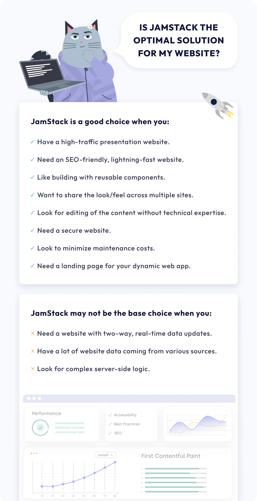

For some time now, Jamstack has asserted itself in the space for creating modern websites. The name Jamstack comes from the "JAMstack," where "JAM" stands for Javascript, APIs, and Markdown. In practice, you can build a website that can easily combine all your content channels and serve it as a lightning-fast website that visitors will enjoy. But there's more to it. Let's dive in and find out more.

## What is Jamstack?

To better understand Jamstack, we can compare it to traditional website architectures, where the content (backend) and user interface (frontend) are tightly coupled. When a user visits a page, the page gets generated each time on the fly. In often cases, this makes these websites feel sluggish and slow. With Jamstack, this is different.

Jamstack frameworks take all website components and pre-generate them to make the website static and lightning-fast. Of course, there are ways to make the website dynamic like in traditional websites, but these practices can be more efficient in Jamstack.

## Benefits of Jamstack

There are many benefits of using Jamstack, and here we will cover the major ones you will be getting.

### Security

Unlike websites built using WordPress or Drupal, Jamstack sites do not require an active connection to the database, making them more secure and less prone to attacks. Since the back and front live in separate places and your database is not exposed, this reduces the risk of breaches and external attacks.

Even better, you can skip using a web server and instead host your website on a content delivery network (CDN). Using a CDN brings an even larger layer of security to your website, which brings us to the next point - performance.

### Lightning, SEO-Friendly Performance

Pre-generated, static website code means the server's sole purpose is to deliver web pages. Since servers do not spend time and resources to generate each page, the result is a lightning-fast website.

Due to their static nature, web pages built with Jamstack can be served over a CDN (Content Delivery Network - a geographically distributed group of servers that work together to provide fast delivery of Internet content), increasing speed and web performance.

This makes growing your website traffic a breeze because you don't need to worry about scaling, only the actual traffic growth. The server's location is no longer critical because your website's content can be served over a CDN network across the globe, milliseconds from your users.

The outcome is faster loading times and an improved user experience across the website - well-rewarded by search engine ranking.

### Simple and Fail-Safe Content Management

Again, Jamstack is about decoupling. Here we have content living on a third-party headless CMS (Content Management System), and a presentation layer served directly to the users.

That way, editors and non-technical folks can focus on updating existing or launching new pages without worrying about breaking something in production. Developers will get notified if something violates the rules, but the website will remain live and functional. You can quickly revert to the older version with version history even if you launch the functional pages with unsuitable content.

### Development and Maintenance Cost

Working in Jamstack architecture can be more expensive at the beginning than investing in a monolithic framework. The initial cost of a Jamstack website might be higher because of the essential building blocks that need to be created at the start.

Luckily, at FatCat Coders, we are prepared and have a preset of building blocks that ensure we move fast and efficiently while cutting development costs.

You can also save on infrastructure costs since Jamstack websites require significantly less computing power than traditional websites. Hosting static files from a Jamstack website can sometimes be free, depending on usage.

Jamstack practically eliminates plugin updates, the need for active developers' maintenance, and updates.

## When to choose Jamstack?

We've created a simple checklist to help you determine whether the JamStack is a good solution for your website.

Jamstack can be great for a vast number of use cases. The flexibility and security it gives you are perfect for any eCommerce website. Also, if you're aiming to have high traffic to your website, Jamstack makes it easier for you to scale effortlessly, no matter the user count. The flexibility Jamstack gives allows you to create new features or edit existing ones quickly.

In terms of security and confidence, services like Stripe and Shopify provide developers with APIs for the Jamstack architecture. By leveraging these services, you are delegating payment processing, bank details, and other topics to the experts in these areas. Delegating complex and development costly processes saves up some money and makes you create a website faster.

Another signal that Jamstack is suitable for you is if you need a blog or a marketing website. In most cases, these websites can be hosted for a small charge or even for free. If you need a custom landing page plus a blog, then Jamstack is for you, together with a headless CMS integration. A setup like this makes your website a great content machine that feels great and runs fast.

## When NOT to choose Jamstack?

The initial setup of Jamstack architecture can be tricky for non-technical people. In most cases, developing a Jamstack website requires coding knowledge, which might be a turn-off for some folks.

Another thing to note about Jamstack is that every change requires going through the "build" process of the website - making it unsuitable for cases when you have a lot of real-time dynamics content changes, such as forums, active discussions, etc.

Luckily, the Jamstack technology is constantly evolving, and developers are trying to minimize the time to complete the build process.

## Conclusion

Thanks for reading this far. We hope this blog post helped you understand why to choose Jamstack as your technology stack.

To summarize, Jamstack is a modern way of building fast and efficient websites. It provides a clear separation of responsibilities between developers and editors, resulting in a more performant way of creating websites.

Thanks for reading, and speak soon.
