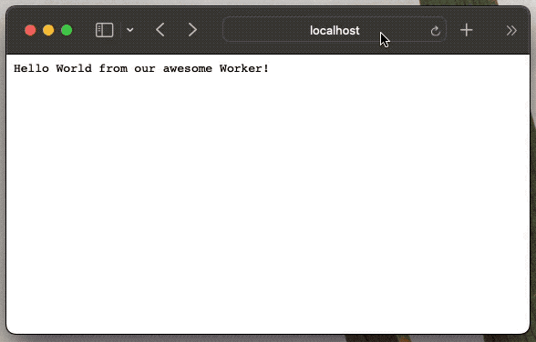
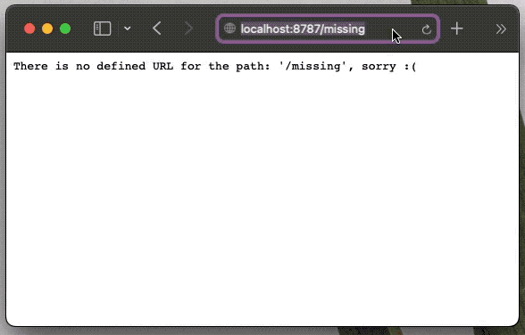
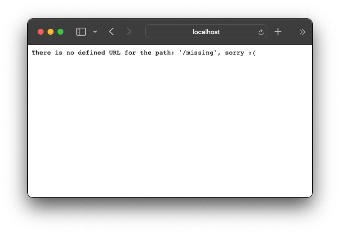
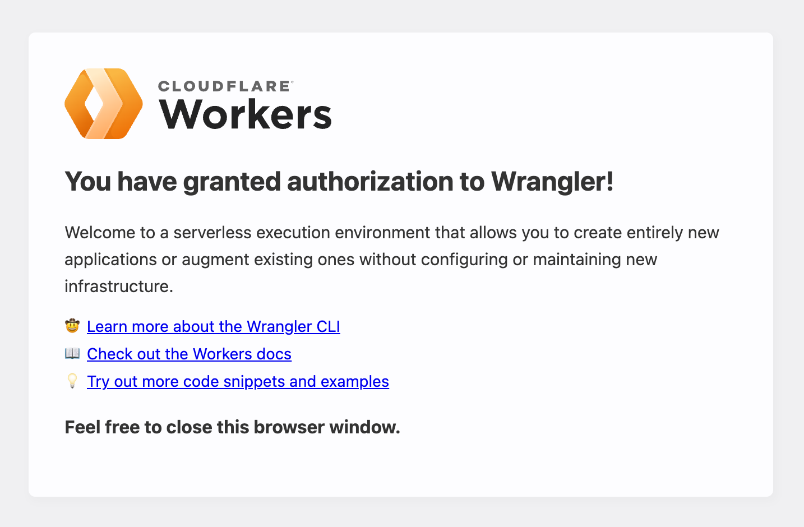
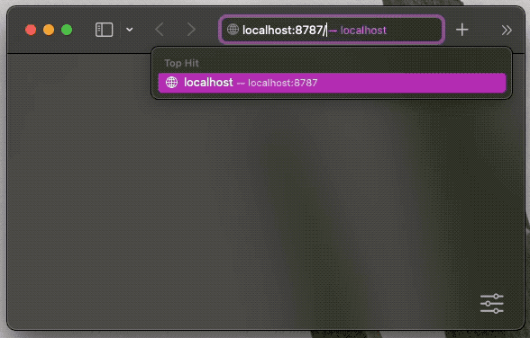
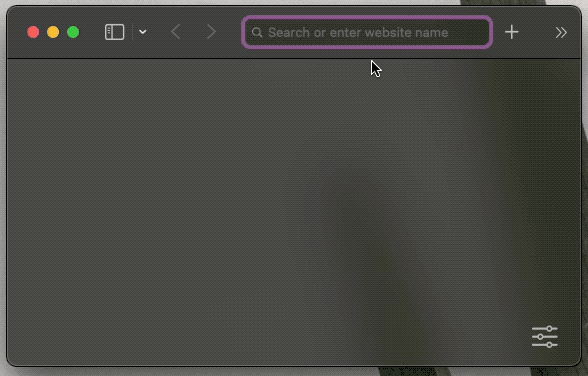
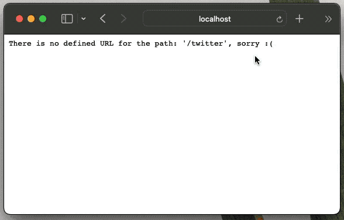

Have you ever used tools like [Bitly](https://bitly.com) or [TinyURL](https://tinyurl.com/app) to shorten long links? Or, have you wondered how these services work? Maybe you wanted to build a URL shortener but never found the time or the proper tools to do so. In any case, if you are interested in this topic, this article is perfect for you.

In this post, we’ll demonstrate how to build a basic URL shortener service using [Cloudflare Workers](https://workers.cloudflare.com). We’ll provide detailed information about how URL shortener services work, introduce several features of Cloudflare Workers, and give step-by-step instructions on how to get started with Cloudflare Workers.

_Jump ahead:_

- [What is Cloudflare Workers?](#what-is-cloudflare-workers)
- [Project overview: URL shortener service](#project-overview-url-shortener-service)
- [Setting up the environment](#setting-up-the-environment)
- [Generating the project](#generating-the-project)
- [How does Cloudflare Workers work?](#how-does-cloudflare-workers-work)
- [Adding a first redirect](#adding-a-first-redirect)
- [Shortening the URL](#shortening-the-url)
- [Adding storage](#adding-storage)
  - [Logging into Cloudflare](#logging-into-cloudflare)
  - [Creating a KV namespace](#creating-a-kv-namespace)
  - [Adding data to the KV](#adding-data-to-the-kv)
  - [Reading from the KV](#reading-from-the-kv)
- [Deploying Cloudflare Workers](#deploying-cloudflare-workers)

Let’s get started!

## What is Cloudflare Workers?

Cloudflare Workers is a service that lets you deploy serverless code to the Cloudflare network. The Cloudflare network, or the Edge, is a network of web servers spread across the globe. One great thing about Cloudflare Workers is that you don’t have to worry about scaling your code. Also, you don’t have to worry about the time zones your code lives in; your code in Workers is spread across the globe seconds after it’s deployed.

On top of that, Cloudflare Workers come with a simple key-value data store, called KV. In this tutorial, we’ll use a combination of Cloudflare Workers and KV storage to build our URL shorter.

## Project overview: URL shortener service

We’ll start by building a simple, non-dynamic URL shortener where you hardcode the websites you want to redirect to. This will serve as an introduction to learning how to use [Wrangler](https://developers.cloudflare.com/workers/wrangler/) (Cloudflare’s official CLI tool) and will demonstrate basic concepts in the Workers realm.

Next, we’ll spice things up a bit and add support for dynamic URLs. Basically, we’ll interact with the Cloudflare Workers KV store, and input short versions of the URL and the actual URL we want to redirect to. The data in the KV store will be similar to the following structure:

```json
'short-url': 'https://my-cool-website.com'
'submit': 'https://my-cool-site.org/blog/ideas/submit'
```

Finally, we’ll deploy our code to production and see it work live across the globe.

Are you excited already? Great, let’s jump in!

## Setting up the environment

To follow along with this article, you’ll need the following:

- Node.js and npm
- Wrangler
- curl (or the browser of your choosing) to test the URL shortener

I use the [asdf tool](https://asdf-vm.com/) to manage my local dependencies, but you can use any version manager you prefer. At the time of writing, here’s my Node and npm version:

```sh
$ node --version
v18.5.0
$ npm --version
8.12.1
```

Wrangler is a command-line tool for building, and recently, it got its 2.0 version. For the purpose of this post, Wrangler will fulfill all our needs. In the future, we might use [Miniflare, a more robust and feature-rich sibling of Wrangler](https://blog.logrocket.com/ditch-wrangler-cli-miniflare/). But, for now, let’s install Wrangler globally via npm:

```sh
$ npm install -g wrangler@2.0.21
```

At the time of writing, the latest Wrangler version is 2.0.21, so we’ll go with that one.

Cool. Now that we have all the dependencies in place, we can use the Wrangler CLI to generate our starter Cloudflare Worker.

## Generating the project

The Wrangler CLI tool will prove very helpful here.

To start, let’s run a command to initiate and set up our project properly:

```sh
$ wrangler init short-it
```

This command will ask a couple of questions. For now, we are going to answer yes (by typing **y**) for all of them:

```sh

$ wrangler init short-it
 ⛅️ wrangler 2.0.21
--------------------
Using npm as package manager.
✨ Created short-it/wrangler.toml
Would you like to use git to manage this Worker? (y/n)
✨ Initialized git repository at short-it
No package.json found. Would you like to create one? (y/n)
✨ Created short-it/package.json
Would you like to use TypeScript? (y/n)
✨ Created short-it/tsconfig.json
Would you like to create a Worker at short-it/src/index.ts?
  None
❯ Fetch handler
  Scheduled handler
✨ Created short-it/src/index.ts

added 62 packages, and audited 63 packages in 1s

1 package is looking for funding
  run `npm fund` for details

found 0 vulnerabilities
✨ Installed @cloudflare/workers-types and typescript into devDependencies

To start developing your Worker, run `cd short-it && npm start`
To publish your Worker to the Internet, run `npm run deploy`
```

If you answered positively to all the questions from Wrangler, then you will have a project name `short-it`, with the following inside:

- `.git` directory in your project, meaning you’re ready to push it to your Git provider
- `package.json` file
- `tsconfig.json` file with all the TypeScript configuration
- `src/index.ts` file with some straightforward logic to get a response from our Worker

Awesome. Let’s see if this thing works!

Let’s `cd` into the `short-it` directory and start Wrangler in local development mode:

```sh
$ cd short-it
$ wrangler dev --local
```

This should run our Worker on [http://localhost:8787/](http://localhost:8787/). If we visit localhost, we should see a simple “Hello World!” message:

<figure>
  
  <figcaption class='photo-caption'>
  Generated Worker is displaying a “Hello World!” message.
  </figcaption>
</figure>

Yay! We made it work. But how? Let’s take a closer look.

## How does Cloudflare Workers work?

We got our first message locally from the generated Worker, but how exactly did that work?

Let’s go through the generated `src/index.ts` file to gain a better understanding of what’s going on there.

```ts
// src/index.ts

/**
 * Welcome to Cloudflare Workers! This is your first worker.
 *
 * - Run `wrangler dev src/index.ts` in your terminal to start a development server
 * - Open a browser tab at http://localhost:8787/ to see your worker in action
 * - Run `wrangler publish src/index.ts --name my-worker` to publish your worker
 *
 * Learn more at https://developers.cloudflare.com/workers/
 */

export interface Env {
  // Example binding to KV. Learn more at https://developers.cloudflare.com/workers/runtime-apis/kv/
  // MY_KV_NAMESPACE: KVNamespace;
  //
  // Example binding to Durable Object. Learn more at https://developers.cloudflare.com/workers/runtime-apis/durable-objects/
  // MY_DURABLE_OBJECT: DurableObjectNamespace;
  //
  // Example binding to R2. Learn more at https://developers.cloudflare.com/workers/runtime-apis/r2/
  // MY_BUCKET: R2Bucket;
}

export default {
  async fetch(
    request: Request,
    env: Env,
    ctx: ExecutionContext
  ): Promise<Response> {
    return new Response("Hello World!")
  },
}
```

The above code includes a definition for our environment (the `Env` interface) and a couple of comments relating to the `ENV` interface.

Since the interface is out of the scope of this article, we’ll ignore that portion of the code and focus solely on the main logic:

```ts
// src/index.ts

export default {
  async fetch(
    request: Request,
    env: Env,
    ctx: ExecutionContext
  ): Promise<Response> {
    return new Response("Hello World!")
  },
}
```

What happens here is that our `index.ts` exports a `fetch` function. This is an interface similar to [Web Workers](https://developer.mozilla.org/en-US/docs/Web/API/Web_Workers_API/Using_web_workers). In fact, it is from this interface that the name “Cloudflare Workers” originates. Cloudflare Workers is similar to Web Workers, except it runs on Cloudflare infrastructure rather than a browser.

In the above code, the `fetch` function returns a new `Response` object with the “Hello World!” text. So when we run our Worker, this `fetch` function is invoked. Then, the invoked `fetch` function returns the “Hello World!” response, and this is what we pick up in the browser (or via any tool used to invoke the Worker).

OK, we’ve cleared up the basics of Cloudflare Workers. We can move on with confidence. If you’re new to TypeScript, do not worry; we will use its features only lightly. Imagine this as a lightweight onboarding to the world of TypeScript.

Great, let’s move onward!

## Adding a first redirect

We’ll begin working on our logic with a gentle start. First, we’ll have our URL shortener redirect a user to a different website. This will be the foundation for later changes.

---

### More great articles from LogRocket:

- Don't miss a moment with [The Replay](https://lp.logrocket.com/subscribe-thereplay), a curated newsletter from LogRocket
- Use React's useEffect [to optimize your application's performance](https://blog.logrocket.com/understanding-react-useeffect-cleanup-function/)
- Switch between [multiple versions of Node](https://blog.logrocket.com/switching-between-node-versions-during-development/)
- [Learn how to animate](https://blog.logrocket.com/animate-react-app-animxyz/) your React app with AnimXYZ
- [Explore Tauri](https://blog.logrocket.com/rust-solid-js-tauri-desktop-app/), a new framework for building binaries
- Compare [NestJS vs. Express.js](https://blog.logrocket.com/nestjs-vs-express-js/)
- [Discover](https://blog.logrocket.com/best-typescript-orms/) popular ORMs used in the TypeScript landscape

---

For now, we’ll have the user go to a page on the [https://http.cat/](https://http.cat/) website when they visit our local Worker.

If you’re not familiar with [https://http.cat/](https://http.cat/), it’s a fun site that displays various cat pictures for different HTTP statuses. For example, if a user makes a request to our Worker to [http://localhost:8787/404](http://localhost:8787/404), they will be directed to [https://http.cat/404](https://http.cat/404).

To achieve this redirect, we’ll edit the `src/index.ts`, like so:

```ts
// src/index.ts
// ...

const basePath = "https://http.cat"

export default {
  async fetch(
    request: Request,
    _env: Env,
    _ctx: ExecutionContext
  ): Promise<Response> {
    const url = new URL(request.url)

    const { pathname } = url

    const redirectURL = basePath + pathname

    if (pathname === "/") {
      return new Response("Hello World from our awesome Worker!")
    }

    return Response.redirect(redirectURL, 301)
  },
}
```

Now, if we visit [http://localhost:8787](http://localhost:8787) we will get an updated message: “Hello World from our awesome Worker!”, as shown below:

<figure>
  
  <figcaption class='photo-caption'>
  Worker displaying an updated “Hello world” message.
  </figcaption>
</figure>

But, if we try to go to [http://localhost:8787/404](http://localhost:8787/404), we’ll get redirected to [https://http.cat/404](https://http.cat/404).

<figure>
  
  <figcaption class='photo-caption'>
  User is redirected to the http.cat/404 website.
  </figcaption>
</figure>

Great, we got our first redirect going. Now, let’s make our URL shortener actually shorten some URLs.

## Shortening the URL

For now, we’ll add a small data structure to store our shortened URLs. We can do it like this:

```ts
const shortURLs = {
  "/blog": "https://pragmaticpineapple.com/",
  "/twitter": "https://twitter.com/nikolalsvk",
  "/github": "https://github.com/nikolalsvk",
} as Record<any, string>

export default {
  async fetch(
    request: Request,
    _env: Env,
    _ctx: ExecutionContext
  ): Promise<Response> {
    const url = new URL(request.url)

    const { pathname } = url

    const redirectURL = shortURLs[pathname]

    if (!redirectURL) {
      return new Response(
        `There is no defined URL for the path: '${pathname}', sorry :(`
      )
    }

    return Response.redirect(redirectURL, 301)
  },
}
```

Here, we added a couple of shortened URLs:

- `/blog` redirects to [my blog](https://pragmaticpineapple.com/)
- `/twitter` to [my Twitter profile](https://twitter.com/nikolalsvk)
- and `/github` to [my GitHub profile](https://github.com/nikolalsvk)

You can change it to whatever you like just to see it working. Now, when I visit [http://localhost:8787/blog](http://localhost:8787/blog), I get redirected to a longer URL where my blog is located. Here’s the result:

<figure>
  
  <figcaption class='photo-caption'>
    Visiting /blog redirects to the actual blog page.
  </figcaption>
</figure>

But, if we request some path, like [http://localhost:8787/missing](http://localhost:8787/missing), we get the following error message: “There is no defined URL for the path: ‘/missing’, sorry :(“.

<figure>
  
  <figcaption class='photo-caption'>
  Visiting /missing displays an error message.
  </figcaption>
</figure>

Awesome, now we are ready to move our hardcoded URLs and their shortened versions to a storage somewhere. Fortunately, we’re using Cloudflare Workers, and it offers a simple key-value storage called KV.

## Adding storage

Before we actually create the KV for our project, we first need to log into Cloudflare Workers via Wrangler. This is necessary because Wrangler will later need to contact Cloudflare in order to create a KV instance for us.

### Logging into Cloudflare

To log into Cloudflare, use the following command:

```sh
$ wrangler login
```

A browser will open, asking you to log in to Cloudflare. Don’t worry; the free plan covers everything we’ll need for this tutorial, and you will not be asked for payment. Go ahead and register, or log in if you already have an account.

Next, Cloudflare will ask if you want to grant authorization to Wrangler. After you agree, you should see the following screen:

<figure>
  
  <figcaption class='photo-caption'>
The Wrangler CLI tool is now properly connected.
  </figcaption>
</figure>

There shouldn’t be any hiccups during the signup process. But, if you got stuck at any point, you can follow [Cloudflare’s guide on creating an account](https://developers.cloudflare.com/fundamentals/account-and-billing/account-setup/).

Awesome! Now that you are signed up and logged in, let’s check whether everything is connected properly.

Use the following command:

```sh
$ wrangler whoami
 ⛅️ wrangler 2.0.21
--------------------
Getting User settings...
👋 You are logged in with an OAuth Token, associated with the email 'nikolaseap@gmail.com'!
┌──────────────────────┬──────────────────────────────────┐
│ Account Name         │ Account ID                       │
├──────────────────────┼──────────────────────────────────┤
│ Nikola Đuza Personal │ 98a16dfefca0e2ee27e1e79ba590d973 │
└──────────────────────┴──────────────────────────────────┘
```

Great, we’re ready to make a KV namespace.

### Creating a KV namespace

A KV namespace can be thought of it as an instance of KV up on the Cloudflare network. We’ll create two KV namespaces: one for production where our app will live and work and another for the preview environment. We’ll use the preview namespace while we test and develop our URL shortener.

We’ll create our KV namespaces via Wrangler with the following commands:

```sh
$ wrangler kv:namespace create SHORT_URLS
🌀 Creating namespace with title "short-it-SHORT_URLS"
✨ Success!
Add the following to your configuration file in your kv_namespaces array:
{ binding = "SHORT_URLS", id = "029d374ebd984e19b0bb98e37ab1a95e" }

$ wrangler kv:namespace create SHORT_URLS --preview
 ⛅️ wrangler 2.0.21
--------------------
🌀 Creating namespace with title "short-it-SHORT_URLS_preview"
✨ Success!
Add the following to your configuration file in your kv_namespaces array:
{ binding = "SHORT_URLS", preview_id = "99a72876e5f84cf58de722b1c2080604" }
```

Add the following to your configuration file in your kv_namespaces array:

```toml
{ binding = "SHORT_URLS", preview_id = "99a72876e5f84cf58de722b1c2080604" }
```

After these two commands run and both namespaces are created, we need to tell Wrangler to use these namespaces when we run `wrangler dev`.

We’ll add information about KV namespaces to the `wrangler.toml` file at the root of our project. It should look something like this:

```toml
name = "short-it"
main = "src/index.ts"
compatibility_date = "2022-07-15"

kv_namespaces = [
  { binding = "SHORT_URLS", id = "029d374ebd984e19b0bb98e37ab1a95e", preview_id = "99a72876e5f84cf58de722b1c2080604" }
]
```

The `wrangler.toml` file is a configuration file that tells `wrangler` certain information about our project. Now, we’re strapped up and ready to add some data to our KV.

### Adding data to the KV

Our next step is to seed the data to the KV. Remember, we have two namespaces so we’ll have to run two commands to have the data in both places. Let’s add the `/blog` entry to the KV:

```sh
$ wrangler kv:key put --binding SHORT_URLS "/blog" "https://pragmaticpineapple.com/" --preview false
 ⛅️ wrangler 2.0.21
--------------------
Writing the value "https://pragmaticpineapple.com/" to key "/blog" on namespace 029d374ebd984e19b0bb98e37ab1a95e.

$ wrangler kv:key put --binding SHORT_URLS "/blog" "https://pragmaticpineapple.com/" --preview
 ⛅️ wrangler 2.0.21
--------------------
Writing the value "https://pragmaticpineapple.com/" to key "/blog" on namespace 99a72876e5f84cf58de722b1c2080604.
```

Awesome. Now we have one entry in the KV. Next, let’s add logic that reads from the KV and redirects the user.

### Reading from the KV

We’ll quickly remove our old hardcoded short URLs and add a call to the KV, like so:

```ts
// src/index.ts
export interface Env {
  SHORT_URLS: KVNamespace
}

export default {
  async fetch(
    request: Request,
    env: Env,
    _ctx: ExecutionContext
  ): Promise<Response> {
    const url = new URL(request.url)

    const { pathname } = url

    const redirectURL = await env.SHORT_URLS.get(pathname)

    if (!redirectURL) {
      return new Response(
        `There is no defined URL for the path: '${pathname}', sorry :(`
      )
    }

    return Response.redirect(redirectURL, 301)
  },
}
```

Here, we add `SHORT_URLS` as a `KVNamespace` type. This will allow us to call KV methods to get the proper data. Instead of the hardcoded object with URLs, this time we use `await env.SHORT_URLS.get(pathname)`.

The call to `env.SHORT_URLS.get(pathname)` tries to get the key from the KV. If it returns a promise, we must `await`. But, if there’s a value for the given `pathname`, then the user is redirected to that URL.

Now, when we visit [http://localhost:8787/blog](http://localhost:8787/blog), we will be redirected to the actual blog URL we put in the KV. It will look like this:

<figure>
  
  <figcaption class='photo-caption'>
  Visiting /blog still redirects us to the actual blog page.
  </figcaption>
</figure>

But, if we now try to visit any of the other URLs we hardcoded, we’ll get a message saying that those URLs are missing a redirect:

<figure>
  
  <figcaption class='photo-caption'>
  Visiting /twitter results in a message indicating the URL is missing a redirect.
  </figcaption>
</figure>

Let’s quickly add the Twitter shortened URL to the KV using these commands:

```sh
$ wrangler kv:key put --binding SHORT_URLS "/twitter" "https://twitter.com/nikolalsvk" --preview false
⛅️ wrangler 2.0.21
--------------------
Writing the value "https://twitter.com/nikolalsvk" to key "/twitter" on namespace 029d374ebd984e19b0bb98e37ab1a95e.

$ wrangler kv:key put --binding SHORT_URLS "/twitter" "https://twitter.com/nikolalsvk" --preview
 ⛅️ wrangler 2.0.21
--------------------
Writing the value "https://twitter.com/nikolalsvk" to key "/twitter" on namespace 99a72876e5f84cf58de722b1c2080604.
```

Now, when we refresh the [http://localhost:8787/twitter](http://localhost:8787/twitter), we should get redirected to the Twitter account.

<figure>
  
  <figcaption class='photo-caption'>
  Twitter loads after we added the shortened URL to the KV.
  </figcaption>
</figure>

Awesome, now we have two short URLs: `/blog` and `/twitter`. Let’s try to deploy our service and see it in production.

## Deploying Cloudflare Workers

The Cloudflare Workers deployment step is fairly easy. We’ll utilize `wrangler publish`, like so:

```sh
$ wrangler publish
 ⛅️ wrangler 2.0.21
--------------------
Retrieving cached values for userId from node_modules/.cache/wrangler
Your worker has access to the following bindings:
- KV Namespaces:
  - SHORT_URLS: 029d374ebd984e19b0bb98e37ab1a95e
Total Upload: 0.45 KiB / gzip: 0.29 KiB
Worker ID: short-it
Worker ETag: f8395cab29edf297137631b803b14c32daaae982758c23e3019b700e2468c277
Uploaded short-it (2.14 sec)
Published short-it (6.33 sec)
  short-it.nikolalsvk.workers.dev
```

Now, the services are live at [https://short-it.nikolalsvk.workers.dev](https://short-it.nikolalsvk.workers.dev). Yay!

If you’re following along with this tutorial, your services should live somewhere along the URL [https://short-it.YOUR_SUBDOMAIN.workers.dev](https://short-it.YOUR_SUBDOMAIN.workers.dev), depending on what you selected for `YOUR_SUBDOMAIN`.

At this point, our Worker script is deployed across the globe on the Cloudflare Edge network. This means that friends and strangers across the globe can get redirected blazingly fast to our Twitter account if they visit [https://short-it.nikolalsvk.workers.dev/twitter](https://short-it.nikolalsvk.workers.dev/twitter).

## Wrapping up

Thanks for following along on the journey of creating a simple URL shortener service using Cloudflare Workers. In this article, we introduced the concepts of a Worker inside the Cloudflare context. We also demonstrated how to create and manage data in Cloudflare’s KV storage.

We were able to execute all of this smoothly using Wrangler, which provides a great developer experience. But, most importantly, we managed to create, test, and deploy our small service that runs fast in all corners of the world.

Achieving this in a similar technology or service might require a lot of money and effort. However, Cloudflare supports a generous free tier of 100,000 requests per day. So you can shorten many URLs and have many visits on them before breaching into a paid plan.

All the code in this article is available in the [GitHub repo](https://github.com/nikolalsvk/short-it) (please star it, if you like it). The shortener service is live at [https://short-it.nikolalsvk.workers.dev](https://short-it.nikolalsvk.workers.dev).

If you liked the post, please consider sharing it with your friends and coworkers.

Until next time, cheers!
