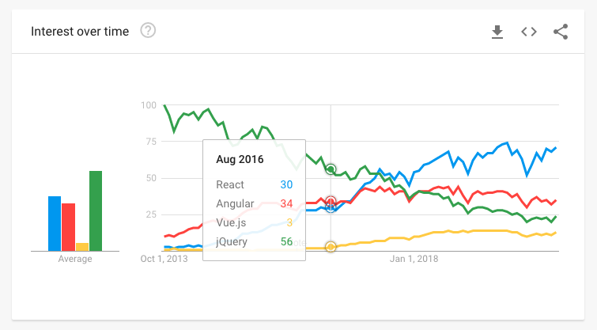
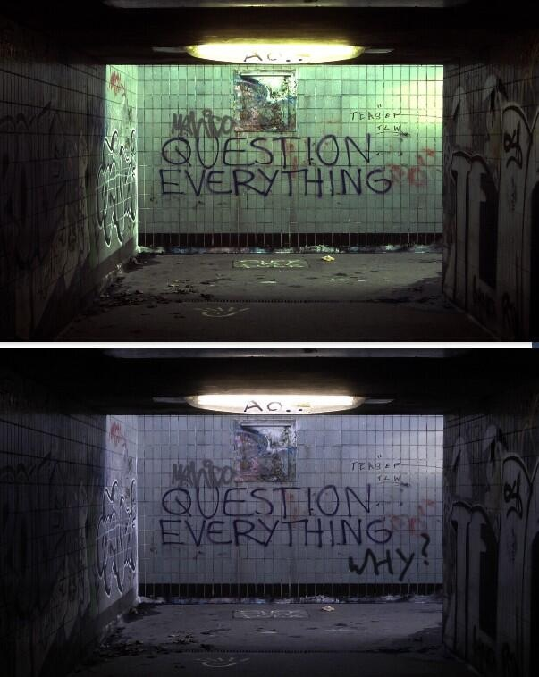
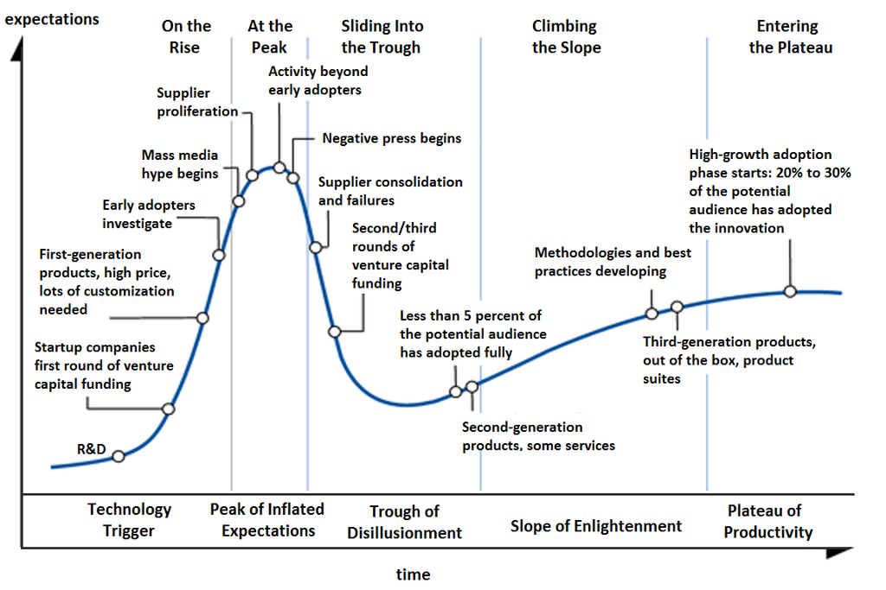

Photo by <a href="https://unsplash.com/@eepeng?utm_source=unsplash&utm_medium=referral&utm_content=creditCopyText">Eepeng Cheong</a> on <a href="https://unsplash.com/s/photos/trends?utm_source=unsplash&utm_medium=referral&utm_content=creditCopyText">Unsplash</a>

It is one of those days. You typed in [twitter.com](https://twitter.com/) in
your browser, and you saw a new tweet from someone on how to use React Hooks.
But, for some reason, your company or a team hasn't switched to using Hooks.
Or, maybe you are using them, but not in a new "trendy" way. Perhaps you are
using Vue.js or Angular, but this React Hooks is popping up everywhere, almost
starting to show up on your microwave when you are heating your dinner.

Since it is one of those days, you start questioning whether what you have in
your codebase is right? Should you maybe refactor that piece of logic with what
you just read? As the questions settle down, you start imagining how that would
look in your code.

Now, you feel a sudden urge to use it. You ping your team lead or send a
message to your whole team about this cool new way of doing things, and you
suggest that you start using it.

## Rewriting Your Code

Some time ago, a cover for an imaginary book surfaced on the [@ThePracticalDev](https://twitter.com/ThePracticalDev/status/715623065078644738/photo/1) Twitter account.
Back in 2016, it was popular to make fun of the ever-changing world of
JavaScript in a bit of a different manner than folks do today.

Psst, I have invented the time machine (don't tell anyone)! Let us quickly travel
back in time to 2016. SWOOSH! We are there. JavaScript landscape looks like this:

If you are using a JavaScript framework or want to use a framework,
Angular.js is probably something you would choose. But, the news about
Angular 2 that will make you rewrite almost everything is just around the
corner. Also, this new kid on the block - React.js is coming up and getting ripe.
Of course, Vanilla JS and no-framework-folks are there. Not using a framework
is still a popular opinion in 2016, but is slowly fading.

Knowing all this, what would you do? Which path would you choose and why? The
answer might seem obvious now that you come from the future - React. But if you
decided about Angular.js, a couple of years down the road, you will get tempted to use new
Angular versions and rewrite your code. If you chose to use React, you'd be a lucky
winner since everyone is riding the React train nowadays. But, you now
get tempted to drop class components and use functional components with those
sweet, sweet hooks, right? Well, at least it is not a whole new API to learn as
with Angular.js - Angular 2 change, right?

So many choices, so little time. What to do?

It doesn't matter what we choose now or what we chose back in the day.
We will still get tempted or have to rewrite our code later down the road.
Reasons to do it might vary:

- your company was using [insert framework name] and is unable to hire new folks
- you feel the old solution is not working out for you anymore, and you want something new
- you succumbed to the industry trends and want to use latest and greatest

Unless we break the cycle.

## Breaking The Cycle

Constant improvement and shipping a new, better version is planted deep inside
our industry. The need to make more efficient, less complex, prettier, robust
solutions is breathing down our necks. To undermine the idea of continuous
learning and advancement is to go against everything and everyone these days.
I am not going to go down that road right now, but please consider subscribing
to the [newsletter](/newsletter) if you want to hear more about this in the
future.

The idea of having to learn something new is good, and I agree with that, but how
often should you do that? Looking at the world of JavaScript, a new idea, blog
post, library, framework, and whatnot pops up very often. Things become
trending, and people quickly try to adopt that. I'm not saying you should not
adopt new things and consider different approaches to a solution, not at all! I
am trying to propose the idea of doing that less often.

Let us get more [pragmatic](/). I used
[axios](https://github.com/axios/axios) before, and it works great. You can
test it properly, is widely supported, has a lot of internet points
(GitHub stars), and so on. Then, I come across a
[blog post](https://kentcdodds.com/blog/replace-axios-with-a-simple-custom-fetch-wrapper)
that tells you to replace axios and roll your fetching logic.

After reading the title of the blog post
"[Replace axios with a simple custom fetch wrapper](https://kentcdodds.com/blog/replace-axios-with-a-simple-custom-fetch-wrapper)", it makes you go through the thought process from the start of this blog post.
It makes you question your choices.

I won't go into details whether you should or should not do as the post tells
you, posts do that pretty well on its own. I can help you with the basic
decision making. Are you happy with axios right now? If the answer is yes, it
is probably best to leave alone this idea of replacing it. Is axios proving
difficult for you or your team? If the answer is yes, then try to do what the
post is telling you and see how that works out.

In short: do not fall for the hype. Try to "feel" what works for you and go
with that. Try not to succumb to flashy new tweets, blog posts, Hacker News top
posts, trending hashtags of what you should or should not do. Read on to find
out how to avoid this Hype Driven Development.

## HDD - Hype Driven Development

The hype is something common in our industry. Remember NoSQL? Or when everyone
went crazy over microservices? Or the AI / Machine learning burst? The list
goes on and on. People get excited about new and breakthrough technologies and
ideas. Folks at Gartner did an excellent job of drawing a Hype Cycle:

It shows a typical life cycle of new and emerging technology. Do you recognize
anything that you are using right now that might fall into some part of the
graph? [Ayman](https://medium.com/@aymanarif/the-hype-cycle-bdbb1adec14)
made a more detailed hype cycle graph:

Recall this slope when going for a recent JS trend, where does it fit in?

## Dealing with hype

Hype and excitement are sometimes good in life. Without it, life would be bland
and boring. It can come as a refreshment to follow the hype and ride the
bandwagon from time to time, but you should always do your research first.

Remember this when trying to adopt a brand new hyped up library or a framework.
Ask these questions to yourself and your team:

### Research and test out before making a decision

Reading blog posts, tweets, and announcements are helpful, but to best
experience whether something is for you is by getting experience in it. Try
building a prototype for what you are planning to use it. See how it 'dances'
with the rest of what you are doing.

If you are planning to do something on the team level, try out team hackathons.
Hackathons are a great way of testing new technology with your team, and a
place where you can go crazy with solutions. Then, you can have a retrospection
of some sort with your team, discussing the pros and cons.

### Is it solving your problem, and what is the cost?

Do you have a specific problem with your current implementation? If so, test out
to see if the new technology does solve it. How much time will it take? Will it
be worth the cost of learning it and rewriting your solution to it? How much will it slow
down the development of your team?

### Get an opinion from other people

This one might be tricky if you are working in a small company or a team of
not so experienced team members. Try to look for an opinion from an architect or a
senior engineer. Just because some library is working out nicely for AirBnB and
their website, might not be the best for you, and you might have overlooked
some aspect of it. Talking to someone experienced is sometimes a privilege, but
if you have it, use it!

If you are a senior, try talking to a junior or someone less experienced
than you. Many companies are running what is called
"[reverse mentoring](https://www.mindtools.com/pages/article/reverse-mentoring.htm)"
programs where juniors coach senior members of a company. Senior's
experience is traded for a fresh perspective from a junior. You'd be amazed at how
much you could learn and share.

In conclusion, try not to make a hasty decision over something you just saw.

If you liked the blog post, consider subscribing to the
[newsletter](/newsletter) or share it with your friends and coworkers:

Until the next one,
Cheers 🍻
