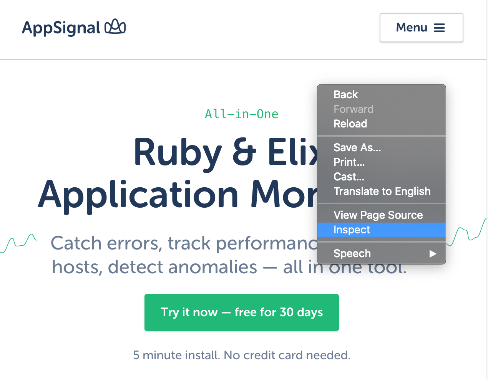
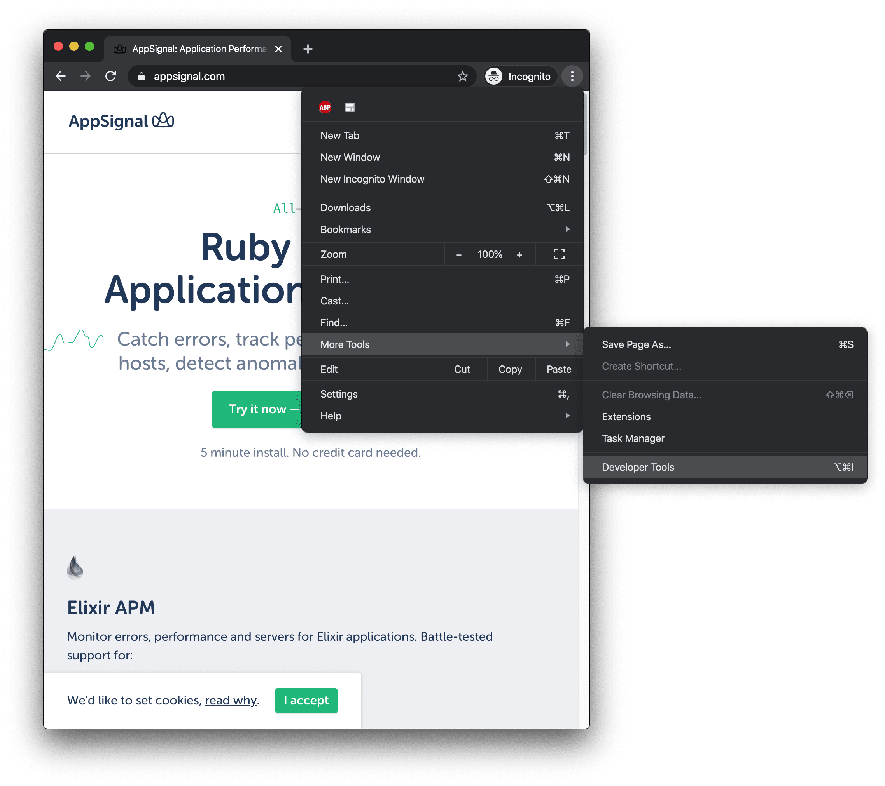
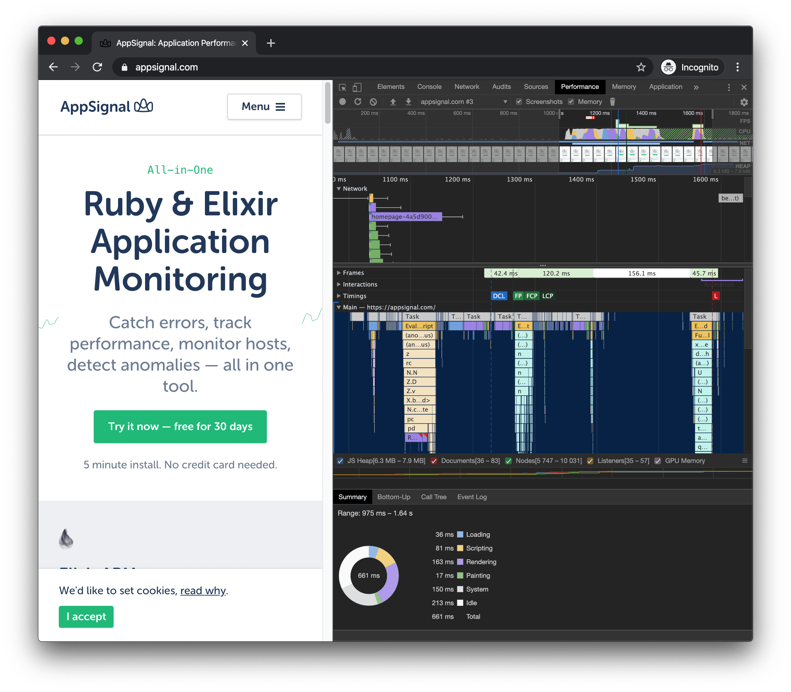
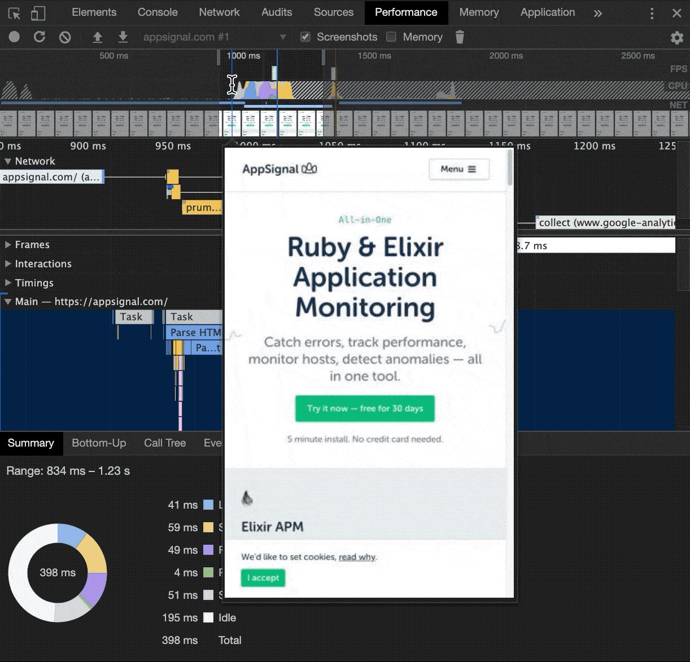
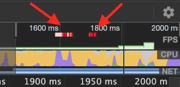
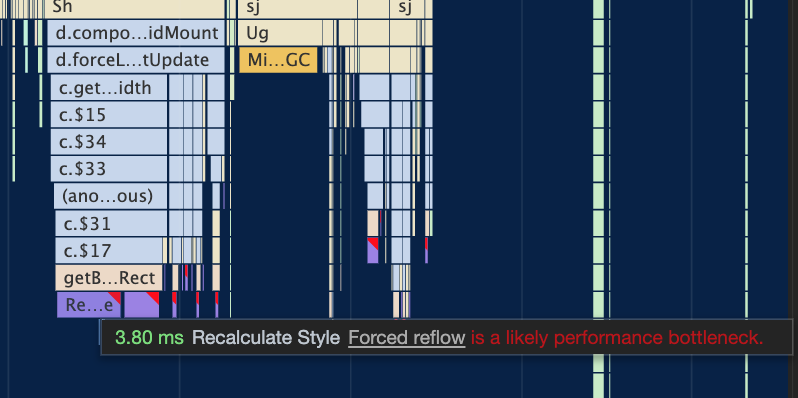
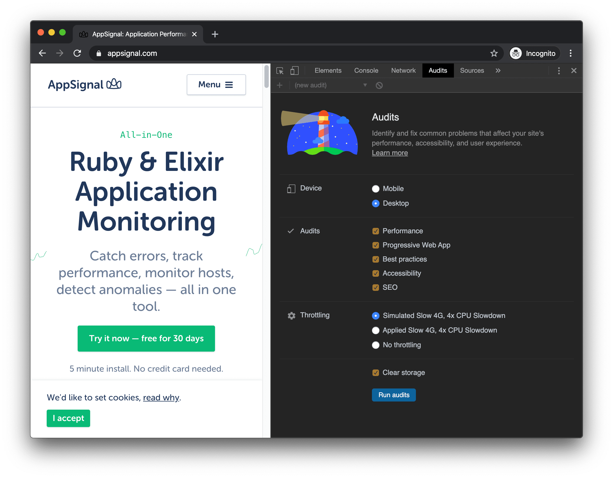
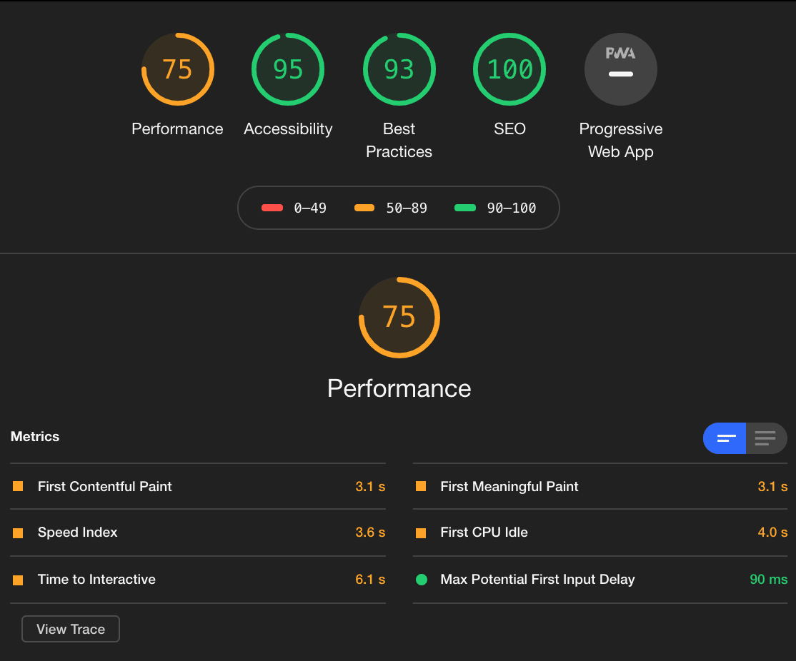

<div class="photo-caption">
Photo from <a href="https://blog.appsignal.com/2020/02/20/effective-profiling-in-google-chrome.html">AppSignal's Blog</a>
</div>

This blog post will explain how to effectively profile your website so that
you can deal with performance pain points.

We’ll go through the two most used tools in Google Chrome for profiling:

- The Performance tab in Google Chrome DevTools Lighthouse—an open-source tool
- for improving the quality of web pages

Imagine that you optimized your backend and everything is running smoothly.
However, for some reason, the load time of your pages is still unreasonably
high. Your users might be experiencing sluggish UI and long load times. This
post will help you sort these issues out.

## Importance of Profiling Your Website

When you get a greenfield project and you start building frontend from
scratch, chances are that your website won’t have poor performance. In
moments like these, you don’t need to worry about measuring performance and
profiling. But, as time goes on and more code and logic is added to the
frontend, you might start experiencing some slowdown. This is fine since you
cannot predict every possible outcome of the code you added. Also, piled up
features and legacy code can prove problematic after some time if they are
not taken care of along the way.

The thing about legacy code and old features is that very few people in your
team want to deal with them. They are the dusty parts of your application and
could easily break (especially if you didn’t write automated tests). But,
when your application slows down, you’ll need to start looking into those
deep corners of your codebase. Luckily, Google Chrome DevTools has a couple
of tools that can help you.

## Profiling Your Pages

Let’s say your page is slow and you want to optimize it. To understand
**why** it is slow, you have to measure **what** is slowing it down and
**how** it is slowing it down. In this blog post, we will describe how to do
this with the Google Chrome browser. Mozilla Firefox also has its own set of
tools for measuring performance, and you can find other resources and
websites online that do the same, but today, we’ll focus on Google Chrome.
What Chrome offers you for profiling is Performance profiling inside the
Performance tab and Lighthouse inside the Audits tab in the Google Chrome
DevTools (let’s just call them DevTools from now on).

## Using the Performance Tab in DevTools

The easiest way to do this is to open DevTools. There are a couple of ways to
open them:

1.  Use the Inspect option by right-clicking somewhere on your page and selecting Inspect
    
2.  Or press Command+Option+C (Mac) or Control+Shift+C (Windows, Linux, Chrome OS).
3.  Press Command+Option+J (Mac) or Control+Shift+J (Windows, Linux, Chrome OS) to jump straight into the Console panel.
4.  Press Command+Option+I (Mac) or Control+Shift+I.
5.  Click Customize and control Google Chrome Customize and control Google Chrome and then select More Tools > Developer Tools.
    

### Recording Performance

Now that we’re in the DevTools, go into the Performance tab, and press the Record button to interact with your website. For example, if you have some part of your application that’s slow, like a list of items being scrolled, try to scroll that list when the profiler is running. Once you’re done with the interaction, press Stop or the Record button again.

### Recording Website’s Load Performance

If you want to measure how your website loads, you can click the **Start profiling and reload the page** button next to the Record button. This will record what is going on and below the page while it’s being loaded. After the application has loaded and you’re finished interacting with it, click the Stop button to get a recording.

### Reading Performance Recordings

After you’ve simulated the behavior that affects your website’s performance and gathered the recordings, it’s time to analyze that data. You should see something like this in your browser:



This can be overwhelming at first and a bit scary, but don’t back down now! As you can see, the Performance tab offers a ton of features for you to look into, but we will only glance over a few common ones. The first thing you should get acquainted with is moving around the **Timeline**. The easiest way for me was to select a specific portion of the Timeline using my mouse. You can do it like this:



As you can see in the GIF above, I’m trying to zoom in on the place in the Timeline where the most activity occurred. The Timeline shows what is going on with your website in each frame. To be able to visually identify what was going on when you profiled your website, Timeline is painted in different colors. JavaScript execution time is marked in yellow and it’s called **Scripting**. The purple area shows the **Rendering** and the green parts of the Timeline show the **Painting** process. To better understand what these mean, let’s dive into how the browser ships pixels to your screen.


Everything begins with evaluating the JavaScript code on your page, which is what the **Scripting** part of Timeline refers to. This is the JS part of your code that will result in some visual changes on your website. Then, the **Rendering** part comes in with **Style** and **Layout** coming into place. **Style calculations** is a process where the browser is figuring out which CSS rule applies to which HTML element. The **Layout** process tries to come up with the sizing of your elements and where to put them on the screen. Finally, we have the **Painting** part that has 2 parts—**Paint** and **Composite**. **Paint** is a process where colors, images, text, and shadows are drawn. **Compositing** is a process that ensures that layers of your website are drawn in the correct order, for example, if you have elements that overlap each other. Each of these processes can slow down, and thus slow down the whole process of showing a frame to the end-user.

You must be thinking, “OK, now what?” Hang on, we’re getting there. Chrome will mark the sections of the timeline where the UI was choppy with red in the FPS row of the timeline like below. Luckily, we just got familiar with what color represents which process, and with that knowledge, we can identify what might be wrong with the code behind it.



This is a clear indicator that something in there is causing poor performance. In that case, you should select the part of the Timeline that is marked as red in the FPS row and investigate the Main thread activity flame chart. If you’ve never read flame charts before, don’t worry, they are pretty intuitive. A flame chart is a data visualization of your call stack while you were profiling your app. Take a look at the call stack that is causing the most trouble by following the execution trace to the bottom. This is how you usually find the culprit.



In this case, JavaScript code was triggering expensive Style recalculation that caused UI to lag. In the Timeline, it will be marked as **Scripting**. This is one of the major causes of poor performance. This happened to me when I was using React and was triggering unnecessary renders that caused a lot of Style changes. In React, you can achieve this by checking when a component should be rerendered using [shouldComponentUpdate](https://reactjs.org/docs/react-component.html#shouldcomponentupdate). One of the solutions, in that case, is to stop triggering renders when they are not needed.

One of the guidelines for avoiding situations like these are: - Let the browser do the work it can. Do not handle touch and scrolls on your own, for example. - Consider using [`requestAnimationFrame`](https://css-tricks.com/using-requestanimationframe/) for those tricky DOM updates. - Delegate some of the work to [Web Workers](https://developer.mozilla.org/en-US/docs/Web/API/Web_Workers_API/Using_web_workers).

If this is not enough, there is a great article about how to [optimize JavaScript execution](https://developers.google.com/web/fundamentals/performance/rendering/optimize-javascript-execution) to improve your website performance.

Another thing that might slow down your website directly is complex CSS which will show up in the Timeline as a lot of purple sections—**Rendering**. One scenario where this can happen is if you have complex CSS selectors like

```css
.box:nth-child(n + 1) a.button.submit {
  /* styles */
}
```

If you have a lot of these at a bad time, the browser will have to calculate to which elements this rule applies to and will slow things down.

If you’re not careful, you can also stress the browser when constantly reading and writing to the DOM. This will cause the browser to repeatedly calculate the layout over and over again. One good solution for this would be to avoid that practice somehow or resort to the [fastdom library](https://github.com/wilsonpage/fastdom) which batches read/write operations to the DOM so that the browser isn’t stressed too much.

Some tips on reducing **Rendering** as a bottleneck: - Try not to have a lot of DOM elements. The browser will then struggle with figuring out their size and position. - First, read element style, then change it. This will avoid [forced synchronous layouts and layout thrashing](https://developers.google.com/web/fundamentals/performance/rendering/avoid-large-complex-layouts-and-layout-thrashing). - Use [flexbox](https://css-tricks.com/snippets/css/a-guide-to-flexbox/) instead of the [float technique](https://css-tricks.com/all-about-floats/) for layout.

You can find more great tips on solving performance problems in an article from Google Developers about [analyzing runtime performance](https://developers.google.com/web/tools/chrome-devtools/rendering-tools). Also, check out this detailed guide on [performance analysis](https://developers.google.com/web/tools/chrome-devtools/evaluate-performance/reference) that explains everything that happens inside the Performance tab.

## Using Lighthouse in DevTools

Sometimes, performance drops are not affected by your code. Or, maybe the SEO score of your website is not that good and it’s being ranked poorly in searches. What do you do in that case? Well, there is a tool called Lighthouse that measures some crucial points of your app so that you can get a well-rounded website.

Lighthouse is an [open source tool](https://github.com/GoogleChrome/lighthouse) that can also be used outside the browser. It is actively maintained by Google and it’s an important tool to have under your belt.

> Lighthouse analyzes web apps and web pages, collecting modern performance metrics and insights on developer best practices.

You can use Lighthouse in other contexts, but we’ll go through the process of using it inside DevTools in Google Chrome.

The first thing you need to do is to open DevTools (we covered this part above) and go to the Audits tab inside it. You should see something like this:



To conduct an audit, click **Perform and audit** and wait for the Lighthouse to finish profiling. It assesses your website using 5 categories, where you can score between 0 and 100 points for each category. Lighthouse measures:

- Performance — how fast is your website?
- Accessibility — how accessible is your website to others?
- Best Practices — are you following the web’s best practices?
- SEO — is your website SEO friendly?
- Progressive Web App — is your website a PWA?

These metrics are important to have a versatile website that will stand out when a user visits it. This can increase your standing in the searches performed by users interested in your website’s topics. You can’t go wrong with trying to score as much as you can on the Lighthouse audit.

After you run an audit, you will get something like this:



As you can see, our Performance score is not perfect, it’s in the orange range. Lighthouse then suggests which metrics attributed to this result. To learn more about the Lighthouse scoring, you can consult its [scoring guide](https://developers.google.com/web/tools/lighthouse/v3/scoring). If you expand them, you can get a more detailed explanation of each metric shown.


When you click on the **Learn more** links, you’ll be taken to a page that deals with potential solutions that address those problems. Most common solutions that make Lighthouse and users happy are to:

- Optimize the size of images on your website. Use tools such as [ImageOptim](https://imageoptim.com/) or [JPEGmini](https://www.jpegmini.com/).
- Remove unused CSS. You can identify unused CSS rules by using [Coverage tab in DevTools](https://developers.google.com/web/tools/chrome-devtools/css/reference#coverage)
- Minify and compress your files
- Use a [Content Delivery Network (CDN)](https://css-tricks.com/adding-a-cdn-to-your-website/) to manage your assets
- Only run the code needed to render that page. Maybe you don’t need `lodash.js` on your homepage after all.

You can also configure Lighthouse to simulate being on a mobile device or having a slow CPU. This can be useful if you are interested in users who are visiting your website from slow mobile devices, for example. You can also change **Throttling** where you can simulate slow internet speeds that can occur most often on mobile devices.

Once you’re done with measuring and profiling from your browser locally, it would be a good thing to know what is happening with your website online. AppSignal has great [support for catching errors from your front-end](https://docs.appsignal.com/front-end/) that allows you to catch errors before your users do. Make sure to check it out if you run Node, Ruby or Elixir on your back-end.

## Automating Performance Checks

After figuring out what was slowing your app down and dealing with it, the
app is now similar to the time when it was brand new and lightning-fast. I’m
pretty sure you will want to keep it that way. The only way to make sure it
stays fast is to measure it through time. One way you can do that is by
setting up automated checks that will keep your website performance at bay.

You can set up Lighthouse to run in your continuous integration (CI) by
following the instructions on its
[GitHub repo](https://github.com/GoogleChrome/lighthouse-ci/blob/master/docs/getting-started.md).
Then, you can set it up to show up in GitHub’s pull request as a status check
and block any future changes that might jeopardize the performance of your
website.

## Always Measure the Performance

No matter how cool and beautiful your website is, nobody will get over the
fact that is slow, inaccessible or dangerous. To keep these adjectives out of
the proximity of your application, I strongly suggest that you always measure
the performance, whether it’s through an automated CI job, or a recurring
Lighthouse run.

In the end, to have a website that’s optimized and fast for all users is a
journey, and profiling and reading data is just the first step in that
journey. Make sure to always think of the end-user while walking on that
path.

I hope this blog post helped you to better grasp how you can measure your
website in Chrome.

If you liked the blog post, feel free to share it with your friends on
Twitter:

<blockquote class="twitter-tweet tw-align-center"><p lang="en" dir="ltr">Is your website getting slow? Or you just want to see how it performs? Then check out the blog post I wrote for <a href="https://twitter.com/AppSignal?ref_src=twsrc%5Etfw">@appsignal</a> about profiling your website in <a href="https://twitter.com/hashtag/Chrome?src=hash&amp;ref_src=twsrc%5Etfw">#Chrome</a> 👇<a href="https://t.co/CBM4OvOES4">https://t.co/CBM4OvOES4</a></p>&mdash; Nikola Đuza (@nikolalsvk) <a href="https://twitter.com/nikolalsvk/status/1230789032793268224?ref_src=twsrc%5Etfw">February 21, 2020</a></blockquote> <script async src="https://platform.twitter.com/widgets.js" charset="utf-8"></script>

Cheers! 🍻
