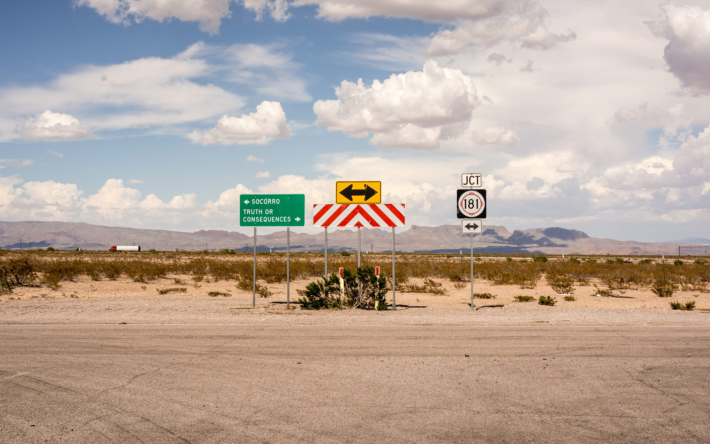
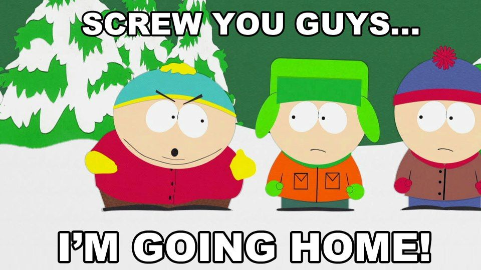
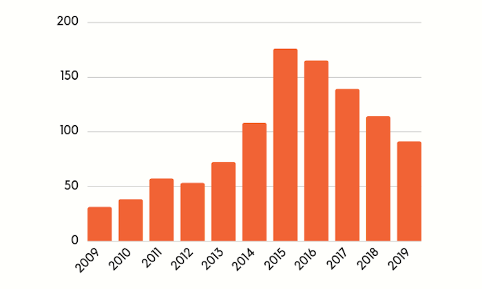

Photo by <a href="https://unsplash.com/@lox?utm_source=unsplash&amp;utm_medium=referral&amp;utm_content=creditCopyText">Lachlan Donald</a> on <a href="https://unsplash.com/s/photos/crossroads?utm_source=unsplash&amp;utm_medium=referral&amp;utm_content=creditCopyText">Unsplash</a>

The software has poured into almost all areas of our lives throughout the
years. It remembers phone numbers of our loved ones, it finds the best route to
a well-reviewed restaurant we want to eat in, and many many more things. This
ever-presence of software engineering in our day-to-day things brings all
kinds of questions on what is ethical and what is not.

The topic of ethics is significant for us programmers (developers) who
produce living and breathing pieces of code every day. Those pieces of code can
change and affect other people's lives. So, is being ethical in your work worth
it? And what to do when presented with questionable requirements from your
superiors?

These are all hard questions and topics, but let's try to break them together.

## To Bully, or To Be Bullied

I recently came about a tweet where a company was being called out for planning
to build features that would do surveillance on their users. Here's the [tweet](https://twitter.com/dhh/status/1336266946044686337):

<blockquote class="twitter-tweet tw-align-center">
The surveillance regime marches on. This is Clockify promising a road map of ever-more oppressive and dehumanizing tracking of employees. If we&#39;re just being HONEST here, I&#39;d like to see this blown into a million bits. Source code encrypted and the key lost. Just awful. <a href="https://t.co/OfnjKn6dDp">https://t.co/OfnjKn6dDp</a>
&mdash; DHH (@dhh) <a href="https://twitter.com/dhh/status/1336266946044686337?ref_src=twsrc%5Etfw">December 8, 2020</a></blockquote> 

A company named Clockify, which provides time-tracking features to their users,
exposed a road-map where they will do screenshots and GPS tracking of their
users. Of course, somebody took the picture in the tweet out of context. The
idea was to provide these features to only some portion of their users who
would pay for them. I am not saying it to justify the features they
are adding, just trying to put more context into the conversation.

Of course, the idea of watching over someone while they work is appalling to me,
and I would never work or run a company that does this. What's more
intriguing to me is the dilemma of what do you do when you work for such a company. We will
always have some persona on social media that will bash the shit out
of ideas like user surveillance, but what can a ground-level developer like
you and me do in this situation?

Let's say you work in that company, and someone asked you to build a feature that
tracks what users do on their computers. Would you stand up and say a hard 'no'
to the management? Or, would you nod your head and leave a 👍 reaction.
Answering this question is hard. But to make it a bit easier, I would like to
remind you that even as an engineer, you can be held accountable, even though
you are not the 'mastermind' behind all of it.

I'm not trying to scare you or anything, but did you know that Volkswagen's
engineer got sentenced to more than three years in prison for being involved in a
scheme that allowed VW to sell diesel cars that generated more pollution than
it was allowed? You can read all about it [here](https://www.reuters.com/article/us-volkswagen-emissions-sentencing/vw-engineer-sentenced-to-40-month-prison-term-in-diesel-case-idUSKCN1B51YP).
You decide if it was worth it for that guy.

## Taking the oath

No matter what job you do as a developer. You had to start somewhere. Some
folks took the university route. Some did the online courses at
home and honed their craft. But no matter what you did, rarely anyone had a
class or a course to them a thing or two about ethics.

In other professions, such as have their documents with core values and
standards. The most famous one is, of course, the Hippocratic oath medical
doctors need to take. Doctors promise to care responsibly for their patients
and learn ethics as part of their education. It is crucial for doctor's
patients to feel confident that the doctor has their best interest at heart.

We should have something similar in our line of work but applied
more often. There are a couple of examples where people put together documents
that describe what ethics for software engineers is. For example, the world's
largest educational and scientific computing society - ACM - has a
[Code of Ethics and Professional Conduct](https://www.acm.org/code-of-ethics).
Check it out, it is an interesting read.

I am not saying that enforcing all computing professionals to take some oath
will drop the surveillance or other unethical software to drop to
zero. People will try to go out of the way whatever we do. What we need to do
instead is to teach about ethics in computer science **more** since our actions
can impact the world more than ever.

## Field studies

An interesting thing I found is that StackOverflow asked a couple of questions
about ethics in 2018 (now two years ago). It turns out that most of the developers
(58.5% to be precise) back then said that they would refuse to write code for
an unethical purpose. Also, a huge portion (almost 80%) said that developers have an
obligation to consider the ethical implications of their code, which is relieving.

Alongside these numbers of ethics awareness, there were a lot of ethical grays.
Devs are not entirely sure who would they report ethical problems. Furthermore,
developers think differently about who is ultimately responsible
for the unethical code. Right there, in those two spots, I see a lot of room for
improvement. There is potential to educate companies and teams and have go-to
persons to report unethical claims in establishments.

I wonder how the survey would perform if the same questions get asked this year. If
you're interested in the survey, you can check it out
[on StackOverflow here](https://insights.stackoverflow.com/survey/2018/#ethics).

## So, is it worth it?

Well, it depends on who you ask. If you are a person responsible for a company's income,
your best interest is to see trends on charts go in the upwards
direction. How you do it, it might now be the most ethical way, but you are
still crushing it. Or are you?

I am going back to the example of the Clockify (or Hubstaff, or any other time-tracking)
product. The new features that go over the ethics will probably be the most
expensive ones, and could provide more profit for the company. Is that a good
thing? Not always, I believe. If you're chasing to increase those fancy
acronyms (ARR and MRR) and do not care about the ethics (and the world) - then
I think it is not a good thing.

Yes, the income will come quicker, but the broader impact on the world can be
detrimental. Imagine if all the time-tracking companies will slowly move to
this approach and that surveillance will become the norm in these apps.

So, in the end, no, I **do think being ethical in your work is worth it**. Maybe
not in a quantifiable way or in a way where you can plot a chart and show it to
your manager. Definitely, the actions you decide to take or not to take can
impact those around you. I feel that the fact that we can influence other
people's lives is something we, as programmers, often overlook. And we shouldn't
do that, because what's most important to remember is that we are all in this
together.

## Action points

Where to go now? I recommend reading or going through a couple of resources here:

- [Programming ethics on Wikipedia](https://en.wikipedia.org/wiki/Programming_ethics) - provides a good summary
- [ACM Code of Ethics](https://www.acm.org/code-of-ethics) - in-depth example of an ethics code
- [The Clean Coder: A Code of Conduct for Professional Programmers](https://www.goodreads.com/book/show/10284614-the-clean-coder) - great book overall
- [What It Takes To Be an Ethical Programming Professional](https://simpleprogrammer.com/ethical-programming-professional/) - an insightful blog post
- If going through an online course is your thing, maybe try one of those

Remember, being ethical won't be easy, and it won't look great at times. The
most critical takeaway from this post is to spend time to set up your ethical
boundaries. From then on, it is easier to have conversations and ask questions
like - "is this in the best interest of our users?" and "how does this affect
our organization's reputation?".

I hope this post brought some insight or, at least, reminded you that something
like ethics still exists in our profession. If you like topics like these,
consider [subscribing to the newsletter](/newsletter).

Also, you can discuss and share this post on Twitter with friends and coworkers:

<blockquote class="twitter-tweet tw-align-center">
A new blog post about ethics 🧑‍⚕️  Were you ever asked to do something unethical at your work?<a href="https://t.co/XzicHONt1A">https://t.co/XzicHONt1A</a>
&mdash; Nikola Đuza (@nikolalsvk) <a href="https://twitter.com/nikolalsvk/status/1338783494118518784?ref_src=twsrc%5Etfw">December 15, 2020</a></blockquote> 

Until the next one, cheers!
