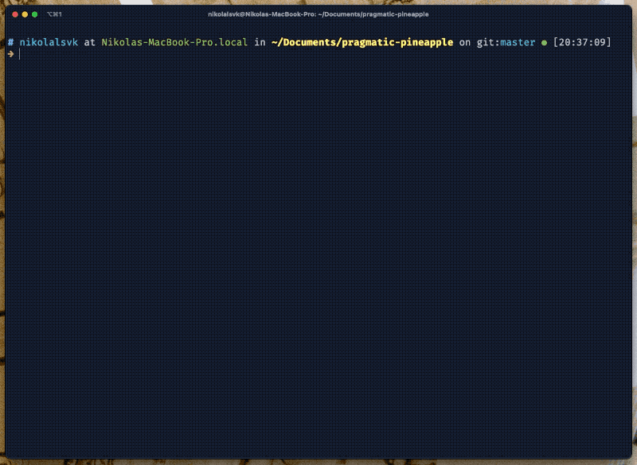
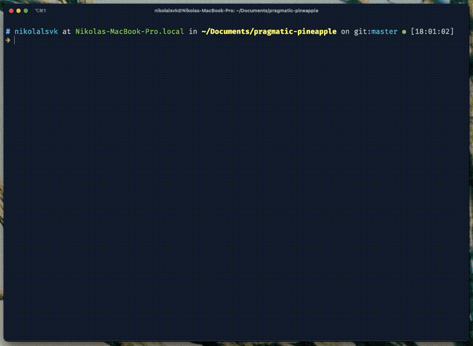
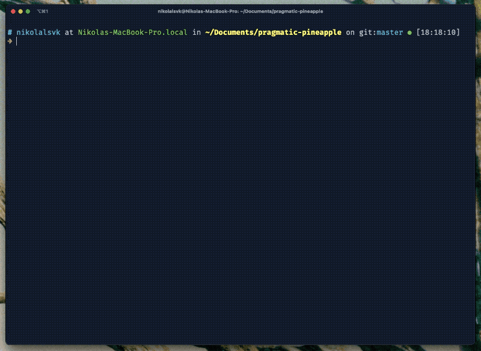
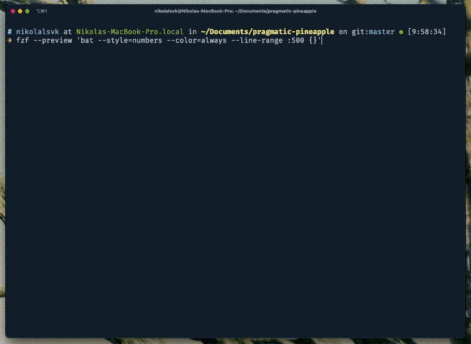

Welcome, you are probably interested in using one of the best tools for command-line - fzf. fzf is a command-line tool for fuzzy searching. Well, at first, it might sound that not attractive. But, bear with me, it is very sexy, and it will make your life easier while leaping through your shell.

I prepared four tricks that you can keep up your sleeve whenever you are inside the terminal. But first, let's go over how we can set up fzf.

<figure>
  
  <figcaption class="photo-caption">
  Photo by <a href="https://unsplash.com/@devano23?utm_source=unsplash&utm_medium=referral&utm_content=creditCopyText">Devon Janse van Rensburg</a> on <a href="https://unsplash.com/s/photos/trick?utm_source=unsplash&utm_medium=referral&utm_content=creditCopyText">Unsplash</a>
  </figcaption>
</figure>

## Getting started

If you haven't already, you can install fzf using Git:

```bash
git clone --depth 1 https://github.com/junegunn/fzf.git ~/.fzf
~/.fzf/install
```

I found it the most straightforward. Or, if you are on macOS and want to skip all the fuss, you can use the following command:

```bash
brew install fzf

# To install useful key bindings and fuzzy completion:
$(brew --prefix)/opt/fzf/install
```

If you're still having trouble, try out the [fzf docs about installing](https://github.com/junegunn/fzf#installation).

### Mic Check

After installing, let's go and try the basic fzf functionality. You can try to run `fzf` inside your terminal. You should see something like this:



The fuzzy finder launches across your terminal window, and you can search for whatever file you want. The cool thing is that fzf if indexing files as you type. If your directory doesn't have much complexity regarding files and dirs, you won't notice the indexing at the bottom.

## 1. Fuzzyily Change Directories

The first trick today is using fzf to quickly `cd` into a directory. You can press `ALT + c` (`OPTION + c` on macOS), and you will get an interactive prompt. Take a look below:



It starts indexing the contents of all the directories that are inside the one you are in right now. You can start typing for the wanted directory, select the one you need with arrow keys, and press the enter key to get into it. Convenient, right?

## 2. Swoosh Through History

The second trick and one of my favorites, to be honest, is the ability to search through the command history with fzf. To get started, press `CTRL + r` in your terminal. Then, search for a command you typed previously. You should see something like this:



You can quickly jump to the command you typed some time ago. I find it super useful on a day-to-day basis.

## 3. Autocomplete Anything

You can utilize fzf almost anywhere in your terminal. One of the default features is to allow you to find the process to kill quickly. You can try it out by typing `kill -9` and pressing `TAB`. If that doesn't work, type `kill -9 **` and `TAB`. You can now search for the process or multiple processes you want to end.

You can also quickly search through hostnames to SSH. To do this, type `ssh **` and press `TAB`. You will get the interactive search to find the wanted hostname.

To sum up, here are some of the options you can use by default:

```bash
kill -9 **<TAB>

ssh **<TAB>
telnet **<TAB>

unset **<TAB>
export **<TAB>
unalias **<TAB>
```

If you get tired of typing `**`, you can change the fzf trigger by setting `FZF_COMPLETION_TRIGGER` variable. For example:

```bash
# Use ~~ as the trigger sequence instead of the default **
export FZF_COMPLETION_TRIGGER='~~'
```

If you want to take this to the next step, try out the [fzf-tab](https://github.com/Aloxaf/fzf-tab) plugin. I am using zsh and oh-my-zsh, so it was pretty straightforward to set up. The plugin basically "plugs in" fzf into your default tab completion. I suggest you try it out.

## 4. Preview Files Before Selecting Them

Another cool thing to try out is the preview feature of the fzf. It allows you to preview files before you open them. To access it, you need to pass `--preview-` to fzf. Let's see it in action:



The command I call is:

```bash
fzf --preview 'bat --style=numbers --color=always --line-range :500 {}'
```

But you can customize this all you want. My command uses the `bat`, the `cat` clone you can find on [GitHub](https://github.com/sharkdp/bat). You can also go with the simple `cat` command like so:

```bash
fzf --preview 'cat {}'
```

Or, if you want to push this a bit more, you can set the default preview options when completing specific commands. You can show the tree view of the directories and files like so:


You can achieve the similar using the power of the `tree`. I had to install it on macOS with `brew install tree`. Then, I added the `_fzf_comprun` function to load on shell initialization (you can add it in `.bashrc` or `.zshrc`). Here is how it looks:

```bash
_fzf_comprun() {
  local command=$1
  shift

  case "$command" in
    cd)           fzf "$@" --preview 'tree -C {} | head -200' ;;
    *)            fzf "$@" ;;
  esac
}
```

You can add more cases with more commands if you'd like because you might want the different commands to show the preview in other cases. For example, `cat` and `bat` will work well for files but not for previewing directories and hostnames to SSH into.

## 5. BONUS: Integrate with Vim

If you're already using Vim (or you're planning), I must tell you that fzf fits with Vim perfectly. The fuzzy search, preview windows, and customization options are so lovely you'd going to wish to have it in every other situation.

If you're interested in setting up Vim and fzf, check out my blog post about [improving Vim workflow with fzf](https://pragmaticpineapple.com/improving-vim-workflow-with-fzf/). Also, I maintain and add new features to my [dotfiles on GitHub](https://github.com/nikolalsvk/dotfiles) if you're interested in my setup.

## Sum Up

fzf is a great tool to have in your toolbelt, especially if you're dwelling inside the terminal. I hope this blog post taught you something new or inspired you to try some of these tricks.

If you liked what you read, consider subscribing to my [newsletter](/newsletter) to get updated when a new post comes up. Also, you can comment, like, or share this with your friends on Twitter below:

<blockquote class="twitter-tweet tw-align-center"><p lang="en" dir="ltr">You can never get enough of command-line tricks up your sleeve<br><br>Check out some of the fzf tricks in the new blog post 👇<a href="https://t.co/RRuiH0BZpB">https://t.co/RRuiH0BZpB</a></p>&mdash; Nikola Đuza (@nikolalsvk) <a href="https://twitter.com/nikolalsvk/status/1407265629040676864?ref_src=twsrc%5Etfw">June 22, 2021</a></blockquote> <script async src="https://platform.twitter.com/widgets.js" charset="utf-8"></script>

Catch you in the next one, cheers.
