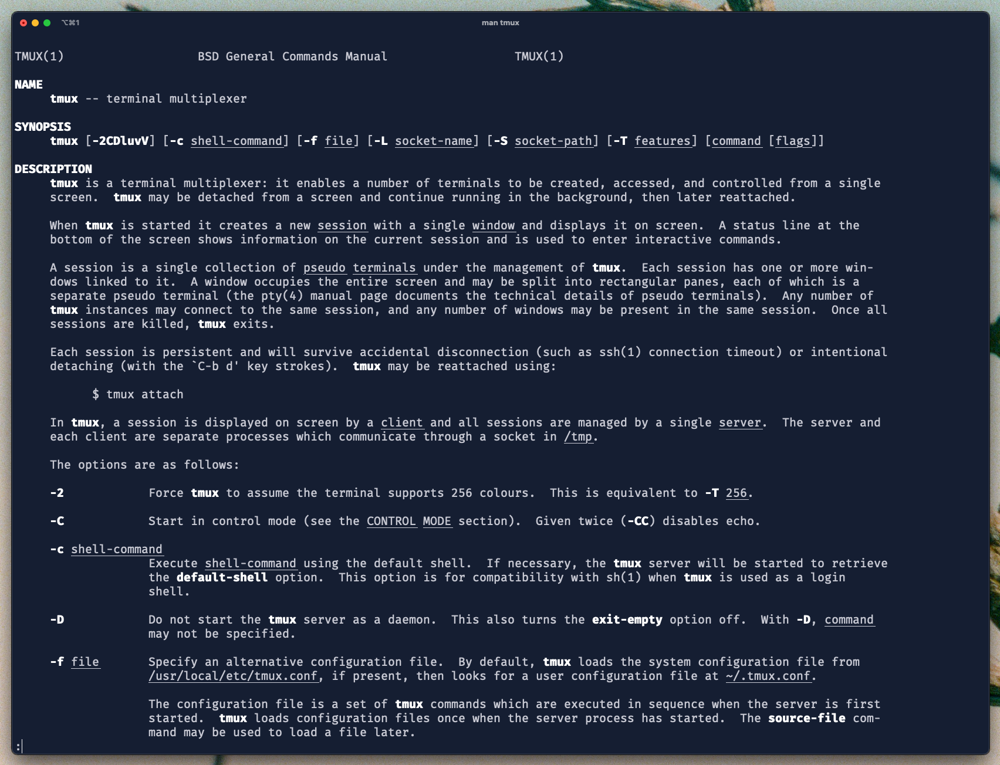
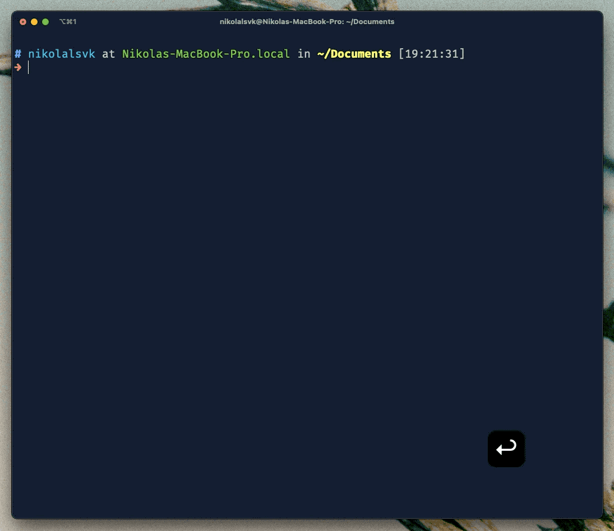
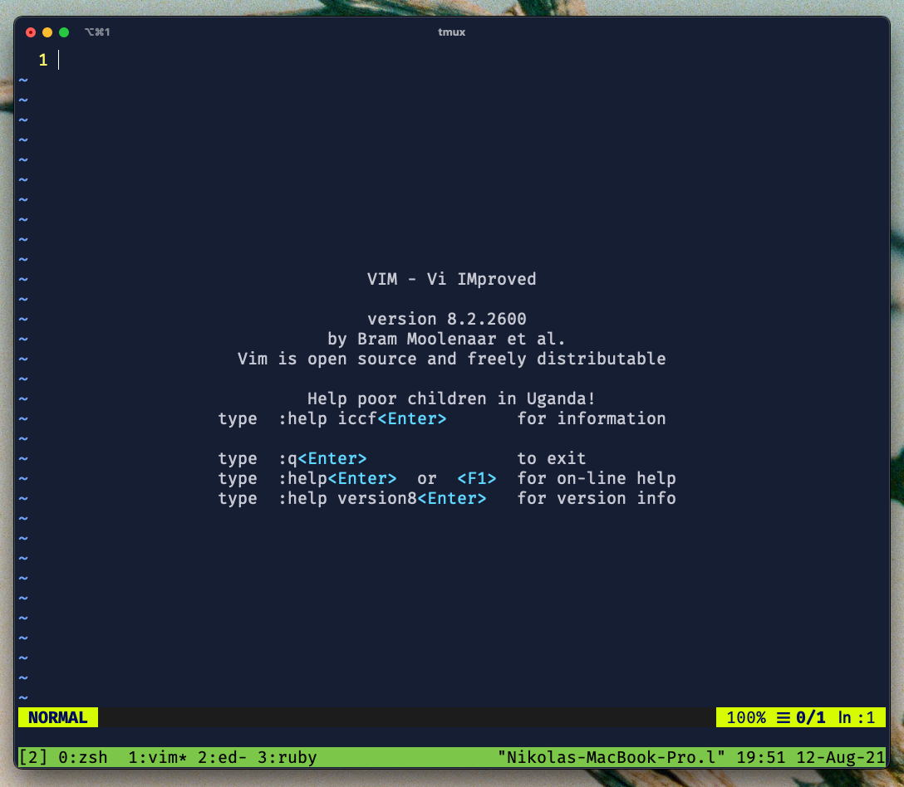
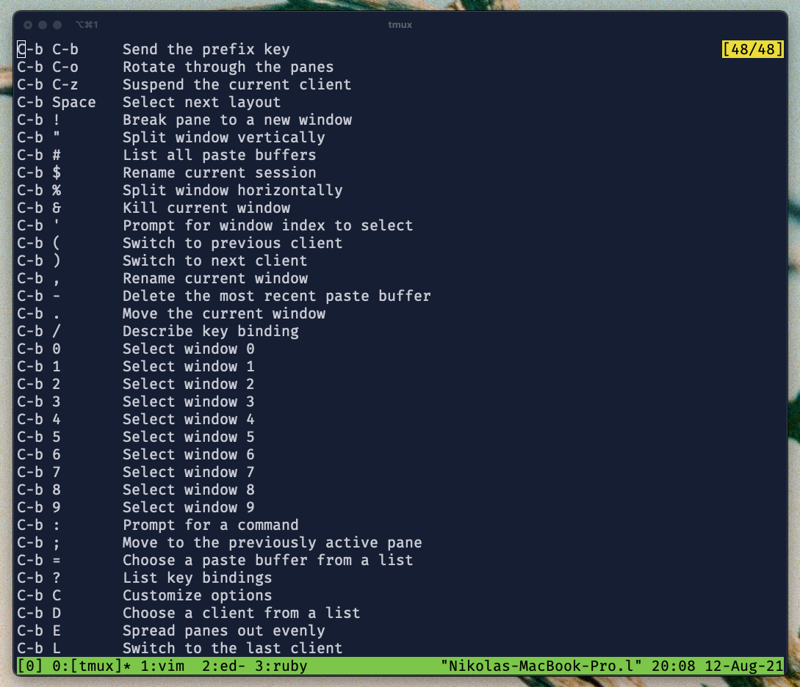

You ended up here probably because you are looking to level up your command line skills. And that's fine, it is the exact same reason I am writing this blog post. Since I began learning how to program, I've been a terminal dweller, and it's been great. I always feel at home when I log into my shell. Today, our terminal experience will feel even better. We will level up our knowledge and our toolbelt with a great tool called tmux.

</figure>
  
  <figcaption class='photo-caption'>
  Photo by <a href="https://unsplash.com/@diskander?utm_source=unsplash&utm_medium=referral&utm_content=creditCopyText">David Iskander</a> on <a href="https://unsplash.com/s/photos/get-started?utm_source=unsplash&utm_medium=referral&utm_content=creditCopyText">Unsplash</a>
  </figcaption>
</figure>

## What is tmux?

tmux is a terminal multiplexer, meaning it is a window manager within your terminal. It allows you to open multiple windows (sessions) within one terminal window (session). So it enables other programs to run from it, allowing you to manipulate them easily. Most of the folks find that one of the features to use tmux on a daily basis.

But, besides being a window manager, tmux can also do the following:
Protect running programs on a remote server from connection drops by running them inside tmux. We've all been there - you connect to a server, you go to get your coffee/lunch, you come back, and the session is frozen or unresponsive.
Allow a user to access programs running on a remote server from multiple different local computers.

Today, we are going to focus on the window manager aspect of tmux. In a future blog post, we will cover some advanced usages of tmux and how it can benefit you.

## Installing

You can install tmux using package managers on all major platforms, but let's cover some of the most famous ones. On Debian or Ubuntu, you can do the following:

```bash
apt install tmux
```

On Mac OS, you can use brew:

```bash
brew install tmux
```

To check whether you succeeded in the installation, let's try to read man pages for tmux with:

```bash
man tmux
```

If you get something like this:

<figure>
  
  <figcaption class='photo-caption'>tmux Manual</figcaption>
</figure>

You're good to go.

## Starting tmux

We can start tmux by using the `tmux` command in our terminal to see what it's all about. After that, you can see that everything stayed the same, except the green line at the bottom. What happened here is that we
connected to a tmux server as a client. tmux runs a server on a specific PID in the background, and when we type `tmux` we run the server automatically.

So we are connected to the tmux server from a session named 0, as you can see in the `[0]` portion of the screen. So tmux acts as sort of a layover of the standard terminal session. Let's have a look at what you get when you enter a tmux session:

<figure>
  
  <figcaption class='photo-caption'>start of a tmux session</figcaption>
</figure>

At the bottom left, you see the `[0]`, which represents the session. Right next to it is the `0:zsh` showing which window is open and what program is running there. We just started this session, so we only have one window open, and zsh is running there.

You can go on and use the terminal as you usually use it, but that would be just plain boring, right? Let's learn a thing or two we can do as beginners in tmux. I'd like us to go through the process of creating and moving through panes in tmux.

## Pane Management

If you've used iTerm2 and utilized pane splitting there, you will like this feature a lot. It is pretty much the same in tmux, with the only difference being the shortcuts you use to create new panes. In iTerm2, you can do `cmd + d` and `cmd + shift + d` to split panes vertically and horizontally.

### Creating Panes

In tmux, you can do it with `Ctrl-b %` for a vertical split and `Ctrl-b "` for a horizontal one. You will see that all shortcuts start with `Ctrl-b` or `C-b` for short. To make `C-b` shortcuts work, you need to press the control key and b key at the same time, then you can press the following character or a symbol like `"` to split horizontally. for example. `C-b` signals tmux that you are about to send a shortcut its way. Let's try out this feature together below:

<figure>
  
  <figcaption class='photo-caption'>How to split panes in tmux</figcaption>
</figure>

If you're not a fan of shortcuts for some reason, you can type `tmux split-window -h` to do a horizontal split and `tmux split-window -v` to do a vertical split.

### Moving Around the Panes

We might've pushed it too much in the GIF above, but you get the idea. Now, for the most important part - how to move around? Don't worry, it's easier by default than in iTerm2. You use `C-b` and arrows left, right, up, and down. So `C-b Arrow-Left` `C-b Arrow-Right` and so on.

### Closing Panes

If you finish with one pane, just press `Ctrl-d`, and it will get closed.

Now let's try to create a new window.

## Window Management

A window in tmux is similar to a tab in iTerm2, pretty much. It's a new canvas for you to split it into panes and run commands. You must be asking - how do I create one?

### Creating Windows

Just do `C-b c`, and a new window will form. You can try it out a couple of times. I did a similar thing, except I opened a program in each window to see the difference together. Let's have a look below:

<figure>
  
  <figcaption class='photo-caption'>Windows in tmux</figcaption>
</figure>

You can see the following text at the tmux status line:

```bash
0:zsh  1:vim* 2:ed- 3:ruby
```

The `0:zsh` presents the first window where just the zsh is running. The `1:vim*` lets us not that in the second window, we have Vim running, and the asterisk `*` shows us it's the active window. The `2:ed-` does the same, except the dash `-` shows us it's the last window. Another question imposes on itself right now - how do we change windows?

## Navigating Through Windows

No worries, I got you. You can change windows in multiple ways, but I find this one most effective. You can use the combination of `C-b` and index of a window, e.g. `C-b 1` to go to the window marked as 1 in the tmux status line. So `C-b 0` in our case will open the window with zsh open since it shows like `0:zsh` in the tmux status line at the bottom of the screen.

You can also use `C-b p` for a previous window, `C-b n` for the next window, and `C-b l` for the last window (this is where that dash `-` comes to play from the section above).

## tmux Sessions

tmux wouldn't be great with its flexible session. You can attach and detach from a session anytime you want. Most of the folks praise tmux for its session management. Imagine sessions as different areas of work you do. For example, one session can relate to your private web project where you run frontend, backend, editor, tests, and so on. Another session can be an SSH session on some server where you are messing around with infrastructure.

### Attaching and Detaching From Sessions

To feel the power of sessions, you can start tmux in another terminal window or a tab (assuming you have one session running from the examples above). If you now press `C-b d` you should see the following:

```bash
$ tmux
[detached (from session 1)]
```

Cool, we detached from the session we just created. Now in that same terminal window, type `tmux ls`:

```bash
$ tmux ls
0: 4 windows (created Thu Aug 12 20:08:22 2021) (attached)
1: 1 windows (created Thu Aug 12 20:15:03 2021)
```

The first session marked with 0 shows that we have four windows open, and we are attached to it. But the second session marked with 1 (one) is not attached. With the `C-b d`, we detached from the session marked with 1, and we used `tmux ls` to list all the available sessions. How neat, now we can organize our work even better.

If you don't like the default naming of sessions with numbers like 0 and 1, you can always give your session a name by using `tmux new -s heythere`. Now the created session will get `heythere` name. We can see that by detaching (`C-b d`) and running `tmux ls` again:

```bash
$ tmux ls
0: 4 windows (created Thu Aug 12 20:08:22 2021) (attached)
1: 1 windows (created Thu Aug 12 20:15:03 2021)
heythere: 1 windows (created Thu Aug 12 20:21:09 2021)
```

We can then attach to the `heythere` session easily with:

```bash
tmux attach -t heythere
```

And we're back in the `heythere` session. Pretty cool, right? I think that's enough for one. We got a lot to process and use in our terminal. I decide we gather back and try to use this for a couple of days or weeks.

## Final Thoughts

And that should be it for getting started with tmux. I want to mention one thing that might help you and me out until the next blog post. If you ever get lost or forget about shortcuts, there's `C-b ?` shortcut that shows a list of commands you can use. Here's how it looks:

<figure>
  
  <figcaption class='photo-caption'>tmux help screen</figcaption>
</figure>

Also, another great thing to check out if you're using iTerm2 is its integration with tmux. More to read in [iTerm2 docs](https://gitlab.com/gnachman/iterm2/-/wikis/TmuxIntegration).

I plan to write a follow-up blog post with some advanced usages of tmux. If you liked this one and want to see another blog post, consider joining the [newsletter](./newsletter), it will get you notified when it's out.

As always, don't forget to share it with your friends or coworkers. Here's a tweet you can message, like, retweet, ignore, or whatever you please:

<blockquote class="twitter-tweet tw-align-center"><p lang="en" dir="ltr">Ever wanted to learn tmux? Here&#39;s your chance now.<br><br>I wrote a simple getting started guide 👇<a href="https://t.co/YdRNXQzGBu">https://t.co/YdRNXQzGBu</a></p>&mdash; Nikola Đuza (@nikolalsvk) <a href="https://twitter.com/nikolalsvk/status/1427245178792955905?ref_src=twsrc%5Etfw">August 16, 2021</a></blockquote> <script async src="https://platform.twitter.com/widgets.js" charset="utf-8"></script>

Thanks for joining, and I'm looking forward to seeing you in the next one.

Cheers.
