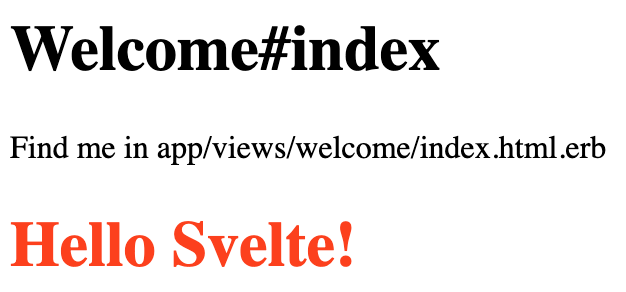

Svelte is slowly rising to fame these days and it’s getting more and more traction with new version 3 being released in April. If you’re interested in how to get started with Rails and Svelte, this is the right post for you! We’ll go through the whats, the whys, and the hows between the two.


<div class="photo-caption">
Photo by <a href="https://unsplash.com/@joannakosinska?utm_source=unsplash&utm_medium=referral&utm_content=creditCopyText">Joanna Kosinska</a> on <a href="https://unsplash.com/s/photos/start?utm_source=unsplash&utm_medium=referral&utm_content=creditCopyText">Unsplash</a>
</div>

## What is Svelte?

Svelte is told to be a new kid on the block that is different from its colleagues — React and Vue.js. Key difference between the two and Svelte, is that Svelte doesn’t use virtual DOM technique to update your app when state changes. Instead, Svelte writes code that “[surgically updates the DOM when the state of your app changes](https://svelte.dev/)”. That sounds pretty assuring, but what does it really mean?

Svelte does its magic **during build time**, where it compiles your components into efficient JavaScript code. That compiled code makes the fewest possible DOM operations. Result of Svelte compilation is [high performant imperative and pure code](https://svelte.dev/blog/svelte-3-rethinking-reactivity). You could say that Svelte is a compiler because it turns Svelte components into imperative JavaScript code.

BTW, [Svelte is pronounced “svelt”](https://youtu.be/AdNJ3fydeao?t=437) and it’s an adjective meaning attractively thin, stylish and graceful.

## Why use it with Rails?

Rails is not the fastest framework out there, but is pretty known to be [“fast enough”](https://m.signalvnoise.com/ruby-has-been-fast-enough-for-13-years/). Meaning it will give you a lot of traction if you’re starting out a project. Developing features in Rails is pretty fast, there are tons of resources that will help you out and the learning curve is gentle.
But also, I’d say why not? Svelte promises high performance, and Rails is fast enough. Combining the two could be interesting and a pioneering move. I’m using it in my pet project and I’m happy with both right now.

## How to get started with Svelte and Rails?

Before we dive into how to get two of them working, here are some requirements that you’re supposed to have:

- Rails 6 and Ruby 2.5.1 ([GoRails guide to installing these](https://gorails.com/setup))
- NodeJS and Yarn ([Yarn installation guide that will also install NodeJS](https://yarnpkg.com/lang/en/docs/install/))

Ensure that you have these available in your environment and continue.


OK, now that you’ve installed everything that’s needed, we can go ahead and jump into our first step.

## Generating Rails application

We will use Rails’ command to generate our app that will use Svelte.

```bash
rails new rails-6-svelte
cd rails-6-svelte
```

We can go ahead and check whether everything is alright by running Rails server:

```bash
rails server
```

And visiting http://localhost:3000. You should see “Yay! You’re on Rails!” page. Pretty nice, let’s move on.

## Installing Svelte into Rails app

Now we need to install Svelte into our fresh Rails application. An easy way to do this is to use webpacker gem which is already installed in our Gemfile. At the time this post was written, support for Svelte is not yet published, but it’s available on the gem’s GitHub repo here https://github.com/rails/webpacker.

In order to have these changes in our project right now, we need to install the gem from GitHub repo directly. To do this, you can open up your Gemfile in file editor and swap this line:

```ruby
g̵e̵m̵ ̵'̵w̵e̵b̵p̵a̵c̵k̵e̵r̵'̵,̵ ̵'̵~̵>̵ ̵4̵.̵0̵'̵
gem 'webpacker', git: 'https://github.com/rails/webpacker'
```

Then run `bundle install`, wait for the command to finish, and we’re ready for our next step.

In order to install all the needed dependencies and files to run Svelte in our Rails project, we can use webpacker’s task that will do this for us. Run

```bash
rails webpacker:install:svelte
```

Awesome! Now our project has Svelte! Let’s actually use it.

## Rendering of simple Svelte app

As you see in your console, previous command generated and modified couple of files. Some of those files are needed to properly configure and run Svelte inside our Rails app. In this post we will concentrate on 2 files:

- `app/javascript/packs/hello_svelte.js` and
- `app/javascript/app.svelte`

If we go to `app/javascript/packs/hello_svelte.js` we will see same code as in the file below:

```javascript
/* eslint no-console: 0 */
// Run this example by adding <%= javascript_pack_tag 'hello_svelte' %> (and
// <%= stylesheet_pack_tag 'hello_svelte' %> if you have styles in your component)
// to the head of your layout file,
// like app/views/layouts/application.html.erb.
// All it does is render <div>Hello Svelte!</div> at the bottom of the page.

import App from "../app.svelte"

document.addEventListener("DOMContentLoaded", () => {
  const app = new App({
    target: document.body,
    props: {
      name: "Svelte",
    },
  })

  window.app = app
})
```

The above code shows a simple setup with the app component accepting a prop of name and targets a place in the HTML file, in this case, body of a page.
Notice the comment on the second line of the file. In order to have this show up in our app, we will need to include it in the main Rails layout file. Let’s go ahead and do that. Open `app/views/layouts/application.html.erb` and put `<%= javascript_pack_tag ‘hello_svelte' %>` there. Your file should look like this:

```erb
<!DOCTYPE html>
<html>
  <head>
    <title>Rails6Svelte</title>
    <%= csrf_meta_tags %>
    <%= csp_meta_tag %>

    <%= stylesheet_link_tag 'application', media: 'all', 'data-turbolinks-track': 'reload' %>
    <%= javascript_pack_tag 'application', 'data-turbolinks-track': 'reload' %>
    <%= javascript_pack_tag 'hello_svelte' %>
  </head>

  <body>
    <%= yield %>
  </body>
</html>
```

Notice how on the line 10, we’ve added the JavaScript pack tag. This line will get picked up by webpacker gem and it will transpile Svelte code so it renders properly when we go to our website. Imagine this as a \<script\> tag that will include all our Svelte code.
If we go ahead and load http://localhost:3000, we will still see “Yay! You’re on Rails!” page which we don’t want. In order to get our Svelte app to render, we need to create Rails controller and an action. Don’t worry, this is not hard. We will use Rails’ generate command which will help us a lot.

```bash
rails generate controller welcome index
```

This will generate `WelcomeController` together with `index` action. We will use this as our root point of [our app](http://localhost:3000/). When a user visits our app, he will see this page. We just need to make one addition to `config/routes.rb` file in our app.

```ruby
Rails.application.routes.draw do
  get 'welcome/index'
  # For details on the DSL available within this file, see https://guides.rubyonrails.org/routing.html
  root 'welcome#index'
end
```

Add root `'welcome#index'` like we did on the line 4. This will tell Rails to open index action of Welcome controller when someone visits our website domain.
Now we can open http://localhost:3000 and see our Svelte app:



<div class="photo-caption">
Yaay! 🎉
</div>

We have our app show up! Finally! But we’re seeing this “Welcome#index” text on our page. This got generated when we created Welcome controller. Let’s get rid of it 🔪. Go to `app/views/welcome/index.html.erb` file and delete everything from it. Save it, and reload the page. You should be seeing just the Svelte part like this:


<div class="photo-caption">
Now we’re talking!
</div>

The actual Svelte code that’s responsible for this is inside `app/javascript/app.svelte` and it looks like this:

```javascript
<script>
  export let name;
</script>

<style>
  h1 {
    color: #FF3E00;
  }
</style>

<h1>Hello {name}!</h1>
```

All Svelte components are saved with .svelte extension. This is a typical implementation of a Svelte component which is divided into three blocks:

- Script section: This section contains the JavaScript code of the component. In this case the name variable is defined as a property (by using the export keyword).
- Style section: The style section contains CSS code which is scoped to the component.
- Template section: The template section contains the markup code (and Svelte specific enhancements) which are used to generate the HTML output of the component.

## Conclusion

And there you have it, you’ve managed to start out with Svelte and Rails 6 🎉! In the next post I’ll talk about how to create something more complex with Svelte and Rails, so click that “Follow” button.

Big thanks to Rich Harris for his work on Svelte, and of course, the rest of the contributors there. Also, this video is a great introduction to Svelte framework, also by Rich Harris.

If you find the post interesting and informative, please 👏 and spread the word. Also, check out my website and follow me on Twitter. I’ll be posting more of Rails and JavaScript related articles, so click “Follow” and stay tuned 🎥.

Also, retweeting this is a great way to help spread the word with your friends:

<div class="center-box">
<blockquote class="twitter-tweet tw-align-center"><p lang="en" dir="ltr">I just published Getting Started with Svelte and Rails 6 <a href="https://t.co/W3ktjrjZ9O">https://t.co/W3ktjrjZ9O</a></p>&mdash; Nikola Đuza (@nikolalsvk) <a href="https://twitter.com/nikolalsvk/status/1188476716882235393?ref_src=twsrc%5Etfw">October 27, 2019</a></blockquote> <script async src="https://platform.twitter.com/widgets.js" charset="utf-8"></script>
</div>

Good luck! 🍻
