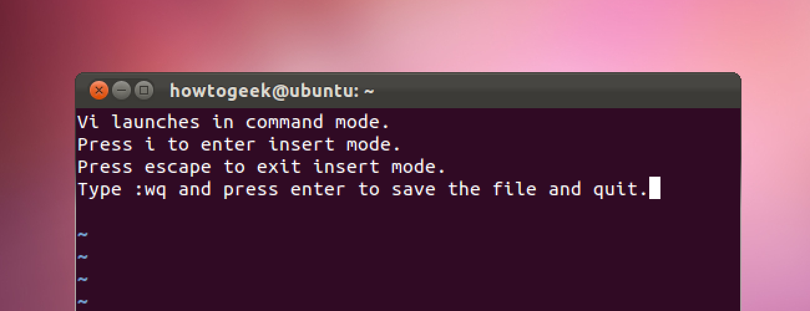

<div class="photo-caption">
  Photo by <a href="https://unsplash.com/@alvarordesign?utm_source=unsplash&amp;utm_medium=referral&amp;utm_content=creditCopyText">Alvaro Reyes</a> on <a href="https://unsplash.com/s/photos/old?utm_source=unsplash&amp;utm_medium=referral&amp;utm_content=creditCopyText">Unsplash</a>
</div>

You probably heard of Vim, the almighty text-editor that is everywhere and
a place where [people get trapped from time to time](https://stackoverflow.com/questions/11828270/how-do-i-exit-the-vim-editor).
If you are hearing from your local DevOps engineer how Vim is excellent and
fast, you probably thought about giving it a try. But how did it come
to this? How did Vim-craze take over the world at some point?

If we look at the
[StackOverflow survey for 2019](https://insights.stackoverflow.com/survey/2019#technology-_-most-popular-development-environments)
about the most popular development environments, Vim is still there on the 5th
place, with around 25% of Web Developers using it. Fifth place is pretty neat
considering the first Vim release happened almost 30 years ago (yeah, you read
that right, Vim got first released in 1991).

To better understand why and how Vim got (and is) so popular, it is best to
look into the roots of how it all started. Before `vim`, there was `vi`, before
`vi` there was `ed`. What are all these two or three letter words, and
what is the story behind it? Let us dive in and figure out.

## Punch cards and line editors

It might be apparent today why we have text editors and fully-fledged IDE
(Integrated Development Environment), but what did we have before that?
As you may know, early forms of programming involved putting [papers with
holes (punch cards)](https://en.wikipedia.org/wiki/Punched_card) inside a
computer. The order in which you placed these in was very essential. For example, this
is a picture of 4.5 megabytes data, stacked in 62500 punch cards. Imagine
dropping that and having to sort it again.


<div class="photo-caption">
  OK, mom, I'll come down, just need to re-stack my new blog post
</div>

Punch cards proved a bit inefficient as computer power and storage grew, and
programming evolved. Eventually, people moved away from punch cards, and then
there came the era of "line editors." One great example of this is an
[`ed` editor](<https://en.wikipedia.org/wiki/Ed_(text_editor)>). Let's not forget to
mention [QED editor](https://www.bell-labs.com/usr/dmr/www/qedman.html),
`ed`'s predecessor.

## Using a line editor

If you are on Linux or Mac OS, open your terminal and type `ed`. You
will get a simple line editor, which will greet you with silence.
If you are amazed by this finding (as I was), you can try playing with it for a while. To write
a file, start typing `a` and press enter, then write your text. Typing `.`
following an enter will exit the append (insert) mode. Then, to write a file, you can
type `w myfile.txt` and press enter and lastly write `q` and enter to exit.

```
# ed
a
Hey there!
I am using ed right now, how cool.
OK, that's enough.
.
w myfile.txt
64
q
```

As you may notice, there are similarities between working with `ed` and with
today's `vim`. If you use Vim, you can say you would get the hang of `ed` pretty
quickly.

## Vim's dad - The Vi

After `ed`, then came the `em` - [the "editor for mortals"](http://www.eecs.qmul.ac.uk/~gc/history/).
It could do similar things as `ed`, but it is 'less cryptic' and built for
regular people. Based on `em`'s code, Bill Joy developed `ex`, which
stands for "extended ed"! It was significant because `ex` had, besides the previous
modes, the `visual` mode, which will show the whole file on your screen. You
must be thinking - duh, how didn't they [think of that earlier](https://www.bell-labs.com/usr/dmr/www/qed.html)?
Having that thing show up on computers in those days was pretty tricky,
and some considered it a resource hog. But, at that point, the benefits had
outweighed objections, and having a file opened on your screen as you edit it
became today's standard.



And like that, the **vi**sual mode was born. Later, the executable `vi` got
introduced in operating systems, but you can still access `ex` commands by
typing `:` in `vi`/`vim`. The `ex` got released in 1976, and the `vi`
executable got released in 1979. 40-something years ago! But, how did `vim` came to life?

## The Imitation Game

A couple of years later, many `vi` clones emerged (my favorite one is
[Elvis](<https://en.wikipedia.org/wiki/Elvis_(text_editor)>)). One of them was "Vi
Improved" which was created by Bram Moolenaar - the name you now see when you
try to open `vim` in your terminal. In the large pool of different `vi` clones,
`vim` managed to stand out. Bram used a clone of `vi` called `STEVIE` (nice
name, BTW), and noticed that it lacks many of `vi`'s commands. He added
some new features and made it compatible with `vi` and released it under
the name "Vi Imitation" (this later changed to "Vi Improved"). The name `vim` came in version 2.0 in 1993 and
stayed like that until the present day. But how did `vim` achieve fame? It had a
[bunch of excellent features](<https://en.wikipedia.org/wiki/Vim_(text_editor)#Features_and_improvements_over_vi>)
at that time, and it was compatible with `vi`. Features and compatibility attracted a lot of folks to use it.

## Half a century of contributions

If you take a look at the essential commands to move around in Vim: `h`, `j`,
`k`, and `l`, these all pull roots from the old `vi` days. Bill Joy's
[keyboard at that time](https://en.wikipedia.org/wiki/ADM-3A)
didn't have cursors to move around. Also, the `ESC` key was in the place
of today's `TAB` key. Take a look at how it was back in the day:


Commands to replace text like `:%s/text_to_replace/text_to_replace_it_with/` is
also something from that era. Having to type `:` to perform a command
was an answer to `ed`'s complete silence when you first enter the editor.

What I am trying to say that `vim` is an effort of over half a century of
good idea accumulation, putting lots of effort into being backward compatible.
Yes, useful features probably made Vim famous. But what kept Vim in the loop is
the compatibility with almost everything you can think about. Wherever you SSH
today, you can start the Vim session, or at least Vi session. That is a strong
(if not the strongest) point to learn it nowadays.

If you're not someone who jumps from server to server and navigates files on
there, the point of having Vim everywhere doesn't bother you. But
still, there are a couple of reasons why it might be valuable to you. I am forming
a new blog post explaining why you should learn Vim in 2020. If you are interested
in this, consider subscribing to the [newsletter](/newsletter).

## Final thoughts

Thanks for reading this far, I appreciate it. I hope this blog post shed some
light on how Vim became what it is today. I also hope the post inspired you to
try it out. You never know when you might need it, or you like it so much that
you decide to switch to using Vim fully.

Maybe you get a Vim mode inside your IDE or VSCode, who knows. I am not saying
that Vim should replace what you are using now, but trying to learn and
configure it will improve your skills and abilities. On the other hand, it doesn't really
matter what editor you use, it is what you do with it!

At the end of the day, it's the matter of finding the proper editor
(tool) that makes you do what you do even better.

If you liked the blog post, you can share it with your friends and coworkers below:

<blockquote class="twitter-tweet tw-align-center"><p lang="en" dir="ltr">I just published a new blog post on the history of Vim and why it became popular. Also, there&#39;s an origin story on why you can use h, j, k, and l to move around in Vim. Check it out ⏬<a href="https://t.co/S3p50cgYPW">https://t.co/S3p50cgYPW</a></p>&mdash; Nikola Đuza (@nikolalsvk) <a href="https://twitter.com/nikolalsvk/status/1277888730414669825?ref_src=twsrc%5Etfw">June 30, 2020</a></blockquote> <script async src="https://platform.twitter.com/widgets.js" charset="utf-8"></script>

Thanks for reading, catch you in the next one, cheers 🍻

There is a translation in [Japanese](https://article.auone.jp/detail/1/3/7/48_7_r_20200704_1593864043058056) and
[Chinese](https://www.eet-china.com/mp/a21872.html).
You can also read the discussion on [HackerNews](https://news.ycombinator.com/item?id=23689091).
