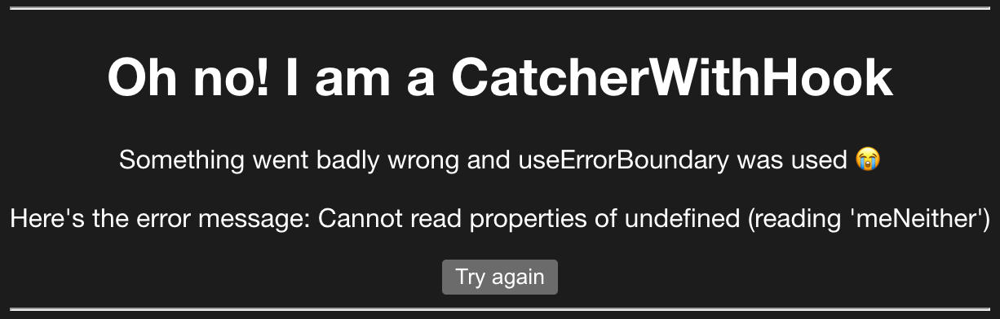

To error is human. It happens all the time. If we don't account for errors on our websites, then our users will get an awful browsing experience. That's why it is better to plan for errors to happen and let users still be able to browse through the site.

In today's post, we'll go through different ways to handle errors in React applications.

## Catching Rendering Errors

Since Preact is a lightweight React alternative, similar rules from React world also apply here. You can't use the classic `try...catch` method of resolving errors while rendering because it's meant to handle imperative code.

But, what is a typical rendering error - you're probably asking. Imagine a component like this:

```jsx
import { h } from "preact"

const CrashableComponent = (props) => {
  return <>{props.iDontExist.meNeither}</>
}

export default CrashableComponent
```

If we try to render `CrashableComponent` on its own, it will break the page, leaving the user stranded. Also, we'd get a similar error in the browser console as below:


So the classic `try...catch` won't do any good here. What will do the job and ensure the page is still usable when an error like this happens? To properly handle **rendering** errors in Preact, you can use these two approaches:

1. Using componendDidCatch
2. Using useErrorBoundary hook

We'll go through both in the following sections.

### 1. Catching Rendering Errors Using componentDidCatch

One way to handle errors is to create a class component that implements `componentDidCatch` lifecycle method. It can look something like this:

```jsx
import { h, Component } from "preact"

class Catcher extends Component {
  constructor() {
    super()
    this.state = { errored: false, error: null }
  }

  componentDidCatch(error) {
    this.setState({ errored: true, error })
  }

  render(props, state) {
    if (state.errored) {
      return (
        <>
          <h1>Oh no! I am a Catcher</h1>
          <p>Listen up, something went badly wrong 😭</p>
          <p>Here's the error message: {state.error.message}</p>
        </>
      )
    }

    return props.children
  }
}

export default Catcher
```

Then, we need to wrap our problematic component or components with the `Catcher` component like so:

```jsx
<Catcher>
  <CrashableComponent />
</Catcher>
```

Now, when we render the page, it will work and show the fallback code we defined in the `Catcher` component like so:


The error handling using `componentDidCatch` will work for any error in the child components. Some folks put a global error catcher that wraps most of the application as a root or near-root component.

What is great about this approach is that you can write any logic you want in the `componentDidCatch`. A good idea would be to push the error to an error-tracking service like AppSignal. Here's an example

```
componentDidCatch(error) {
  appsignal.sendError(error)
}
```

We can also use one more way of handling rendering errors in Preact.

### 2. Catching Rendering Errors Using useErrorBoundary Hook

Preact also exports a hook you can use to catch an error and also easily gives a user chance to retry again. The hook is called `useErrorBoundary` and you can use it like so within a component:

```jsx
const [error, resetError] = useErrorBoundary()
```

To better illustrate, let's create a functional component in Preact that handles errors for us:

```jsx
import { h } from "preact"
import { useErrorBoundary } from "preact/hooks"

const CatcherWithHook = (props) => {
  const [error, resetError] = useErrorBoundary()

  if (error) {
    return (
      <>
        <h1>Oh no! I am a CatcherWithHook</h1>
        <p>Something went badly wrong and useErrorBoundary was used 😭</p>
        <p>Here's the error message: {error.message}</p>

        <button onClick={resetError}>Try again</button>
      </>
    )
  }

  return props.children
}

export default CatcherWithHook
```

What we got is the `CatcherWithHook` component that is leaner than the original `Catcher` with `componentDidCatch` implementation. Also, using the `useErrorBoundary` is more convenient because it takes care of the `resetError` part for you. With `componentDidCatch`, you have to manually take care of the state and its reseting.

To make sure errors are caught, we need to wrap the problematic code with the new component we made:

```jsx
<CatcherWithHook>
  <CrashableComponent />
</CatcherWithHook>
```

Now, when we render the page, it will show a fallback message and a button to retry the rendering like so:



The same rule applies here - any rendering error in any child component of `CatcherWithHook` will get caught, and a fallback UI will show.

An important thing to note is that you can leverage an optional callback for monitoring purposes and pass that as the first argument to `useErrorBoundary`. So if you want to report the error to a service like AppSignal, here's how to do it:

```jsx
const [error] = useErrorBoundary((error) => appsignal.sendError(error))
```

Awesome, we covered all Preact features for handling errors. But, we have to be aware that `componentDidCatch` and `useErrorBoundary` won't catch **all** errors. They do not catch errors for:
Event handlers
Asynchronous code (e.g. setTimeout or requestAnimationFrame callbacks)
Errors that are thrown in the error boundary itself (rather than its children)
You still need to use the `try...catch` statement for these cases. So, let's go ahead and show how you can do that.

## Error Catching in Event Handlers

As mentioned before, tools like `componentDidCatch` and `useErrorBoundary` can't help us with errors in event handlers. For those scenarios, we are back to the old-fashioned `try...catch` block like so:

```jsx
import { h } from "preact"
import { useState } from "preact/hooks"

const CrashIfClicked = () => {
  const [error, setError] = useState(null)

  if (error) {
    return (
      <>
        <p>An error happened, sorry!</p>
        <button onClick={() => setError(null)}>Try again</button>
      </>
    )
  }

  return (
    <>
      <p>This is a component that will crash the app.</p>

      <button
        onClick={() => {
          try {
            throw new Error("Crash!")
          } catch (e) {
            setError(e)
          }
        }}
      >
        Crash!
      </button>
    </>
  )
}

export default CrashIfClicked
```

If we try to render this crashable button and interact, this will happen:


A similar thing goes with errors in `setTimeout` calls

## Error Catching in setTimeout Calls

Imagine a similar component, but it has a `setTimeout` call in the event handler. Here it is:

```jsx
import { h } from "preact"
import { useState } from "preact/hooks"

const CrashAfterAWhile = () => {
  const [error, setError] = useState(null)

  if (error) {
    return (
      <>
        <p>An error happened, sorry!</p>
        <button onClick={() => setError(null)}>Try again</button>
      </>
    )
  }

  return (
    <>
      <p>
        This is a component that will crash after 1 second within clicking the
        button.
      </p>

      <button
        onClick={() => {
          setTimeout(() => {
            try {
              throw new Error("I crashed after 1 second!")
            } catch (e) {
              setError(e)
            }
          }, 1000)
        }}
      >
        Crash after 1 second!
      </button>
    </>
  )
}

export default CrashAfterAWhile
```

When we interact with the button, it will throw an error after 1000 milliseconds. Then, we will catch the error and show a fallback message. Here's how it looks:


That's nice and dandy, our app is catching errors and showing messages and retry buttons to our users instead of blank screens.

## Conclusion

Thanks for reading this blog post about handling errors in Preact. I hope you had as much fun reading and trying things out as I did writing it. You can find all the code, with examples, in the [GitHub repo I created](https://github.com/nikolalsvk/preact-error-handling).

Here is a quick rundown of the things we went through:

- Preact features like `componentDidCatch` lifecycle method, and `useReactBoundary` hook are great for catching errors in declarative code (e.g., inside their child component tree).
- For other cases, you need to use a `try...catch statement` (e.g., async calls like setTimeout, event handlers, and errors thrown in the error boundary itself).

That is all, folks. Thanks for reading and catch you in the next one!
