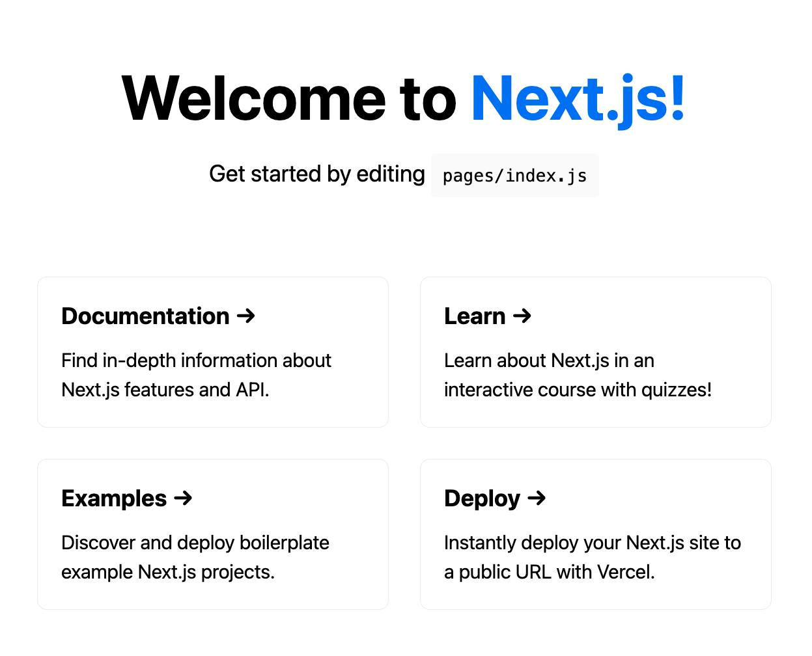
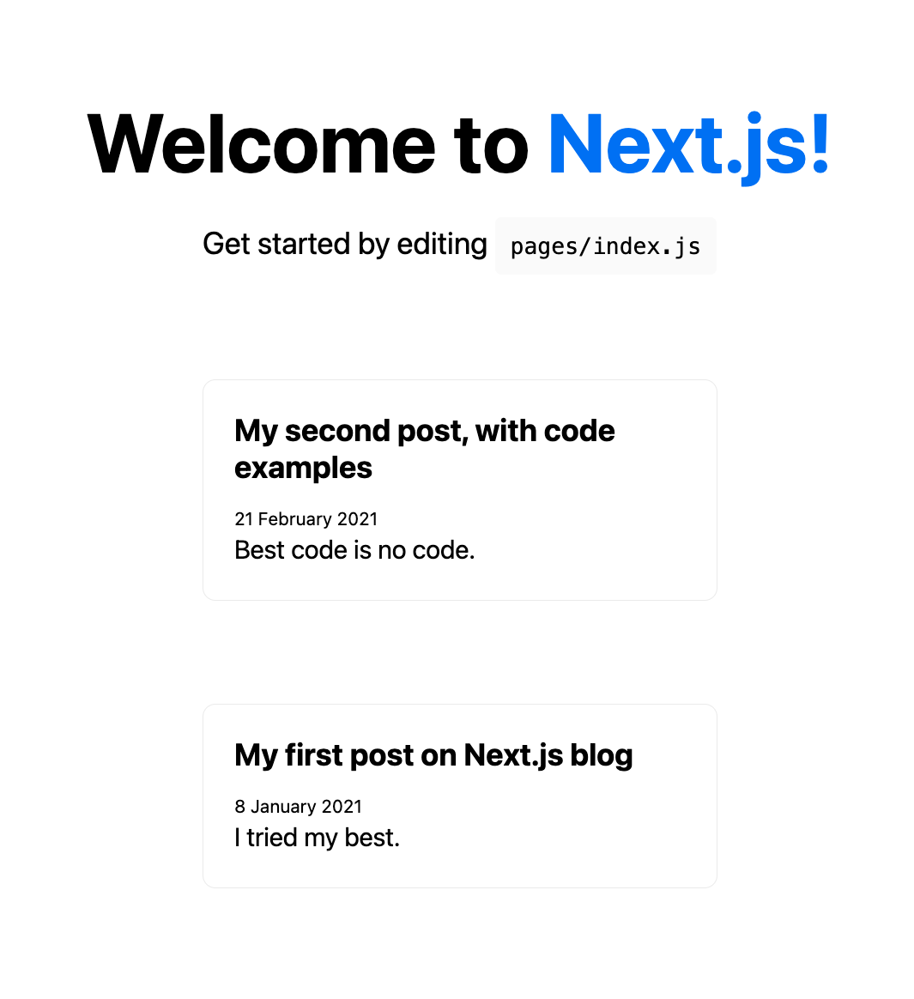
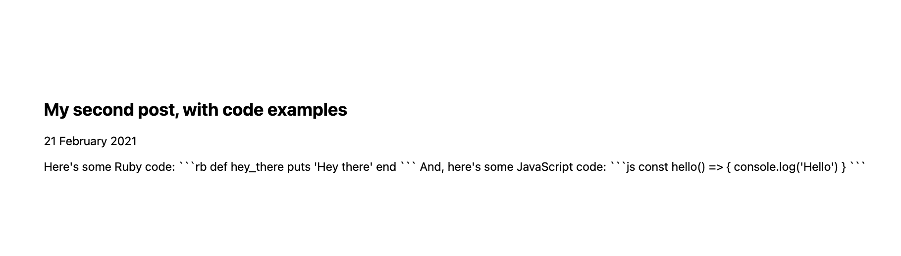
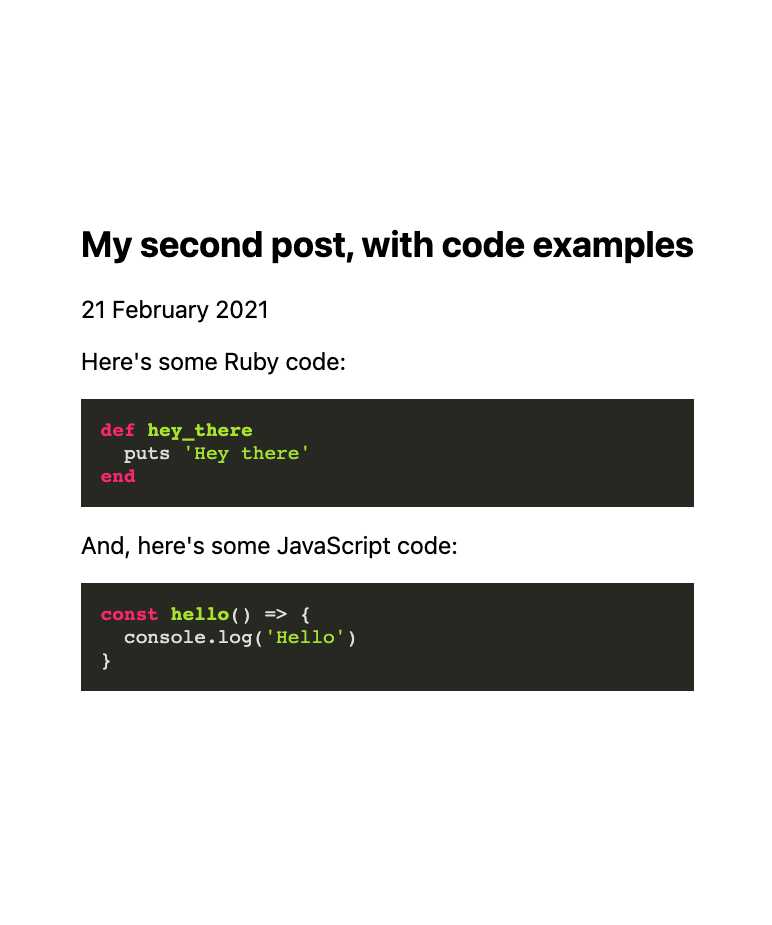
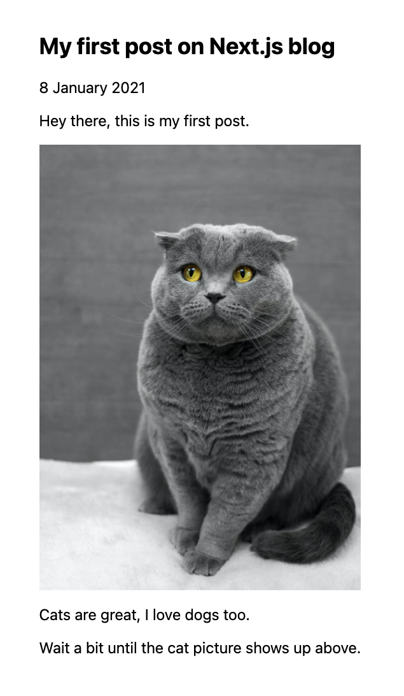
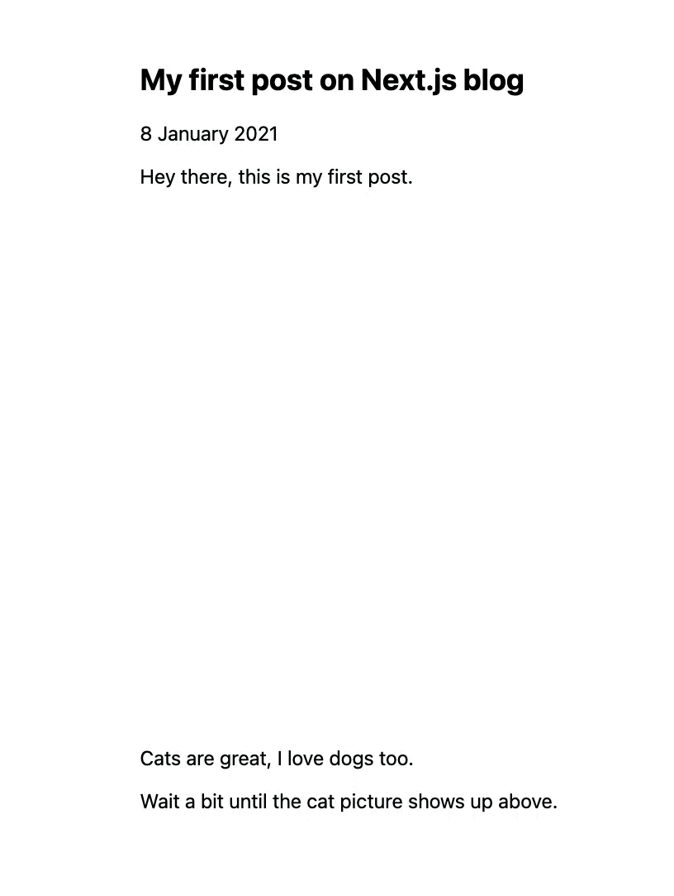
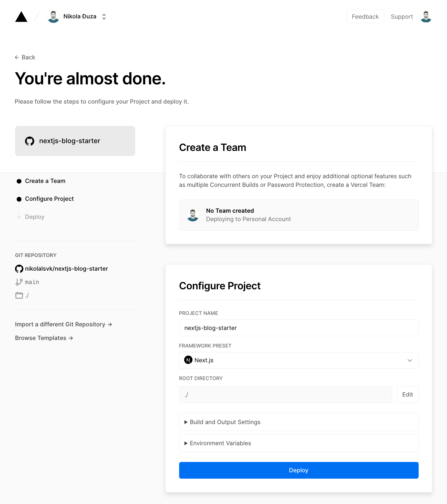
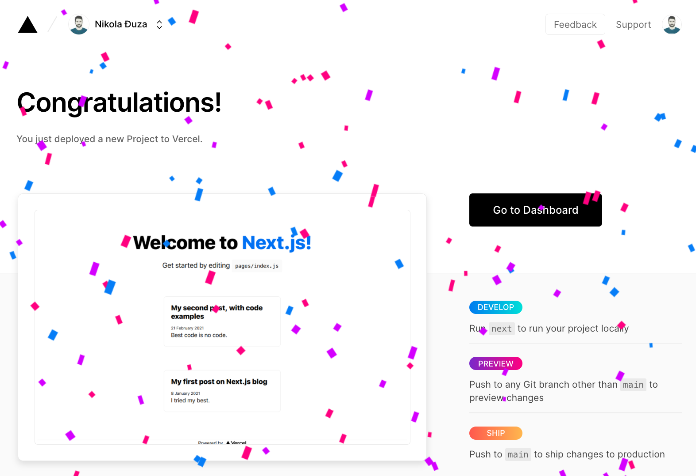

A while back, you were probably looking for a great solution to create your blog, and Gatsby was the most popular solution floating around at the time.

Now that some time has passed, a new player has risen to fame on the scene: Next.js has taken developer blogs by storm.

Whatever your reasons for switching, we will explain how to switch from the Gatsby stack over to Next.js in this post.

## Why Use Gatsby?

When Gatsby became popular, it got advertised as the best thing around. You get convenient plugins, little to no setup, and the fantastic power of GraphQL. Plus, the word 'speed' was stamped all over it. Your static content is indeed fast with Gatsby, as it loads only essential data and then fetches other needed resources.

What is excellent about Gatsby is that you can jump-start a website with a couple of commands in your terminal. There is no more need to set up Webpack, code split, image optimize, and all the pesky details you usually do. You can choose preexisting themes, customize them at your own will and have a great-looking site. Plus, you get GraphQL to manage any data fetching you might need.

In reality, users (like myself) do not utilize GraphQL in Gatsby for what it's worth. The real power comes when you have multiple data sources to build your website. For example, you load content from your local files, plus you have some content living in some headless CMS. In that case, GraphQL may become very useful. In other cases, it is overkill, I believe (unless you want to get the hang of GraphQL).

Other than that, Gatsby generates HTML pages in build time and lets you host them wherever you like, meaning that you don't need a running server in some cases.

So, what can compete against a JavaScript (React) framework for static site generation? What gives Next.js the edge over Gatsby? Let's find out.

## Why Switch to Next.js?

Next.js is also advertised as a React framework, but its focus is on Single Page Applications. The idea is that you can use it for other things than just rendering static content.

### Powerful Server-Side Rendering with Next.js

The power of Next.js lies in Server-Side Rendering (SSR), which is becoming increasingly popular in the React community. Next.js is a hybrid tool for server-side rendered pages and a static sites generator.

The main benefit of SSR is that you get a faster Time To First Draw (TTFD) because the content can serve as HTML directly from the server. But, Time To First Byte (TTFB) can be something that it potentially lacks. That means that all the heavy lifting gets done on the server, unlike other frameworks that minimize TTFB by loading critical resources first and then working on the client, thus increasing TTFD.

The main reason why you'd choose Next.js is when you need some dynamic parts of a page versus plain static content. An example of this can be a website offering products. You can generate parts of it as static content and then render the product shop dynamically. This is the advantage that Next.js has over Gatsby.

So Next.js offers more when you need a mixture of static and dynamic content. But you should consider the kind of website you are building. Remember that Gatsby has many features that require little to no configuration if you need to get started quickly. If you're making a product and deciding between the two, I believe Next.js is a winner. Also, if you want more fine-grain control over configuration, Next.js gives you more freedom there.

Now let's work on a simple use case and show how to migrate a simple Gatsby blog to Next.js.

## Gatsby to Next.js Migration Challenges

We want to migrate an existing Gatsby blog to use Next. The requirements are simple — we want blog readers to not notice that something has changed visually and content-wise. Also, we want to keep our SEO and performance at the same levels, if not better.

To do this, we have to migrate content (our blog posts) and all the things that come with it — images, code highlighting, content, and any potential hidden quirks there. Also, we want our sitemap to function correctly so that search indexes know our blog's pages. And, finally, we want to deploy our blog to the internet so others can read it.

## Laying Out the Groundwork

To start, let's generate a simple Next.js app, so we have a clean plate. Starting from a simple app will help us understand both Next.js and the process to follow.

Luckily, we don't have to write everything by hand. There's a handy `create-next-app` tool at our disposal. We will start by generating our Next.js project:

```bash
npx create-next-app nextjs-blog --use-npm
```

With the command above, we will get all the essential files needed to start and run our Next.js app for now. If you peek at `package.json`, you will see a simple setup where we have `next`, `react`, and` react-dom` as dependencies. It seems pretty lightweight compared to Gatsby, where you get a lot of things out of the box.

You can check whether everything is working correctly by running `npm run dev`. You should get a "Welcome to Next.js" page on http://localhost:3000/.



Cool, now that we have it running, let's analyze the content of our new app. From the start, you will see that the file structure is stoic. We have the `pages` dir with `_app.js` and `index.js`. There's also the `api` directory, but we won't touch it in this blog post.

The `_app.js` is the 'root' of our project, and here we can define global styles, SEO, and other site-wide shenanigans. What is important is that every file you create in `pages` dir, will create a page on your website. This is similar to what Gatsby does, but with one quirk that we will go into later. To test this out, let's create `pages/about.js`:

```js
// pages/about.js

import styles from "../styles/Home.module.css"

export default function About() {
  return (
    <main className={styles.main}>
      <h1 className={styles.title}>Hey, this is the about page.</h1>
    </main>
  )
}
```

Now, let's go to http://localhost:3000/about, and we should see the following:


Pretty cool! Now that we've figured that out, we will jump into the next section and migrate content into our brand new Next.js app.

## Migrating Content Into Next.js

The heart of a blog is its content — without it, our blog won't be a true blog, right? So let's investigate how we can render blog posts in our Next.js blog. In Gatsby, the content is usually stored in the root of the project inside the `content` directory. We can create a similar structure here as well.

I went ahead and created `content/blog` directory, and put two Markdown files there — `first-post.md` and `second-post.md`. Here's how they look:

```md
# content/blog/first-post.md

---

title: My first post on Next.js blog
description: I tried my best.
date: 8 January 2021

---

Hey there, this is my first post.
```

````md
# content/blog/second-post.md

---

title: My second post, with code examples
description: Best code is no code.
date: 21 February 2021

---

Here's some Ruby code:

```rb
def hey_there
  puts 'Hey there'
end
```

And, here's some JavaScript code:

```javascript
const hello() => {
  console.log('Hello')
}
```
````

Excellent, so how do we show these in the browser? Glad you asked. We need to somehow load these Markdown files to Next.js. There are several ways, but my favorite is to read file slugs from the posts directory and load them one by one.

### Load Posts on the Index Page

If you come from Gatsby, you will find this part a bit unexpected. Gatsby allows you to add a plugin to make Markdown files available and parses them to you with GraphQL. Unfortunately, we're not in Gatsby, and we have to take more control in our hands. So, let's see how we can load and parse Markdown files so that our React components understand them.

Let's create a `lib` directory in the root of our project and put a file named `posts.js` there. This file will contain the logic for loading, parsing, and sorting our blog posts. Here's how the file should look:

```js
// lib/posts.js

import fs from "fs"
import { join } from "path"
import matter from "gray-matter"

const postsDirectory = join(process.cwd(), "content/blog")

export const posts = () => {
  const slugs = fs.readdirSync(postsDirectory)
  const allPosts = slugs
    .map((slug) => getPostBySlug(slug))
    .sort((post1, post2) =>
      new Date(post1.frontmatter.date) > new Date(post2.frontmatter.date)
        ? -1
        : 1
    )

  return allPosts
}

export const getPostBySlug = (slug) => {
  const realSlug = slug.replace(/\.md$/, "")
  const fullPath = join(postsDirectory, `${realSlug}.md`)
  const fileContents = fs.readFileSync(fullPath, "utf8")
  const { data: frontmatter, content } = matter(fileContents)

  return { slug: realSlug, frontmatter, content }
}
```

We use `fs` to load files and `gray-matter` library to parse its content. For this, you will have to install `gray-matter` in the project with:

```bash
npm install gray-matter
```

So, what happens in `lib/posts.js`? We find out our `postsDirectory`, then we get all the file slugs and feed them one by one into `getPostBySlug`. The `getPostBySlug` then reads the file and parses it using the `matter` function from the `gray-matter` lib. We want to use `matter` to parse the frontmatter we added in our blog posts (meta-information about our posts, like title, description, and date).

Cool, now that we got that out of the way, let's load our blog posts on the index page. We will go into `pages/index.js`, which serves our index page, and modify it a bit to look like this:

```js
// pages/index.js

import styles from "../styles/Home.module.css"
import { posts } from "../lib/posts"
import Layout from "../components/layout"

export default function Home({ allPosts }) {
  if (!allPosts || !allPosts.length) return

  return (
    <Layout>
      <h1 className={styles.title}>
        Welcome to <a href="https://nextjs.org">Next.js!</a>
      </h1>

      <p className={styles.description}>
        Get started by editing{" "}
        <code className={styles.code}>pages/index.js</code>
      </p>

      {allPosts.map((post) => (
        <div key={post.slug} className={styles.grid}>
          <a href={post.slug} className={styles.card}>
            <h2>{post.frontmatter.title}</h2>
            <span>{post.frontmatter.date}</span>
            <p>{post.frontmatter.description}</p>
          </a>
        </div>
      ))}
    </Layout>
  )
}

export async function getStaticProps() {
  const allPosts = posts()

  return {
    props: {
      allPosts,
    },
  }
}
```

We cleaned up the `index.js` a bit by creating a `Layout` component that holds common rendering logic which we'll later reuse. The important thing here is the [`getStaticProps` function](https://nextjs.org/docs/basic-features/data-fetching#getstaticprops-static-generation). `getStaticProps` is an async function that gets picked up by Next.js. If you provide this function, Next.js will pre-render this page at build time using the props returned by `getStaticProps`. So we ensure our posts are loaded at build time, and then later, we can use them in the `Home` component.

In the `Home` component, we receive `allPosts` props and render them one by one. I used and modified the styling a bit from the generated Next.js app, but you can go crazy and do whatever you like here. You can go without styles or bring in your own. Styling and CSS are huge topics and we can discuss them in another blog post. Let's keep it simple for now.

Cool, now that we added the code above, we should see something like this in our browser:



Looks pretty nice so far. Now when users come to our website, they will see the blog posts we have. But there's one problem. When they click on the blog post, they will get a 404 page. So it's time to implement rendering logic for each blog post.

### Loading a Single Post

To do this, let's create a `[slug].js` file inside `pages` directory. If you haven't seen a file name like this before, you might be confused. Don't worry, this is a Next.js feature. Our file resides in `pages/[slug].js`, which means that requests like `/some-blog-post` or `/abc` will be handled by the logic in `pages/[slug].js`. Next.js calls it dynamic routing, and it is a very elegant solution.

Let's add some logic to `pages/[slug].js` so it renders a blog post:

```js
// pages/[slug].js

import Layout from "../components/layout"
import { posts, getPostBySlug } from "../lib/posts"

const Post = ({ content, frontmatter }) => {
  return (
    <Layout>
      <article>
        <h1>{frontmatter.title}</h1>
        <p>{frontmatter.date}</p>

        {content}
      </article>
    </Layout>
  )
}

export default Post

export async function getStaticProps({ params }) {
  const { content, frontmatter } = getPostBySlug(params.slug)

  return {
    props: {
      content,
      frontmatter,
    },
  }
}

export async function getStaticPaths() {
  const allPosts = posts()

  return {
    paths: allPosts.map((post) => {
      return {
        params: {
          slug: post.slug,
        },
      }
    }),
    fallback: false,
  }
}
```

If you remember the `Layout` component — I extracted it to `lib/components`, and I'm calling it from there. In the body of `Post` component, I render some frontmatter data we set in the Markdown file. We get that data from the previously mentioned `getStaticProps`. But, no, we have a new kid on the block — `getStaticPaths`. The `getStaticPaths` function should return paths, so Next.js knows which paths to render to HTML at build time.

All we do in `getStaticPaths` is fetch all our posts and let Next.js know that each of those slugs should be rendered at build time. Now we can open a blog post from our index page, and we should see something like this:



The title and the date are there, but the content of the post is a little messed up. That's because we didn't convert the raw Markdown to HTML. Let's go ahead and do that. We will use the `ReactMarkdown` component from the `react-markdown` library. Let's install it first with:

    1npm install react-markdown

After `react-markdown` is installed, we can modify our `pages/[slug].js` to look like this:

```js
// pages/[slug].js

...

import ReactMarkdown from "react-markdown";

const Post = ({ content, frontmatter }) => {
  return (
    <Layout>
      <article>
        <h1>{frontmatter.title}</h1>
        <p>{frontmatter.date}</p>

        <ReactMarkdown>{content}</ReactMarkdown>
      </article>
    </Layout>
  );
};

...
```

And with that, we should see a better-looking blog post like this:


Now our blog post looks better. But there's one thing missing — code highlighting. Let's jump in and highlight code sections.

### Add Code Highlighting

We will use [`highlight.js` library](https://highlightjs.org/) to highlight code inside our blog posts. First, let's install the library with:

    1npm install highlight.js

Now, we can highlight our code. To do it, we will pass a custom component to `ReactMarkdown` to render code blocks. Here's how it should look:

```js
// pages/[slug].js

...
import highlight from "highlight.js";

const Post = ({ content, frontmatter }) => {
  return (
    <Layout>
      <article>
        <h1>{frontmatter.title}</h1>
        <p>{frontmatter.date}</p>

        <ReactMarkdown
          components={{
            code: ({ ...props }) => <Code {...props} />,
          }}
        >
          {content}
        </ReactMarkdown>
      </article>
    </Layout>
  );
};

const Code = ({ children, className, ...props }) => {
  const highlightedHtml = highlight.highlightAuto(children[0]).value;

  return (
    <pre>
      <code
        className={`${className} hljs`}
        dangerouslySetInnerHTML={{ __html: highlightedHtml }}
      />
    </pre>
  );
};

...
```

In the `Code` component, we receive `children` — the code we want to highlight, and a `className` — the name of the class we'll set on the `code` element. We call highlight for `children[0]` and render it as HTML with React's `dangerouslySetInnerHTML`.

Now that we have the highlighting part, we need to import the styles needed to highlight languages. Luckily, [`highlight.js` has some themes you can check out](https://highlightjs.org/static/demo/). We're going to load a Monokai theme in the `_app.js` like so:

```js
// pages/_app.js

import "../styles/globals.css"
import "../node_modules/highlight.js/styles/monokai.css"

function MyApp({ Component, pageProps }) {
  return <Component {...pageProps} />
}

export default MyApp
```

After these changes, we should see our blog post like this:



Perfect, our blog posts are nice and readable now. Next, we need to figure out how to load images on our blog. Before that, let's discuss whether we could have gone the other way with rendering our blog content.

### Markdown or MDX?

The hot topic for a while has been MDX. What is MDX, you might be asking? Its tagline is "Markdown for the component era." But in short, it allows you to import and render components alongside markdown content. It seems pretty nifty and helpful, but I like to keep my blog simple. For now, I don't need components inside my blog posts.

If you are interested in using `.mdx` instead of `.md` files, there are solutions out there. We won't discuss them in this blog post, maybe in the following ones. But just so that you know, people can use MDX with Next.js. One of the popular solutions is `@next/mdx`.

So we've decided to use plain Markdown for now. Let's figure out how to show images properly in the next section.

## Migrating Images from Gatsby to Next.js

One of Gatsby's cool things is its automatic image gimmicks if you use the `gatsby-image` plugin in your setup. You can achieve similar results if you utilize `next/image` inside Next.js projects. Let's compare the two:

- Gatsby automatically optimizes images for you during build time, whereas Next.js does this on-demand.
- Gatsby integrates into the internal GraphQL you use to load images, while Next.js lets you define how you will load them.
- Both allow you to have a blurred image preview, and they will keep the space needed for the image before it loads. Reserving space for the image reduces layout shift on the page.

So they have pretty similar features, but the way you use them is different. In Gatsby, you try to configure the image plugin from a higher level, whereas in Next.js, a lot of the configuration feels very manual and like you are in control.

One simple way to get images to load for our blog is to put them in the `public` directory in the root of our project. Let's put an image of a cat — `cat.jpg` \- to the `public/cat.jpg`. Then, in our blog post, we can render it like this:

    1

When we open the blog post, it will render the cat picture, but not in the most efficient way. Also, I don't like storing images in the `public` directory. We could fine-tune this solution to load the image efficiently, but let's try another, more straightforward approach.

So, how do we load images properly in our Next.js blog? Instead of putting images in the `public` dir, we can create a `content/images` directory and put our `cat.jpg` (and future pics) there. Alongside the new directory, we can create a new component called `Image` that we will feed to `ReactMarkdown`. The code should look like this:

```md
# content/blog/first-post.md

---

title: My first post on Next.js blog
description: I tried my best.
date: 8 January 2021

---

Hey there, this is my first post.


Cats are great, I love dogs too.

Wait a bit until the cat picture shows up above.
```

And we should get the blog post to look like this:



_Photo by Max Baskakov on Unsplash_

Cool, but what just happened? We created a custom `Image` component, and we told `ReactMarkdown` to use it when it tries to render images. Then, in the `Image` component, we require a local image and tell `next/image` to blur it out before it gets loaded. Here's how it should look locally:



Luckily, we don't need to set width and height in our scenario. Next.js will calculate it during build time since it has access to the picture we're trying to load. In other scenarios, like loading a remote image, you must set width and height attributes to the `next/image` component. Again, this is because Next.js doesn't have access (or at least doesn't try to have it) in the build time. The build procedure is what sets apart Gatsby and Next.js.

One more thing we did is set `layout` to `responsive`. You can take a look at [different options that come with `next/image` here](https://nextjs.org/docs/api-reference/next/image#layout). The `responsive` layout will scale the image dimensions down for smaller viewports and scale up for larger viewports.

Now that we've loaded images properly let's do one more thing before deploying our website. Let's set up a sitemap so search engines are aware of the pages on our blog.

## Setting Up the Sitemap for Your Next.js Blog

With Gatsby, you'd install a plugin, configure it a bit, and voila, you'd get a sitemap ready. As with everything else in Next.js, the process of forming a sitemap is a bit different. You are encouraged to do this on your own for more control. So this is exactly what we're going to do.

We will create a Node script that will run after the build is complete. Set up a `scripts` directory and add a file named `generate-sitemap.mjs`. Don't get freaked out by the `.mjs` extension — it is a way to define and use ECMAScript modules in a Node script. The logic inside the file should look like this:

```js
// scripts/generate-sitemap.mjs

import { writeFileSync } from "fs"
import { globby } from "globby"
import prettier from "prettier"

async function generate() {
  const prettierConfig = await prettier.resolveConfig("./.prettierrc.js")
  const pages = await globby([
    "pages/*.js",
    "content/**/*.md",
    "!content/*.md",
    "!pages/_*.js",
    "!pages/[*.js",
    "!pages/api",
    "!pages/404.js",
  ])

  const sitemap = `
    <?xml version="1.0" encoding="UTF-8"?>
    <urlset xmlns="http://www.sitemaps.org/schemas/sitemap/0.9">
        ${pages
          .map((page) => {
            const path = page
              .replace("pages", "")
              .replace("content/blog", "")
              .replace(".js", "")
              .replace(".md", "")
            const route = path === "/index" ? "" : path

            return `
              <url>
                  <loc>${`https://DOMAIN_NAME_HERE${route}`}</loc>
                  <changefreq>daily</changefreq>
                  <priority>1.0</priority>
              </url>
            `
          })
          .join("")}
    </urlset>
    `

  const formatted = prettier.format(sitemap, {
    ...prettierConfig,
    parser: "html",
  })

  writeFileSync("public/sitemap.xml", formatted)
}

generate()
```

In the script, we pick up the filenames of Markdown files inside `content/` and filenames of certain files in `pages/` using the `globby` library. We ignore files that start with `[` and `_` in `pages/`, together with the `pages/api/` and the `404.js`. Then, we remove excess data from the filenames to get paths (pages) on our website. Iterate over pages and add them as entries in the sitemap, with priority and change frequency attributes.

Finally, use `prettier` to format the sitemap properly, and write the sitemap to `public/sitemap.xml` so it's available there.

To run this script, we need to install two packages:

    1npm install -D globby prettier

And, we will run this script after the build by defining it in the `package.json`:

```js
{
  ...
  "scripts": {
    "dev": "next dev",
    "build": "next build",
    "postbuild": "node ./scripts/generate-sitemap.mjs",
    "start": "next start",
    "lint": "next lint"
  },
  ...
}
```

So, when we run `npm run build`, our script will create a new file in `public/sitemap.xml`. We can add this file to the `.gitignore` so it doesn't get committed.

And that's it — we're ready to roll and publish our website!

## Next.js Blog Deployment Options

What good is a blog if only you can read it? Probably not very good, so let's figure out how to deploy it and have other people read it. There are a few options for deployment — Netlify, Heroku, Vercel, and many others. In this post, we will look into Netlify and Vercel.

Both Netlify and Vercel offer free plans where you can deploy and host your website. But one important thing is that Vercel doesn't support commercial websites like eCommerce ones. If you plan to host something like this, you'd better check with Vercel if it's fine to do it on the free plan or you need to upgrade to their Pro plan.

Other than that, the two services are pretty similar in what they offer, but to me, it feels natural to deploy Next.js to Vercel since the company Vercel builds and supports Next.js. So, let's start with Vercel and see how we can deploy and host our website there.

Before we do it, let's push our website to GitHub to automate builds and deploys from there. I created a [`nextjs-blog-starter` repo](https://github.com/nikolalsvk/nextjs-blog-starter) here that you can use. Then, you need to log in or sign up at [Vercel](https://vercel.com/). After that, you should be able to create a new project from GitHub and get a page similar to this one:



After clicking deploy and waiting for a bit, your blog should be online.



Here's mine — [https://nextjs-blog-starter-nikolalsvk.vercel.app/](https://nextjs-blog-starter-nikolalsvk.vercel.app/) — and you should get a similar URL when you deploy yours. Congrats for making it this far, yay!

## Wrapping Up

Thank you for following along: now you should, hopefully, be able to migrate your blog post from Gatsby to Next.js. There was a lot of information covered in this blog post, and it might be too much to ingest in one sitting. The good thing is that you can always come back to it later.

But there's also a lot of ground we didn't manage to cover here. To 'complete' our blog, we need features like:

- MDX (if we want components in Markdown)
- auto-linking blog headers
- scrolling to a page ID
- an RSS feed
- an email subscription box
- a Tweet embedding solution for Twitter

and so on. If we did include all of these, this would be a mini-book instead of a blog post, so don't worry about it. We will cover these in future blog posts.

What is important is that you have a solid foundation to go and build whatever you want on your Next.js blog. You managed to get through the initial learning curve and how Next.js works. The things you add later should be a breeze.

I wish you good luck in building your blog with Next.js. If you have any questions or comments, feel free to reach me through the link in the bio below.

Cheers, and see you in the next one.
