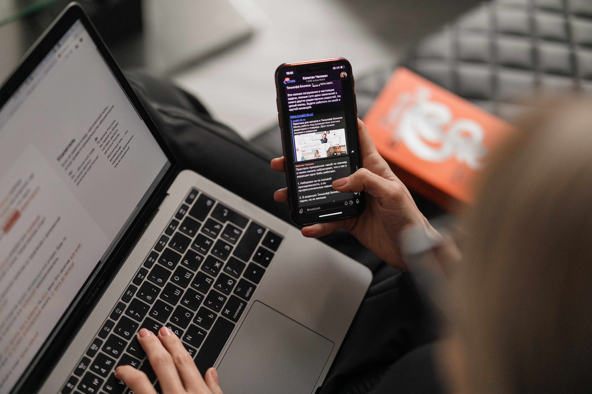

<figure>
  
  <figcaption class='photo-caption'>
  Photo by <a href="https://unsplash.com/@glvrdru?utm_source=unsplash&utm_medium=referral&utm_content=creditCopyText">Maxim Ilyahov</a> on <a href="https://unsplash.com/s/photos/computer-phone?utm_source=unsplash&utm_medium=referral&utm_content=creditCopyText">Unsplash</a>
  </figcaption>
</figure>

Are you looking to preview your website on your mobile (or tablet) while developing it on your computer? Or vice-versa? Maybe you want to get a "real feel" of how the website works and looks directly on the device. Then, you're in for a treat. Today, we'll show how you can visit the website hosted on `localhost` directly from your mobile or tablet.

## Step 1: Connect your device to the same network

If you have multiple WiFi networks, ensure **your computer and device are on the same WiFi**. This step is essential.

## Step 2: Find your computer's local IP address

Your computer has a public IP and a local IP address. We need a **local IP address**, IPv4, to be more precise. You must be asking - "How do I find my local IP address?". Here's how you can do it on different operating systems:

### Mac OS

1.  Open System Preferences -> Network
2.  Next to the Status, you should see the IP address. It should write out - "WiFi is connected to YOUR_WIFI_NAME and has the IP address YOUR_LOCAL_IP." See how it looks in the screenshot below:

<figure>

  <figcaption class='photo-caption'>
  The local IP address is underlined in red.
  </figcaption>
</figure>

### Linux

1. Run in your terminal `hostname -I`. Or, run `ifconfig | grep "inet " | grep -v 127.0.0.1`

### Windows

1. Select Start > Settings > Network & internet > Wi-Fi and then select the Wi-Fi network you're connected to.
2. Under Properties, look for your IP address listed next to IPv4 address.

Great, now that we got our computer's local IP address, we need to run our app.

## Step 3: Get the port number

If you're running a Rails app, the port is usually 3000, and you can access your app in the `http://localhost:3000`.

> 💡 In my case, I had to bind the server to `0.0.0.0`. I run a Gatsby website, so for me, it was `gatsby develop --host 0.0.0.0`, which runs the server that listens on the 8000 port.

Whatever way you run your server, make sure to use the PORT from `http://localhost:PORT` - where the server listens for incoming requests.

## Step 4: Open your other device's browser

On your phone or tablet, open your browser of choice and type in `http://YOUR_LOCAL_IP:PORT` - which in my case was `http://192.168.1.30:8000`.

If you're running a server on `http://localhost:3000`, and your IP is `192.168.1.10`, then you need to visit `http://192.168.1.10:3000` on your mobile or tablet.

## That is it

You can now browse your website directly from your other device while you develop on the computer. How neat!

Now, you can test mobile and tablet views on real devices. That is if you need to do so.

Thanks for following along, and catch you in the next one.
