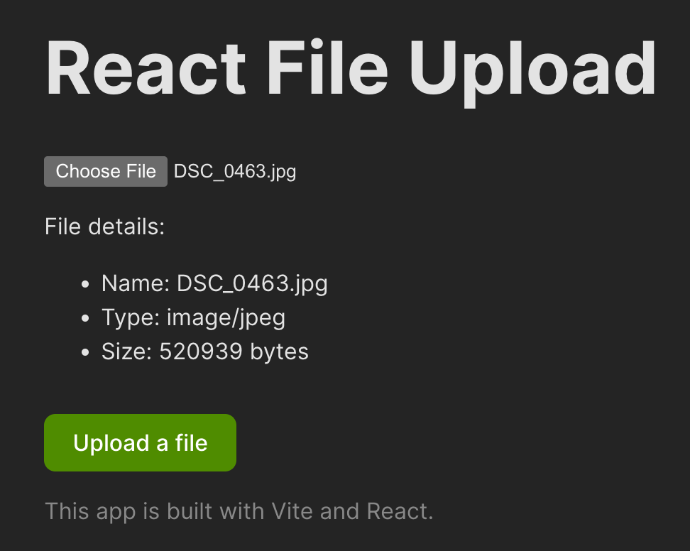
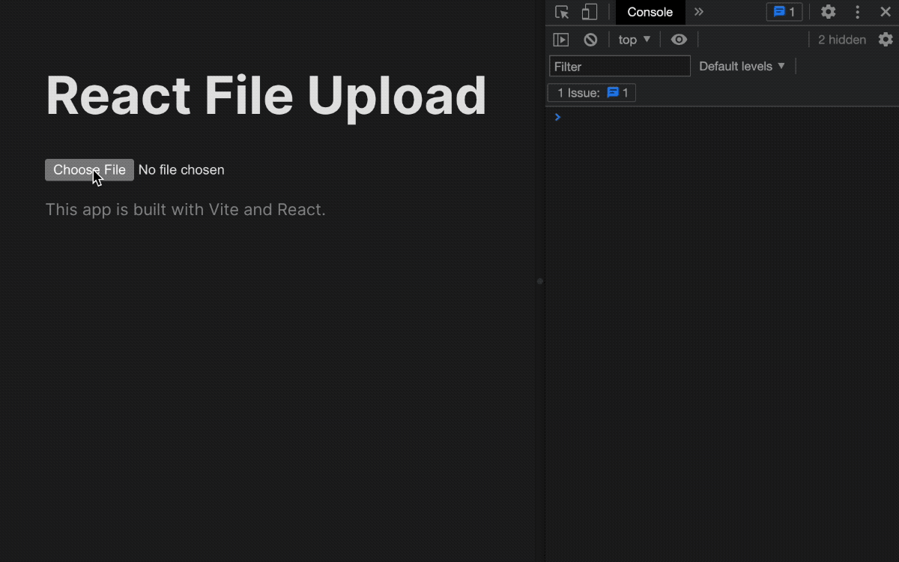
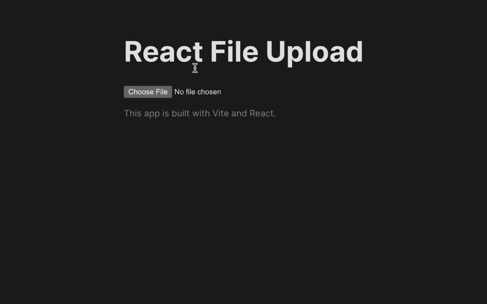

React is one of the popular tools for building user interfaces and is a skill worth knowing. If you're building something with React, you will face the challenge of uploading files sooner or later. Do not worry; writing a file-uploading logic in React is straightforward, and this post will show you exactly how to do it.

We'll cover how to upload a single file, upload multiple files, and see how you can use a 3rd party library that does the heavy lifting for you. But first, let's dive into uploading a single file in React with fetch.

## Uploading a single file in React with fetch

Firstly, we will create a boilerplate app that we'll use to add the file upload markup and logic. We will use Vite and TypeScript.

```bash
npm create vite@latest react-file-upload -- --template react-ts
```

Then, we'll create a new component called `SingleFileUploader` in `src/components/SingleFileUploader.tsx`. For starters, we will show how to add a file picker in React and have the user interact with it. Here's the code:

```tsx
import React, { useState } from "react"

const SingleFileUploader = () => {
  const [file, setFile] = useState<File | null>(null)

  const handleFileChange = (e: React.ChangeEvent<HTMLInputElement>) => {
    if (e.target.files) {
      setFile(e.target.files[0])
    }
  }

  const handleUpload = async () => {
    // We will fill this out later
  }

  return (
    <>
      <div>
        <label htmlFor="file" className="sr-only">
          Choose a file
        </label>
        <input id="file" type="file" onChange={handleFileChange} />
      </div>
      {file && (
        <section>
          File details:
          <ul>
            <li>Name: {file.name}</li>
            <li>Type: {file.type}</li>
            <li>Size: {file.size} bytes</li>
          </ul>
        </section>
      )}

      {file && <button onClick={handleUpload}>Upload a file</button>}
    </>
  )
}

export default SingleFileUploader
```

Now, a user can pick a file they want to upload. When a user chooses a file, we show a summary (file name, file type, and file zie) of the selected file under the file input.

There's also a small class for the `label` element called `sr-only` that makes it accessible for screen readers but hidden for folks seeing the file input. That's a minor web accessibility touch-up you can [read more about here](https://css-tricks.com/inclusively-hidden/).

But all in all, here's how the file input and the showing of details work.



Now, we have to write the logic inside the `handleUpload` function that will actually upload the selected file. For that, we're going to use `fetch` and `FormData`. Let's see what those are below.

### Using Fetch API and FormData

To make things as simple as possible, we're going to utilize two APIs that are available in almost all modern browsers:

- [Fetch API](https://developer.mozilla.org/en-US/docs/Web/API/Fetch_API) with its [fetch method](https://developer.mozilla.org/en-US/docs/Web/API/fetch) - a handful method to make a request call
- [FormData](https://developer.mozilla.org/en-US/docs/Web/API/FormData) interface to easily append files to the `fetch` payload we'll send

Here's how those two will look in the code:

```tsx
const handleUpload = async () => {
  if (file) {
    console.log("Uploading file...")

    const formData = new FormData()
    formData.append("file", file)

    try {
      // You can write the URL of your server or any other endpoint used for file upload
      const result = await fetch("https://httpbin.org/post", {
        method: "POST",
        body: formData,
      })

      const data = await result.json()

      console.log(data)
    } catch (error) {
      console.error(error)
    }
  }
}
```

Here, we first check whether the `file` is present so we have something to upload. After that, we initiate the new `FormData` object with `new FormData()` and assign it to `formData`. Now, `formData` allows us to append a file to it with `formData.append(file)`. Then, we call `fetch` with the URL endpoint for uploading files. There's a random URL in the example, but in reality, it should be an endpoint you're working with (usually your backend or a 3rd party service).

Then, in the fetch call, we simply pass the `formData` object inside the body like so:

```ts
const result = await fetch("https://httpbin.org/post", {
  method: "POST",
  body: formData,
})
```

The `fetch` and `FormData` work flawlessly together, and that's all you have to do to ensure a file is sent properly. When we tie the file input component and the new logic we wrote into one piece of code, here's how it will look:

```tsx
import React, { useState } from "react"

const SingleFileUploader = () => {
  const [file, setFile] = useState<File | null>(null)

  const handleFileChange = (e: React.ChangeEvent<HTMLInputElement>) => {
    if (e.target.files) {
      setFile(e.target.files[0])
    }
  }

  const handleUpload = async () => {
    if (file) {
      console.log("Uploading file...")

      const formData = new FormData()
      formData.append("file", file)

      try {
        // You can write the URL of your server or any other endpoint used for file upload
        const result = await fetch("https://httpbin.org/post", {
          method: "POST",
          body: formData,
        })

        const data = await result.json()

        console.log(data)
      } catch (error) {
        console.error(error)
      }
    }
  }

  return (
    <>
      <div>
        <label htmlFor="file" className="sr-only">
          Choose a file
        </label>
        <input id="file" type="file" onChange={handleFileChange} />
      </div>
      {file && (
        <section>
          File details:
          <ul>
            <li>Name: {file.name}</li>
            <li>Type: {file.type}</li>
            <li>Size: {file.size} bytes</li>
          </ul>
        </section>
      )}

      {file && <button onClick={handleUpload}>Upload a file</button>}
    </>
  )
}

export default SingleFileUploader
```

And here's how it works:



We select a file, view its details and click "Upload a file" button. Then, after some time, in the browser's console, we can view the result of the file upload request meaning our file got uploaded successfully. To make things easier to follow through and avoid relying on the browser's console, we can make a simple section in the UI to show whether the upload started and if it was successful or not.

### Show upload result indicator

We can make the result indicator based on state of the uploading. I created four states:

- Initial - the upload hasn't started yet
- Uploading - the upload started
- Success - the upload finished properly
- Failure - the upload, unfortunately, failed

And here's the code that makes the upload status indicator work:

```tsx
import React, { useState } from "react"

const SingleFileUploader = () => {
  const [file, setFile] = useState<File | null>(null)
  const [status, setStatus] = useState<
    "initial" | "uploading" | "success" | "fail"
  >("initial")

  const handleFileChange = (e: React.ChangeEvent<HTMLInputElement>) => {
    if (e.target.files) {
      setStatus("initial")
      setFile(e.target.files[0])
    }
  }

  const handleUpload = async () => {
    if (file) {
      setStatus("uploading")

      const formData = new FormData()
      formData.append("file", file)

      try {
        const result = await fetch("https://httpbin.org/post", {
          method: "POST",
          body: formData,
        })

        const data = await result.json()

        console.log(data)
        setStatus("success")
      } catch (error) {
        console.error(error)
        setStatus("fail")
      }
    }
  }

  return (
    <>
      <div className="input-group">
        <label htmlFor="file" className="sr-only">
          Choose a file
        </label>
        <input id="file" type="file" onChange={handleFileChange} />
      </div>
      {file && (
        <section>
          File details:
          <ul>
            <li>Name: {file.name}</li>
            <li>Type: {file.type}</li>
            <li>Size: {file.size} bytes</li>
          </ul>
        </section>
      )}

      {file && (
        <button onClick={handleUpload} className="submit">
          Upload a file
        </button>
      )}

      <Result status={status} />
    </>
  )
}

const Result = ({ status }: { status: string }) => {
  if (status === "success") {
    return <p>✅ File uploaded successfully!</p>
  } else if (status === "fail") {
    return <p>❌ File upload failed!</p>
  } else if (status === "uploading") {
    return <p>⏳ Uploading selected file...</p>
  } else {
    return null
  }
}

export default SingleFileUploader
```

Now, we can close the browser console and view the upload state in the UI directly like so:



Great, now that we covered the basics on how to show file input, selected file details, how to upload a single file in React - let's show how to upload multiple files.

## Upload multiple files in React with fetch

The majority of the code will stay the same from the previous section where we show how to upload the single file. The only part that will change is the part where the user can choose multiple files to upload. For that purpose, we'll create a new component called `MultipleFileUploader.tsx` in `src/components`:

```tsx
import React, { useState } from "react"

const MultipleFileUploader = () => {
  const [files, setFiles] = useState<FileList | null>(null)
  const [status, setStatus] = useState<
    "initial" | "uploading" | "success" | "fail"
  >("initial")

  const handleFileChange = (e: React.ChangeEvent<HTMLInputElement>) => {
    if (e.target.files) {
      setStatus("initial")
      setFiles(e.target.files)
    }
  }

  const handleUpload = async () => {
    if (files) {
      setStatus("uploading")

      const formData = new FormData()

      ;[...files].forEach((file) => {
        formData.append("files", file)
      })

      try {
        const result = await fetch("https://httpbin.org/post", {
          method: "POST",
          body: formData,
        })

        const data = await result.json()

        console.log(data)
        setStatus("success")
      } catch (error) {
        console.error(error)
        setStatus("fail")
      }
    }
  }

  return (
    <>
      <div className="input-group">
        <label htmlFor="file" className="sr-only">
          Choose files
        </label>
        <input id="file" type="file" multiple onChange={handleFileChange} />
      </div>
      {files &&
        [...files].map((file, index) => (
          <section key={file.name}>
            File number {index + 1} details:
            <ul>
              <li>Name: {file.name}</li>
              <li>Type: {file.type}</li>
              <li>Size: {file.size} bytes</li>
            </ul>
          </section>
        ))}

      {files && (
        <button onClick={handleUpload} className="submit">
          Upload {files.length > 1 ? "files" : "a file"}
        </button>
      )}

      <Result status={status} />
    </>
  )
}

const Result = ({ status }: { status: string }) => {
  if (status === "success") {
    return <p>✅ Uploaded successfully!</p>
  } else if (status === "fail") {
    return <p>❌ Upload failed!</p>
  } else if (status === "uploading") {
    return <p>⏳ Uploading started...</p>
  } else {
    return null
  }
}

export default MultipleFileUploader
```

Now, we set `files` inside the component's state and have it as `FileInput` type instead of `File` type previously. With that, we get all the `e.target.files` and save it in the state. Then, in the `handleUpload` logic, we iterate through `files` with a simple trick append each file to `formData` with `formData.append('files', file)`. The trick to iterate through `FileList` is to destructure it into an JavaScript array like so:

```ts
[...files].forEach(...)
```

Unfortunately, we have to do that because the `FileList` doesn't have the typical Array methods like `map` or `forEach`. Later, in the markup, we do the same trick when showing each file's data.

Awesome, we set up everything, and now this is how multi-file upload works in React:


But, what if we can make that easier and if we try to use an already-baked solution? Let's try out Uploadcare's File Uploader for file upload in the next section.

## Uploading files in React with Uploadcare React Widget

Uploadcare made a brand new uploader that is fully customizable. The new uploader is built with Web Components and part of the Uploadcare Blocks components.

To get started, you need to install the Uploadcare Blocks with the following command:

```
npm install @uploadcare/blocks
```

And add types configuration to `tsconfig.json` in the root of the project:

```json
{
  "compilerOptions": {
    // ...
    "types": ["@uploadcare/blocks/types/jsx"]
    // ...
  }
}
```

Then, we'll create a small component for the Uploadcare File Uploader called `UploadcareUploader` in `src/components`. It will look like this:

```jsx
import React, { useCallback, useEffect, useRef, useState } from "react";

import * as LR from "@uploadcare/blocks";
import { PACKAGE_VERSION } from "@uploadcare/blocks/env";

import "./UploadcareUploader.css";

LR.registerBlocks(LR);

const UploadcareUploader = () => {
  const dataOutputRef = useRef<LR.DataOutput>();
  const [files, setFiles] = useState<any[]>([]);

  const handleUploaderEvent = useCallback((e: CustomEvent<any>) => {
    const { data } = e.detail;
    setFiles(data);
  }, []);

  useEffect(() => {
    const el = dataOutputRef.current;

    el?.addEventListener(
      "lr-data-output",
      handleUploaderEvent as EventListenerOrEventListenerObject
    );
    return () => {
      el?.removeEventListener(
        "lr-data-output",
        handleUploaderEvent as EventListenerOrEventListenerObject
      );
    };
  }, [handleUploaderEvent]);

  return (
    <section
      style={
        {
          "--uploadcare-pubkey": `"${import.meta.env.VITE_UPLOADCARE_API_KEY}"`,
        } as React.CSSProperties
      }
    >
      <lr-file-uploader-regular
        class="uploaderCfg"
        css-src={`https://unpkg.com/@uploadcare/blocks@${PACKAGE_VERSION}/web/file-uploader-regular.min.css`}
      >
        <lr-data-output
          ref={dataOutputRef}
          use-event
          hidden
          class="uploaderCfg"
          onEvent={handleUploaderEvent}
        ></lr-data-output>
      </lr-file-uploader-regular>

      <div className="img-gallery">
        {files.map((file) => (
          
        ))}
      </div>
    </section>
  );
};

export default UploadcareUploader;
```

There's a lot to unravel from the code above, but don't worry. We will do it gradually. First off, we need to import `LR` from `@uploadcare/blocks` and call `registerBlocks` on it. This is needed so we can register the components that are going to be used in this `UploadcareUploader` React component.

Then, we see this part of the code:

```tsx
const UploadcareUploader = () => {
  const dataOutputRef = useRef<LR.DataOutput>()
  const [files, setFiles] = useState<any[]>([])

  const handleUploaderEvent = useCallback((e: CustomEvent<any>) => {
    const { data } = e.detail
    setFiles(data)
  }, [])

  useEffect(() => {
    const el = dataOutputRef.current

    el?.addEventListener(
      "lr-data-output",
      handleUploaderEvent as EventListenerOrEventListenerObject
    )
    return () => {
      el?.removeEventListener(
        "lr-data-output",
        handleUploaderEvent as EventListenerOrEventListenerObject
      )
    }
  }, [handleUploaderEvent])

  // ...
}
```

There, we are setting a way to get the files from the Uploadcare File Uploader and set them inside the React component state. We create a ref, state for the files, and register events for when the file is uploaded and removed.

After that, we come to the markup part of the component.

```tsx
const UploadcareUploader = () => {
  // ...

  return (
    <section
      style={
        {
          "--uploadcare-pubkey": `"${import.meta.env.VITE_UPLOADCARE_API_KEY}"`,
        } as React.CSSProperties
      }
    >
      <lr-file-uploader-regular
        class="uploaderCfg"
        css-src={`https://unpkg.com/@uploadcare/blocks@${PACKAGE_VERSION}/web/file-uploader-regular.min.css`}
      >
        <lr-data-output
          ref={dataOutputRef}
          use-event
          hidden
          class="uploaderCfg"
          onEvent={handleUploaderEvent}
        ></lr-data-output>
      </lr-file-uploader-regular>

      <div className="img-gallery">
        {files.map((file) => (
          
        ))}
      </div>
    </section>
  )
}

export default UploadcareUploader
```

Now we get to the fun part. First off, we wrap everything into a `section` HTML element (this can be some other element of your choice) and we set a CSS variable with our Uploadcare project API key. You can retrieve the key easily from the Uploadcare project dashboard. We used an environment variable `VITE_UPLOADCARE_API_KEY` to store it, but you can use your own solution for that. This step is important because later, we will configure the Uploadcare File Uploader through CSS 🤯

Then, we put two components provided by Uploadcare Blocks:

```tsx
<lr-file-uploader-regular
  class="uploaderCfg"
  css-src={`https://unpkg.com/@uploadcare/blocks@${PACKAGE_VERSION}/web/file-uploader-regular.min.css`}
>
  <lr-data-output
    ref={dataOutputRef}
    use-event
    hidden
    class="uploaderCfg"
    onEvent={handleUploaderEvent}
  ></lr-data-output>
</lr-file-uploader-regular>
```

The `lr-file-uploader-regular` and `lr-data-output`. The `lr-file-uploader-regular` provides the actual UI for uploading files, and `lr-data-output` is there so we can track what gets uploaded and taken down by the user in the UI.

As you can notice, both of these elements have the `class` attribute and the "uploaderCfg" value. This is because Uploadcare Blocks are customized via CSS. We put the CSS in `UploadcareUploader.css` and imported it at the top. Here's how the CSS looks:

```css
.uploaderCfg {
  --ctx-name: "uploader";

  --cfg-pubkey: var(--uploadcare-pubkey);
}
```

The `--ctx-name` is to make sure both `lr-file-uploader-regular` and `lr-data-output` are connected. Both elements need to have the same `--ctx-name`. Then, the `--cfg-pubkey` is the place where we put the Uploadcare project API key. You can hardcode it there, but we added it through a environment variables so it is not showing in the code. Vite supports `.env` files so there's an entry there like this `VITE_UPLOADCARE_API_KEY=my_key`. Then, in the code, we set it as a CSS variable `--uploadcare-pubkey` in the parent element and then read it as `var(--uploadcare-pubkey)` in CSS and set it for `--cfg-pubkey` so Uploadcare File Uploader can pick it up.

After that, we show the uploaded files from the `files` in the React component state. All files (in this case, images) are rendered in the gallery below the uploader.

To get a better idea of it all, let's see how it works below:


And that's it, Uploadcare will take care of the uploading for you and make it faster with its uploading network (it works like CDN). You also get the tracking of uploading of each file and the option to choose where you'd like to upload files from (from the device, from a link, local camera, Dropbox, Google Drive etc.)

You can checkout the [official docs on File Uploader here](https://uploadcare.github.io/blocks/solutions/file-uploader/) and see how you can configure it and tailor it for your needs.

## Conclusion

In this blog post, we went through a few things related to uploading files in React. We covered:

- how to show a proper file input and show selected file details,
- how to work with [FormData](https://developer.mozilla.org/en-US/docs/Web/API/FormData) interface and `fetch` to upload one or multiple files,
- how to show a simple upload indicator in the UI,
- how to iterate over `FileList` with a neat trick,
- and how to efficiently use Uploadcare File Uploader to upload data without writing much code.

I hope you enjoyed and learned something from this post. All the code you've seen here is at the [GitHub repository here](https://github.com/nikolalsvk/react-file-upload/) and there's a [live playground here](https://codesandbox.io/p/github/nikolalsvk/react-file-upload/main).

Thanks for reading, and catch you in the next one.
