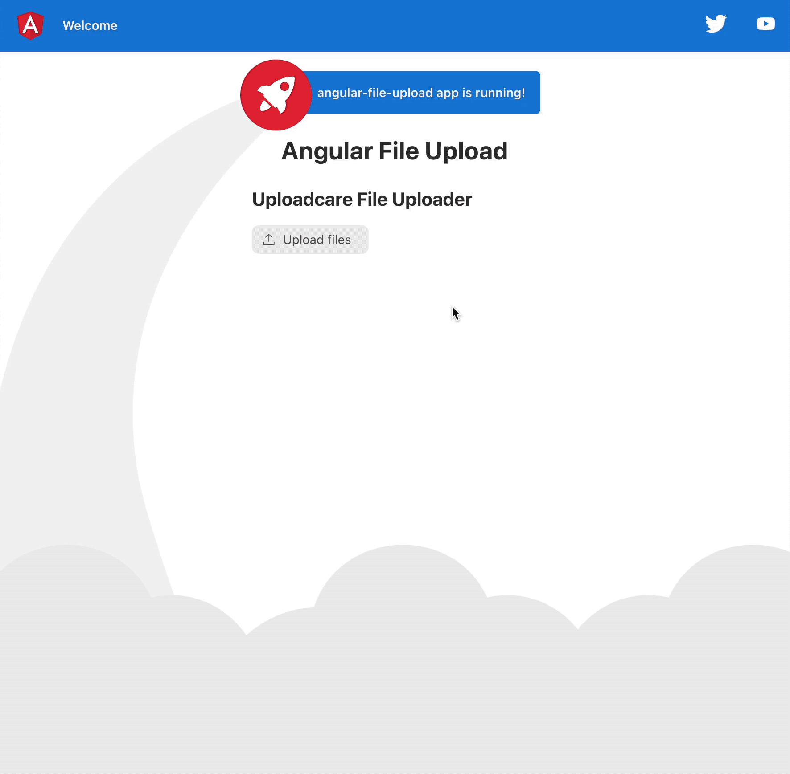
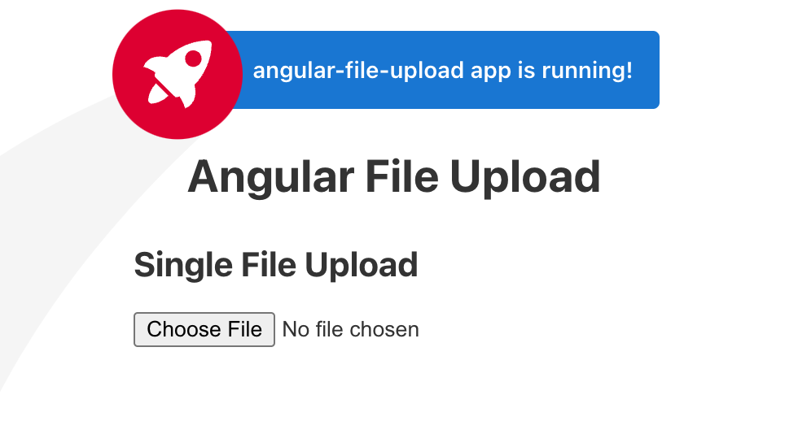
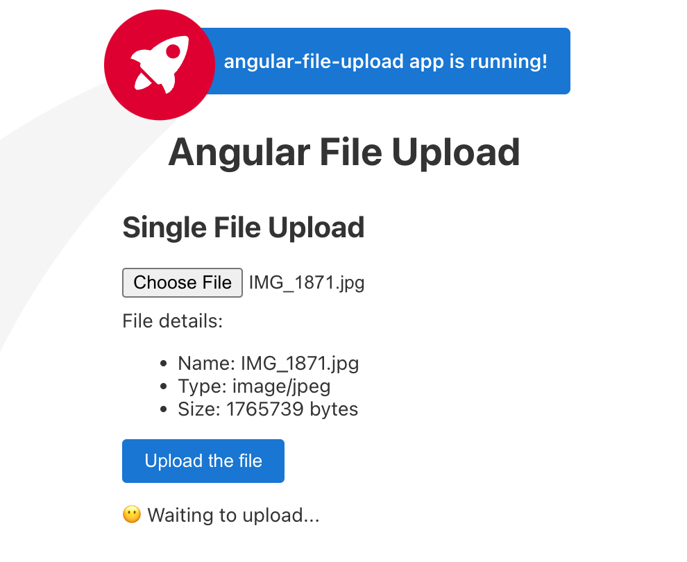
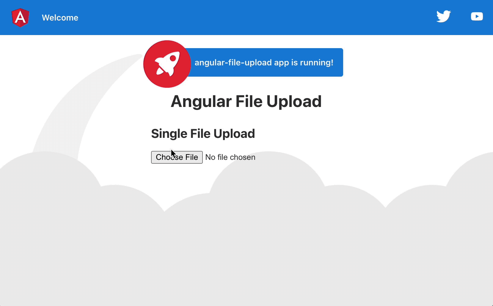
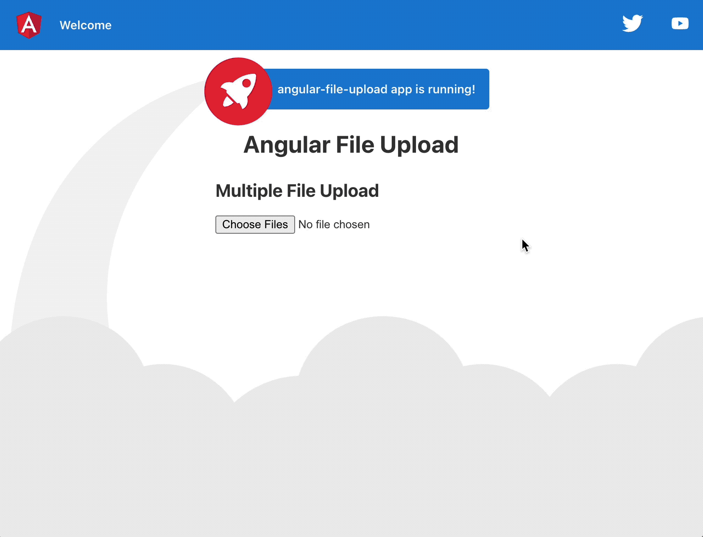

<figure>

<figcaption class="photo-caption">
Photo by <a href="https://unsplash.com/es/@thalia_s_ruiz?utm_source=unsplash&utm_medium=referral&utm_content=creditCopyText">Thalia Ruiz</a> on <a href="https://unsplash.com/s/photos/stamp?utm_source=unsplash&utm_medium=referral&utm_content=creditCopyText">Unsplash</a>
</figcaption>
</figure>

In today's interconnected digital landscape, file uploads have become essential to creating web applications. Whether you're building a social media platform, an e-commerce site, or a collaborative document editing tool, enabling users to upload files seamlessly is crucial.

Angular has been around since 2010, and according to the [State of JS research](https://2022.stateofjs.com/en-US/libraries/front-end-frameworks/), it is still the second most popular front-end framework. However, you can often take time and effort to implement a reliable and user-friendly file upload functionality with Angular. Fortunately, with the collaboration of the right tools, you can simplify the file upload process and provide a delightful user experience.

This guide will explore how to handle file uploading with Angular. We'll build a simple application with a user-friendly interface to upload single and multiple files. We'll also figure out how to streamline the development workflow using the [Uploadcare widget](https://uploadcare.com/docs/file-uploader/) and implement file-uploading functionality in just a few minutes.

So, without further ado, let's discover how to take your file upload functionality to the next level!

Oh, wait! Here's what our result is going to look like! Amazing, huh?



Uploadcare Uploader in Angular flow

## Setting up the Project

To begin, let's create a new Angular project using the Angular CLI. If you haven't installed it yet, you can do so by following these steps:

1.  Open your terminal or command prompt.
2.  Run the command `npm install -g @angular/cli@latest` to install the Angular CLI globally on your system.
3.  Run `ng new angular-file-upload` to generate a new Angular project called "angular-file-upload".

After the project is generated, navigate into the project directory using `cd angular-file-upload`.

## Implementing the Single File Upload Component

Let's generate a new component called "single-file-upload" to handle the single-file upload functionality:

```bash
ng generate component single-file-upload
```

This command will create several files for us, including `single-file-upload.component.html` and `single-file-upload.component.ts`, which we'll focus on in this blog post.

Open the `single-file-upload.component.html` file and add the following code:

```html
<h2>Single File Upload</h2>

<input type="file" class="file-input" (change)="onChange($event)" #fileUpload />

<div *ngIf="file">
  <section class="file-info">
    File details:
    <ul>
      <li>Name: {{file.name}}</li>
      <li>Type: {{file.type}}</li>
      <li>Size: {{file.size}} bytes</li>
    </ul>
  </section>

  <button (click)="onUpload()">Upload the file</button>

  <section [ngSwitch]="status">
    <p *ngSwitchCase="'uploading'">⏳ Uploading...</p>
    <p *ngSwitchCase="'success'">✅ Done!</p>
    <p *ngSwitchCase="'fail'">❌ Error!</p>
    <p *ngSwitchDefault>😶 Waiting to upload...</p>
  </section>
</div>
```

In this code snippet, we've added an input field for file selection, a section to display file details, a button to initiate the file upload, and a status section to indicate the progress of the upload.

Next, open the `single-file-upload.component.ts` file and replace its contents with the following code:

```ts
import { Component } from "@angular/core"
import { HttpClient } from "@angular/common/http"

@Component({
  selector: "app-single-file-upload",
  templateUrl: "./single-file-upload.component.html",
  styleUrls: ["./single-file-upload.component.css"],
})
export class SingleFileUploadComponent {
  status: "initial" | "uploading" | "success" | "fail" = "initial" // Variable to store file status
  file: File | null = null // Variable to store file

  constructor(private http: HttpClient) {}

  ngOnInit(): void {}

  // On file Select
  onChange(event: any) {
    const file: File = event.target.files[0]

    if (file) {
      this.status = "initial"
      this.file = file
    }
  }

  onUpload() {
    // we will implement this method later
  }
}
```

With this TypeScript code, we have defined the `SingleFileUploadComponent` class. It includes properties to track the upload status and the selected file. The `onChange` function is triggered when a file is selected, updating the `file` property with the selected file. The `onUpload` function is called when clicking the "Upload the file" button. Within this function, we'll create a new `FormData` object, append the selected file to it, and send a POST request using Angular's HTTP client.

To visualize the single file upload component, open the src/app/app.component.html file and add the following code:

```html
<!-- Other HTML -->

<h1>Angular File Upload</h1>

<app-single-file-upload></app-single-file-upload>

<!-- Other HTML -->
```

Now, you can run the project by executing `ng serve` in the project's root directory. The application will be accessible at `http://localhost:4200`, and you should see the single file upload component displayed.

We can run `ng serve` to view what we built at the project's root. The result should look like this:



<div class="photo-caption">
Single file upload
</div>

At this point, we can select a file for upload, and the component will display its details. However, clicking the "Upload the file" button won't trigger any action.



<div class="photo-caption">
Single file upload file selected
</div>

We still need a crucial component - the actual file-uploading functionality. To address this, we will leverage the power of FormData and Angular's HTTP client capabilities.

### Utilizing Angular's HTTP Client and FormData

Angular provides an exceptional feature set, including its built-in [HTTP client](https://angular.io/guide/understanding-communicating-with-http), which enables effortless request handling. In our case, we will combine this capability with FormData to accomplish our file-uploading objectives.

To begin, let's incorporate the uploading logic into the `onUpload` method located in `single-file-upload.component.ts`:

```ts
onUpload() {
  if (this.file) {
    const formData = new FormData();

    formData.append('file', this.file, this.file.name);

    const upload$ = this.http.post("https://httpbin.org/post", formData);

    this.status = 'uploading';

    upload$.subscribe({
      next: () => {
        this.status = 'success';
      },
      error: (error: any) => {
        this.status = 'fail';
        return throwError(() => error);
      },
    });
  }
}
```

In this code snippet, we first validate whether a file has been selected for uploading. If a file is present, we create a new instance of `FormData` using `new FormData()` and assign it to the variable `formData`. It enables us to append our file to the `formData` object using the `formData.append(file)` method.

Next, we call `this.http.post` with a URL designated for file uploads. In our example, we utilize `https://httpbin.org/post`. However, you will likely employ a backend route or a suitable third-party service such as Uploadcare. Within the POST request, we include the `formData` object as follows:

```ts
const upload$ = this.http.post("https://httpbin.org/post", formData)
```

Angular's `this.http.post method` seamlessly integrates with `FormData`, streamlining the file upload process. To ensure the request is sent, we call the `subscribe` method on the `upload$` observable. The `$` (dollar) suffix is a convention used for observables in Angular. For further information on Angular's HTTP Client and its RxJS observables, please refer to the official documentation on [HTTP server communication](https://angular.io/guide/http-server-communication#starting-the-request). In summary, invoking `upload$.subscribe(...)` triggers the execution of the request and initiates its transmission. Additionally, we pass an object containing two handlers, `next` and `error`, to the `upload$.subscribe()` method. These handlers allow us to update the upload status whenever they are invoked. By following these steps, we ensure the seamless delivery of the file to the target URL.

Here's the complete code for the component:

```ts
import { Component } from "@angular/core"
import { HttpClient } from "@angular/common/http"
import { throwError } from "rxjs"

@Component({
  selector: "app-single-file-upload",
  templateUrl: "./single-file-upload.component.html",
  styleUrls: ["./single-file-upload.component.css"],
})
export class SingleFileUploadComponent {
  status: "initial" | "uploading" | "success" | "fail" = "initial"
  file: File | null = null

  constructor(private http: HttpClient) {}

  ngOnInit(): void {}

  onChange(event: any) {
    const file: File = event.target.files[0]

    if (file) {
      this.status = "initial"
      this.file = file
    }
  }

  onUpload() {
    if (this.file) {
      const formData = new FormData()

      formData.append("file", this.file, this.file.name)

      const upload$ = this.http.post("https://httpbin.org/post", formData)

      this.status = "uploading"

      upload$.subscribe({
        next: () => {
          this.status = "success"
        },
        error: (error: any) => {
          this.status = "fail"
          return throwError(() => error)
        },
      })
    }
  }
}
```

Here's an illustration of how these ties work together:



<div class="photo-caption">
Single file upload flow
</div>

We select a file, view its details, and click the "Upload the file" button. Throughout the process, we can track the upload status. Upon pressing the "Upload the file" button, the status indicates that the file is currently being uploaded. Once the upload is complete, a "Done" message is displayed.

Now that we have covered the fundamentals of displaying a file input, presenting file details, and uploading a single file in Angular, let's explore the process of uploading multiple files.

We select a file, view its details and click the "Upload the file" button. All the time, we can follow the status of the upload. Once we press the "Upload the file" button, the status shows that the file is uploading. Once it finishes, we see the "Done" message show.

Great, now that we covered the basics on how to show file input, selected file details, and upload a single file in Angular - let's show how to upload multiple files.

## Uploading Multiple Files in Angular

Most of the code will remain the same as in the previous section, where we demonstrated how to upload a single file. The only part that will change is the section where users can choose multiple files to upload and how we handle them using `FormData`. Let's generate a separate component for multiple file uploads using the `ng` CLI tool:

```bash
ng generate component multiple-file-upload
```

Next, we'll begin populating the markup in `multiple-file-upload.component.html`:

```html
<h2>Multiple File Upload</h2>

<input type="file" class="file-input" multiple (change)="onChange($event)" />

<div *ngIf="files.length" class="file-section">
  <section *ngFor="let file of files">
    File details:
    <ul>
      <li>Name: {{file.name}}</li>
      <li>Type: {{file.type}}</li>
      <li>Size: {{file.size}} bytes</li>
    </ul>
  </section>

  <button (click)="onUpload()" class="upload-button">Upload the file</button>

  <section [ngSwitch]="status">
    <p *ngSwitchCase="'uploading'">⏳ Uploading...</p>
    <p *ngSwitchCase="'success'">✅ Done!</p>
    <p *ngSwitchCase="'fail'">❌ Error!</p>
    <p *ngSwitchDefault>😶 Waiting to upload...</p>
  </section>
</div>
```

The difference from the single file upload is including the `multiple` attribute in the `input` element. Additionally, we have an `ngIf` section where we iterate over the selected files and display their information. Now, let's proceed to the component logic in `multiple-file-upload.component.ts`:

```ts
import { Component } from "@angular/core"
import { HttpClient } from "@angular/common/http"
import { throwError } from "rxjs"

@Component({
  selector: "app-multiple-file-upload",
  templateUrl: "./multiple-file-upload.component.html",
  styleUrls: ["./multiple-file-upload.component.css"],
})
export class MultipleFileUploadComponent {
  status: "initial" | "uploading" | "success" | "fail" = "initial"
  files: File[] = []

  constructor(private http: HttpClient) {}

  ngOnInit(): void {}

  onChange(event: any) {
    const files = event.target.files

    if (files.length) {
      this.status = "initial"
      this.files = files
    }
  }

  onUpload() {
    if (this.files.length) {
      const formData = new FormData()

      ;[...this.files].forEach((file) => {
        formData.append("file", file, file.name)
      })

      const upload$ = this.http.post("https://httpbin.com/post", formData)

      this.status = "uploading"

      upload$.subscribe({
        next: () => {
          this.status = "success"
        },
        error: (error: any) => {
          this.status = "fail"
          return throwError(() => error)
        },
      })
    }
  }
}
```

In this code, we perform a similar process to the `SingleFileUploaderComponent`. However, in this case, we save the selected `files` and iterate over them, appending each file to the `formData` object as follows:

```ts
;[...this.files].forEach((file) => {
  formData.append("file", file, file.name)
})
```

We deconstruct `this.files` to convert the `FileList` to an array, enabling us to utilize array methods like `map` or `forEach`.

Now that we have everything set up for multiple file uploading let's see how it works in action:



<div class="photo-caption">
  Multiple file uploading flow
</div>

That is all nice and dandy, but what if we simplify the implementation further? In the next section, we'll explore the Uploadcare File Uploader, which can make things even easier.

## Uploading Files in Angular with Uploadcare File Uploader

Let's enhance the file uploading experience using the [Uploadcare File Uploader](https://uploadcare.com/docs/file-uploader/). It is a highly customizable widget that allows managing files from various sources, storing them via external CDN, and optimizing them for performance needs.

To get started, you need to install the Uploadcare Blocks package using the following command:

```bash
npm install @uploadcare/blocks
```

Additionally, you may need to add an option to `tsconfig.json` to enable the default import from `@uploadcare/blocks`. You can easily skip this step.

```json
{
  // ...
  "compilerOptions": {
    // ...
    "allowSyntheticDefaultImports": true
    // ...
  }
  // ...
}
```

Next, in the `app.module.ts` file, add the `CUSTOM_ELEMENTS_SCHEMA` so that we can use the `@uploadcare/blocks` custom elements to render the uploader.

```ts
import { NgModule, CUSTOM_ELEMENTS_SCHEMA } from "@angular/core"
import { BrowserModule } from "@angular/platform-browser"
import { HttpClientModule } from "@angular/common/http"

import { AppComponent } from "./app.component"
// others imports...

@NgModule({
  declarations: [
    AppComponent,
    // ...
  ],
  imports: [BrowserModule, HttpClientModule],
  providers: [],
  bootstrap: [AppComponent],
  schemas: [CUSTOM_ELEMENTS_SCHEMA],
})
export class AppModule {}
```

Now, let's generate a component to handle the Uploadcare logic using the `ng generate` command:

```bash
ng generate component uploadcare-upload
```

Inside `uploadcare-upload.component.html`, add the necessary markup to render the uploader:

```html
<h2>Uploadcare File Uploader</h2>

<div class="wrapper">
  <lr-file-uploader-regular
    class="uploader-cfg"
    css-src="https://unpkg.com/@uploadcare/blocks@0.24.1/web/file-uploader-regular.min.css"
  >
    <lr-data-output
      (lr-data-output)="handleUploaderEvent($event)"
      use-event
      hidden
      class="uploader-cfg"
    ></lr-data-output>
  </lr-file-uploader-regular>

  <div class="output">
    
  </div>
</div>
```

Here, we have two custom elements: `lr-file-uploader-regular` and `lr-data-output`. The `lr-file-uploader-regular` element provides the UI for uploading files, while `lr-data-output` allows us to track the uploaded and removed files in the UI.

Note that both elements have the class attribute with the value "uploader-cfg" because Uploadcare Blocks are customized using CSS. The styles are placed in `uploadcare-upload.component.css`, and here's its content:

```css
.uploader-cfg {
  --ctx-name: "uploader";

  /* DO NOT FORGET TO USE YOUR OWN PUBLIC KEY */
  --cfg-pubkey: "demopublickey";
}
```

The `--ctx-name` variable ensures that both `lr-file-uploader-regular` and `lr-data-output` are connected. To work correctly, both elements must have the same `--ctx-name`. The `--cfg-pubkey` variable is where you should place your Uploadcare project API key. We use the demo public key in this example, but you should replace it with your public key.

Next, let's add the logic to `uploadcare-upload.component.ts`:

```ts
import { Component } from "@angular/core"
import * as LR from "@uploadcare/blocks"

LR.registerBlocks(LR)

@Component({
  selector: "app-uploadcare-upload",
  templateUrl: "./uploadcare-upload.component.html",
  styleUrls: ["./uploadcare-upload.component.css"],
})
export class UploadcareUploadComponent {
  files: any[] = []

  handleUploaderEvent(e: Event) {
    const { data: files } = (e as CustomEvent).detail
    this.files = files
  }
}
```

In this code, we import `LR` from `@uploadcare/blocks` and call `registerBlocks(LR)` to register the components used within `UploadcareUploadComponent`. The `handleUploaderEvent` function stores the uploaded files in the component so that we can render and display them to the user.

Now that we have added all the necessary logic let's see how it works in action:


<div class="photo-caption">
  Uploadcare Uploader in Angular flow
</div>

And that's basically it!

Uploadcare takes care of the uploading process, accelerating it by using its uploading network (similar to a CDN), tracking the uploading progress, processing files on the fly, and [even more](https://uploadcare.com/products/file-uploader/).

You can check [the documentation on File Uploader](https://uploadcare.github.io/blocks/solutions/file-uploader/) and see how to configure it and tailor it to your needs.

## Conclusion

So, we covered various aspects of file uploading in Angular 2+:

- How to display a proper file input and show selected file details;
- How to work with FormData interface and Angular's HTTP client for uploading single or multiple files;
- How to show a simple uploading status indicator in the UI;
- How to iterate over FileList with a neat trick;
- Hnd how to efficiently use Uploadcare File Uploader to simplify file management.

Hope you enjoyed this guide. You can find all the source code in the [GitHub repo](https://github.com/nikolalsvk/angular-file-upload) and even try them out in the [live playground](https://codesandbox.io/p/github/nikolalsvk/angular-file-upload/main).

Thanks for reading, and catch you in the next one.
