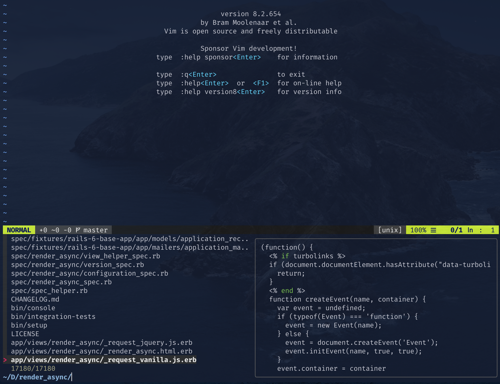
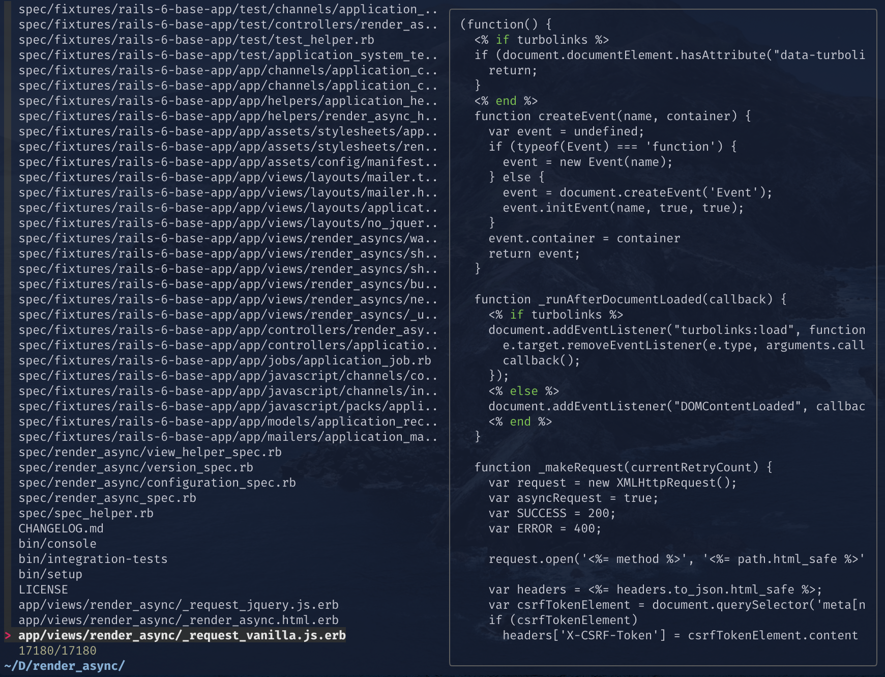
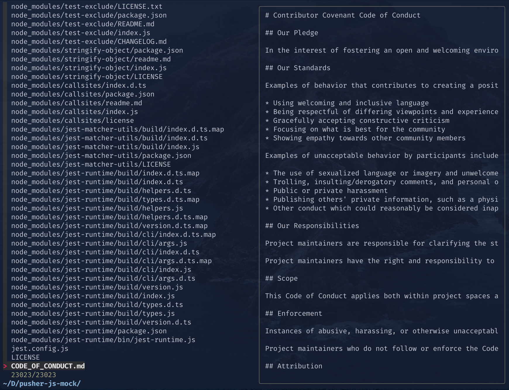
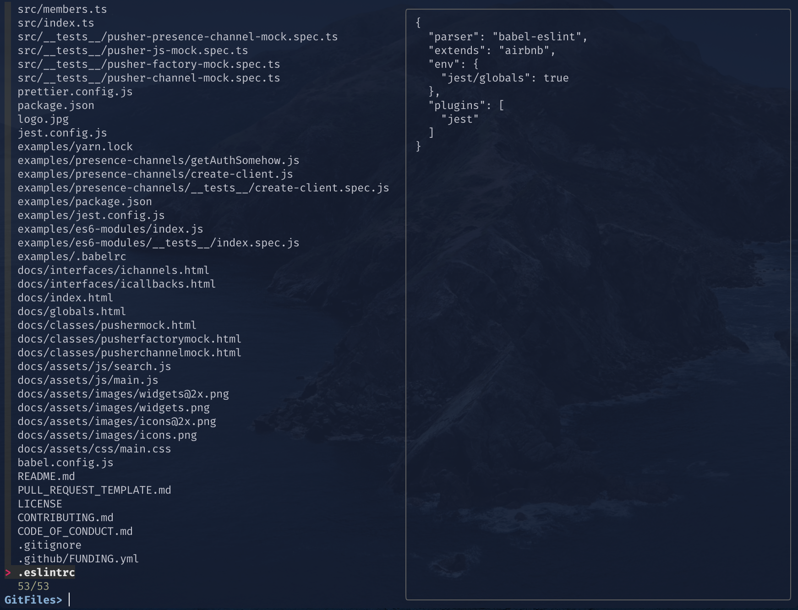
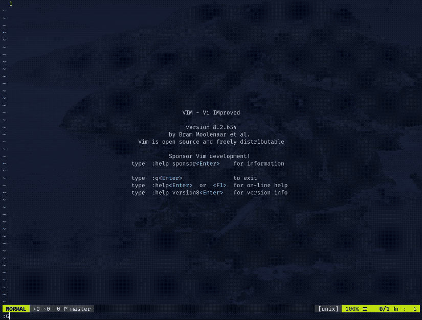
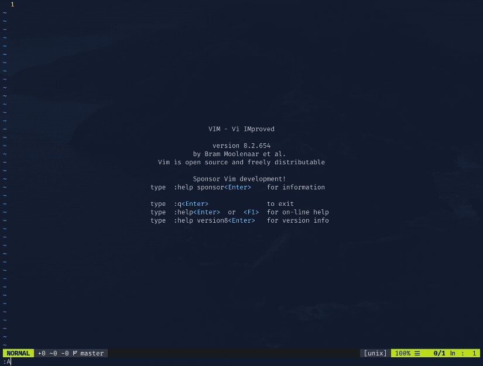
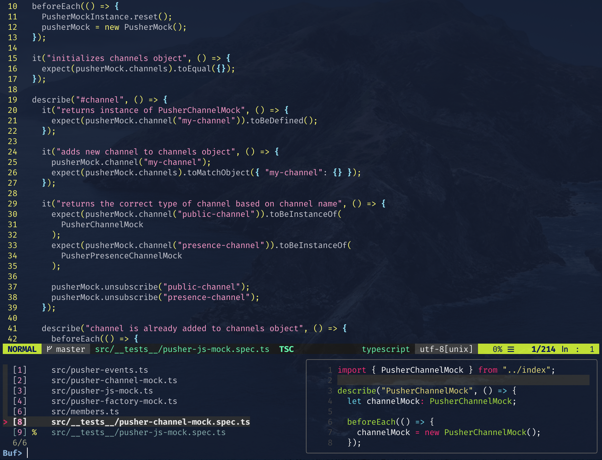
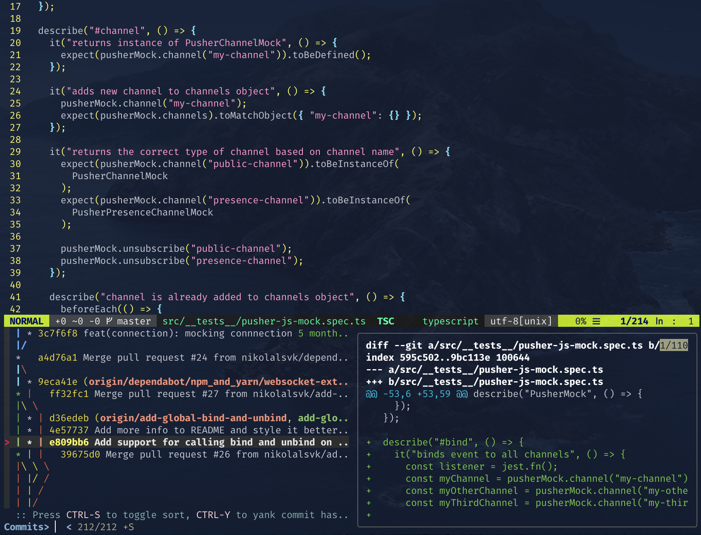

<figure>
  

  <figcaption class="photo-caption">
  <span>Photo by <a href="https://unsplash.com/@pineapple?utm_source=unsplash&amp;utm_medium=referral&amp;utm_content=creditCopyText">Pineapple Supply Co.</a> on <a href="https://unsplash.com/s/photos/improve-pineapple?utm_source=unsplash&amp;utm_medium=referral&amp;utm_content=creditCopyText">Unsplash</a></span>
  </figcaption>
</figure>

If you never heard of [fzf](https://github.com/junegunn/fzf), it is a very
handy general-purpose command-line fuzzy finder. Besides command-line, it is
also a popular Vim plugin. If you're wondering, a fuzzy finder is a tool that
helps you find what you're looking for without needing to write the full name.

As a Vim user, I am always obsessed with doing a thing in the fewer keystrokes
as possible. Having the ability to open a file in Vim quickly is super useful to
me, and you will see why soon.

But, did you know that this fuzzy finder - fzf, can do a lot more than you
thought? Oh yeah, the fuzzy search is just the tip of the iceberg here.
It is like wine; the more you leave it on your computer, the more flavor and
sweetness it accumulates from that command-line. Let's dive in and find out how
you can increase your productivity with fzf inside Vim.

## Starting off

To be able to do the things I am doing in this blog post, you will need a couple of
plugins. If you're not using [vim-plug](https://github.com/junegunn/vim-plug)
for installing other Vim plugins, then you are missing out. Go ahead and set
that up, and you can add the following:

```vim
Plug 'junegunn/fzf', { 'do': { -> fzf#install() } }
Plug 'junegunn/fzf.vim'
```

Then, install these plugins with `:PlugInstall` or use this shortcut I use:

```vim
" Source Vim configuration file and install plugins
nnoremap <silent><leader>1 :source ~/.vimrc \| :PlugInstall<CR>
```

You can then press your leader key and number 1 to install and apply all the
changes in your `.vimrc`.

Now, to the coolest part!

## The magic finder

Everything we need is installed, and we can get to the practical part. As we
said before, fzf is a fuzzy finder, a file selector if you want. Let's try
out that feature right off. To get the file picker opened, type `:Files` in
a Vim session. You should get something like this:



What happened is fzf opened a small window at the bottom showing files in our
directory. If you look at the newly opened window, you will see the list of
files, and the **preview** of the currently selected file on the right
of the window. So you got your files on the left and their preview on the
right. Are you already impressed as I was? Cool, let's move on.

If you don't like the window, you can fine-tune easily with fzf customization
options. But if you want any fzf command in fullscreen, you can append `!` at
the end of the command. For example, let's do `:Files!` and you should see the
following:



But, I don't use `:Files` that often. As a matter of fact, I only use
`:GFiles` command by fzf. `:GFiles` will open a file picker for your Git files,
ignoring ones in the `.gitignore`. Using it is pretty neat in JavaScript
projects where `node_modules` files tend to kill the mood when running
`:Files`. Let us compare the same project with `:Files` and `:GFiles` commands:



<div class="photo-caption">
  Yuck! `node_modules` everywhere.
</div>



<div class="photo-caption">
  Ah, that's better.
</div>

Notice the difference? It feels like I just dropped a heavy backpack off my
back by not having those `node_modules/**` files popping up. Anyway, let's see
this bad boy in action when searching for files to edit.



That's it, and it is looking pretty good. Only thing I dislike about using `:GFiles` is
that it won't include your new files unless you add them to the Git index with
`git add`. Also, I'd like some syntax highlighting to be there out of the box
when previewing files, but we will cover that in another blog post. In the
meantime, consider subscribing to the [newsletter](/newsletter) to get similar
posts like this.

To sum up, fzf is useful and quick as a flash when searching for files. And, as
Drake below says, resort to using `:GFiles` or try to configure `:Files` to
ignore certain files and paths.


To make this super fast for you, you can create a shortcut. I open `:GFiles`
with CTRL + p. I got left with this in my muscle memory from the legendary
[ctrlp](https://github.com/kien/ctrlp.vim) plugin. To have `:GFiles` wired
up, so it opens with CTRL + p, you can add the following to your `.vimrc`:

```vim
nnoremap <C-p> :GFiles<Cr>
```

## Speed search your project

What blows my mind from time to time is other things you can do with fzf in
Vim. For example, you can use
[The Silver Searcher](https://github.com/ggreer/the_silver_searcher)
or
[ripgrep](https://github.com/BurntSushi/ripgrep) with fzf.
To search with The Silver Searcher, type `:Ag` and a term you want to
search. And, to search with ripgrep, type `:Rg` and the term. Of course, to
have these commands work, you need the respective libraries installed in your
environment.

I use `:Ag`, and it performs wonderfully. It is wired to CTRL + g for me,
so I access it quickly. To have this or a similar setup, add the following
to your `.vimrc`:

```vim
nnoremap <C-g> :Ag<Cr>
```

The shortcut above will open up the `:Ag` search windows at the bottom with the
preview of the file. I find it super helpful and quick when I need to search
for a word in a project. Let's see `:Ag` in action.



## Buffed up

You can search all your open buffers with fzf by typing `:Buffers`. I keep a
shortcut at my leader key (the Space key, BTW) + b. Like so:

```vim
nnoremap <silent><leader>l :Buffers<CR>
```

With that command, you will get a buffers explorer where you can quickly switch
between open files. I hope that helps. Let's see how it looks:



## ASCII art (kind of)

If you are a fan of drawing inside the terminal, then you are going to love this one.
Try typing `:Commits` if you are using the [vim-fugitive](https://github.com/tpope/vim-fugitive) plugin.
The plugin by itself is a pretty awesome wrapper around Git, just if you
never want to leave the warmth of your Vim session. Anyways, if you type
`:Commits` you should get a tree of your project commits like so:



Pretty cool, huh? You can scroll up and down and checkout changes at each
commit. You can even enter the commit you are interested in and check out
changes made there. All of this is possible thanks to the `vim-fugitive`, so check
it out. A blog post about using Git inside Vim is coming, so be sure to
subscribe to the [newsletter](/newsletter).

## A quick summary

Vim ecosystem has a lot of plugins, and fzf is one great plugin. You can search
for files with `:GFiles` and `:Files`. If you want to do a text search, try using
`:Ag` or `:Rg`, which use The Silver Searcher and ripgrep, respectively. Tired of
slow switching between open buffers - try out `:Buffers`. Or, if you want some
nice commit information, do `:Commits`.

These are just a couple of commands and tricks fzf has, be sure to check out
their README for more information. Also, stay tuned for more posts like these
from me and consider subscribing to the [newsletter](/newsletter). If you found
the blog post interesting, make sure to spread the word and share it with
your friends and coworkers:

<blockquote class="twitter-tweet tw-align-center"><p lang="en" dir="ltr">I just released a new blog post about using the fzf plugin with Vim. Check it out 👇<a href="https://t.co/fmybAXNNnx">https://t.co/fmybAXNNnx</a></p>&mdash; Nikola Đuza (@nikolalsvk) <a href="https://twitter.com/nikolalsvk/status/1328670506803924992?ref_src=twsrc%5Etfw">November 17, 2020</a></blockquote> <script async src="https://platform.twitter.com/widgets.js" charset="utf-8"></script>

> 💡 Are you curious to learn Vim in the most effective way possible? Then check out
> the [Mastering Vim Quickly](https://gumroad.com/a/561247347) book.

Until the next one, cheers!
