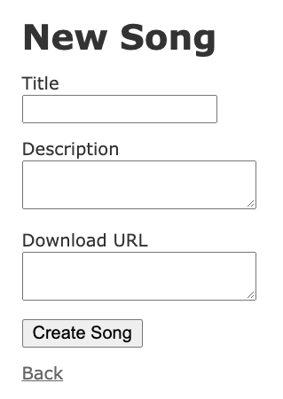

Welcome back to the third installment of the [Ruby on Rails Patterns and Anti-Patterns series](https://blog.appsignal.com/category/rails-patterns-and-anti-patterns.html). In the previous posts, we covered patterns and anti-patterns in general as well as in relation to Rails Models. In this post, we are going to go over some patterns and anti-patterns associated with Rails views.

Rails views can sometimes work perfectly and be fast, and at other times, they can have all sorts of issues. If you want to increase confidence over how you handle your views or you just want to learn more on the topic, then this blog post is for you. Let’s dive right in.

As you probably know, the Rails framework follows convention over configuration. And since Rails is big on the Model-View-Controller (MVC) pattern, the motto naturally applies to the View code as well. This includes your markup (ERB or Slim files), JavaScript and CSS files. At first glance, you might think that the View layer is pretty straightforward and easy, but keep in mind that these days, there is a mix of technologies living in the View layer.

We use JavaScript, HTML, and CSS in the view. These three can lead to confusion and disorganization of code — leading to implementation that doesn’t make much sense in the long run. Luckily, today we are going to go through some common problems and solutions with the Rails View layer.

## Powerlifting Views

This is a mistake that doesn’t happen that often, but when it does, it’s an eyesore. Sometimes, people tend to put the domain logic or querying directly inside the View. This makes the View layer do the heavy-lifting or powerlifting. What is interesting is that Rails actually allows this to easily happen. There is no ‘safety net’ when it comes to this, you are allowed to do whatever you want in the View layer.

By definition, the View layer of the MVC pattern should contain presentation logic. It shouldn’t be bothered with domain logic or with querying data. In Rails, you get ERB files (Embedded Ruby) that allow you to write Ruby code that will then get evaluated into HTML. If we consider an example of a website that lists songs on the index page, then the view logic would be in the `app/views/songs/index.html.erb`.

To illustrate what “powerlifting” means and what not do to, let’s take a look at the following example:

```erb
# app/views/songs/index.html.erb

<div class="songs">
  <% Song.where(published: true).order(:title) do |song| %>
    <section id="song_<%= song.id %>">
      <span><%= song.title %></span>

      <span><%= song.description %></span>

      <a href="<%= song.download_url %>">Download</a>
    </section>
  <% end %>
</div>
```

A huge anti-pattern here is the fetching of songs right in the markup. The responsibility of fetching the data should be delegated to the controller or a service that is being called from the controller. I sometimes see people prepare some data in the controller and later fetch more data in the views. This is bad design and it makes your website slower because you are stressing your database with queries more often.

What you should do instead is to expose a `@songs` instance variable from the controller action and call that in the markup, like so:

```rb
class SongsController < ApplicationController
  ...

  def index
    @songs = Song.all.where(published: true).order(:title)
  end

  ...
end
```

```erb
# app/views/songs/index.html.erb

<div class="songs">
  <% @songs.each do |song| %>
    <section id="song_<%= song.id %>">
      <span><%= song.title %></span>

      <span><%= song.description %></span>

      <a href="<%= song.download_url %>">Download</a>
    </section>
  <% end %>
</div>
```

These examples are far from perfect. If you want to keep your controller code more readable and avoid SQL Pasta, I urge you to check out the [previous blog post](https://blog.appsignal.com/2020/11/18/rails-model-patterns-and-anti-patterns.html). Also, leaving out the logic in the View layer increases the chances that other people will try to build their solutions off of it.

## Make Use of What Rails Gives You

We will keep it short here. Ruby on Rails as a framework comes with a lot of neat helpers, especially inside the view. These nifty little helpers allow you to build your View layer quickly and effortlessly. As a beginner user of Rails, you might be tempted to write the full HTML inside your ERb files like so:

```erb
# app/views/songs/new.html.erb

<form action="/songs" method="post">
  <div class="field">
    <label for="song_title">Title</label>
    <input type="text" name="song[title]" id="song_title">
  </div>

  <div class="field">
    <label for="song_description">Description</label>
    <textarea name="song[description]" id="song_description"></textarea>
  </div>

  <div class="field">
    <label for="song_download_url">Download URL</label>
    <textarea name="song[download_url]" id="song_download_url"></textarea>
  </div>

  <input type="submit" name="commit" value="Create Song">
</form>
```

With this HTML, you should get a nice form for a new song as seen in the screenshot below:



But, with Rails, you don’t need and you shouldn’t write plain HTML like that since Rails has your back right there. You can use the `form_with` view helper that will generate the HTML for you. `form_with` was introduced in Rails 5.1 and it is there to replace `form_tag` and `form_for` that might be familiar to some folk. Let’s see how `form_with` can relieve us from writing extra code:

```erb
<%= form_with(model: song, local: true) do |form| %>
  <div class="field">
    <%= form.label :title %>
    <%= form.text_field :title %>
  </div>

  <div class="field">
    <%= form.label :description %>
    <%= form.text_area :description %>
  </div>

  <div class="field">
    <%= form.label :download_url do %>
      Download URL
    <% end %>
    <%= form.text_area :download_url %>
  </div>

  <%= form.submit %>
<% end %>
```

Besides generating HTML for us, `form_with` also generates an authenticity token that prevents CSRF attacks. So in almost all cases, you are better off using designated helpers since they might play well with the Rails framework. If you tried to submit a plain HTML form, it will fail because there was no valid authenticity token submitted with the request.

Besides `form_with`, `label`, `text_area`, and `submit` helpers, there are a bunch more of these view helpers that come out-of-the-box with Rails. They are there to make your lives easier and you should get to know them better. One of the “all-stars” is definitely `link_to`:

```erb
<%= link_to "Songs", songs_path %>
```

Which will generate the following HTML:

```html
<a href="/songs">Songs</a>
```

I won’t go into much detail on each helper, since this post will be too long and going through all of them is not part of today’s topic. I suggest you go through [Rails Action View helpers guide](https://guides.rubyonrails.org/action_view_helpers.html) and pick what you need for your website.

## Reusing and Organizing View Code

Let’s imagine the perfect web application. In the perfect use-case, there are no if-else statements, just pure code that takes data from the controller and puts it between HTML tags. That kind of application exists maybe in hackathons and dreams, but real-world applications have a bunch of branches and conditions when rendering views.

What should you do when the logic for showing parts of a page gets too complex? Where do you go from there? A general answer would be to perhaps reach for a modern JavaScript library or framework and build something complex. But, since this post is about Rails Views, let’s look at the options we have inside them.

## After-Market (Custom) Helpers

Let’s say you want to show a call-to-action (CTA) button below a song. But, there is a catch — a Song can either have a download URL or, for whatever reason, it can be missing. We might be tempted to code something similar to the following:

```erb
# app/views/songs/show.html.erb

...

<div class="song-cta">
  <% if @song.download_url %>
    <%= link_to "Download", download_url %>
  <% else %>
    <%= link_to "Subscribe to artists updates",
                artist_updates_path(@song.artist) %>
  <% end %>
</div>

...
```

If we look at the example above as an isolated presentational logic, it doesn’t look too bad, right? But, if there are more of these conditional renders, then the code becomes less readable. It also increases the chances of something, somewhere not getting rendered properly, especially if there are more conditions.

One way to fight these is to extract them to a separate helper. Luckily, Rails provides us a way to easily write custom helpers. In the `app/helpers` we can create a `SongsHelper`, like so:

```rb
module SongsHelper
  def song_cta_link
    content_tag(:div, class: 'song-cta') do
      if @song.download_url
        link_to "Download", @song.download_url
      else
        link_to "Subscribe to artists updates",
                artist_updates_path(@song.artist)
      end
    end
  end
end
```

If we open up the show page of a song, we will still get the same results. However, we can make this example a bit better. In the example above, we used an instance variable `@song`. This might not be available if we decide to use this helper at a place where `@song` is `nil`. So to cut off an external dependency in the form of an instance variable, we can pass in an argument to the helper like so:

```rb
module SongsHelper
  def song_cta_link(song)
    content_tag(:div, class: 'song-cta') do
      if song.download_url
        link_to "Download", song.download_url
      else
        link_to "Subscribe to artists updates",
                artist_updates_path(song.artist)
      end
    end
  end
end
```

Then, in the view, we can call the helper like below:

```erb
# app/views/songs/show.html.erb

...

<%= song_cta_link(@song) %>

...
```

With that, we should get the same results in the view as we did before. The good thing about using helpers is that you can write tests for them ensuring that no regression happens regarding them in the future. A con is that they are globally defined and you have to ensure that helper names are unique across your app.

If you are not a big fan of writing Rails custom helpers, you can always opt-in for a View Model pattern with the [Draper gem](https://github.com/drapergem/draper). Or you can roll your own View Model pattern here, it shouldn’t be that complicated. If you are just starting out with your web app, I suggest starting slowly by writing custom helpers and if that brings pain, turn to other solutions.

## DRY up Your Views

What I really liked when I started with Rails was the ability to easily DRY up your markup that it was almost unbelievable to me. Rails gives you the ability to create partials — reusable code pieces that you can include anywhere. For example, if you are rendering songs in multiple places, and you have the same code across multiple files, it makes sense to create a song partial.

Let’s say you show your song as shown below:

```erb
# app/views/songs/show.html.erb

<p id="notice"><%= notice %></p>

<p>
  <strong>Title:</strong>
  <%= @song.title %>
</p>

<p>
  <strong>Description:</strong>
  <%= @song.description %>
</p>

<%= song_cta_link %>

<%= link_to 'Edit', edit_song_path(@song) %> |
<%= link_to 'Back', songs_path %>
```

But, you also want to show it on another page with the same markup. Then you can create a new file with an underscore prefix like `app/views/songs/_song.html.erb`.

```erb
# app/views/songs/_song.html.erb

<p>
  <strong>Title:</strong>
  <%= @song.title %>
</p>

<p>
  <strong>Description:</strong>
  <%= @song.description %>
</p>

<%= song_cta_link(@song) %>
```

And then wherever you want to include the song partial, you just do the following:

```erb
...

<%= render "song" %>

...
```

Rails will do an auto-lookup of whether the `_song` partial exists and it will render it. Similar to an example with custom helpers, it is best if we get rid of the instance variable `@song` in our partial.

```erb
# app/views/songs/_song.html.erb

<p>
  <strong>Title:</strong>
  <%= song.title %>
</p>

<p>
  <strong>Description:</strong>
  <%= song.description %>
</p>

<%= song_cta_link(song) %>
```

Then, we will need to pass in the song variable to the partial, making it more reusable and suitable to being included in other places.

```erb
...

<%= render "song", song: @song %>

...
```

## Final Thoughts

That’s all folks for this post. To summarize, we went through a few patterns and anti-patterns that you can come across in the Rails View realm. Here are a few takeaways:

- Avoid complex logic in the UI (do not make the View do lots of powerlifting)
- Learn what Rails gives you out-of-the-box in terms of View helpers.
- Structure and reuse your code with custom helpers and partials
- Do not depend on instance variables too much.

In the next post, we will cover Rails Controller patterns and anti-patterns where things can get pretty messy. Stay tuned for that.

Until the next one, cheers!
