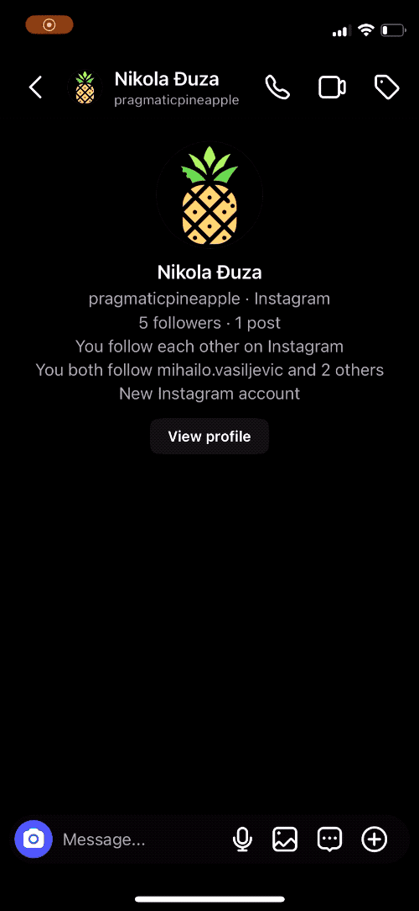
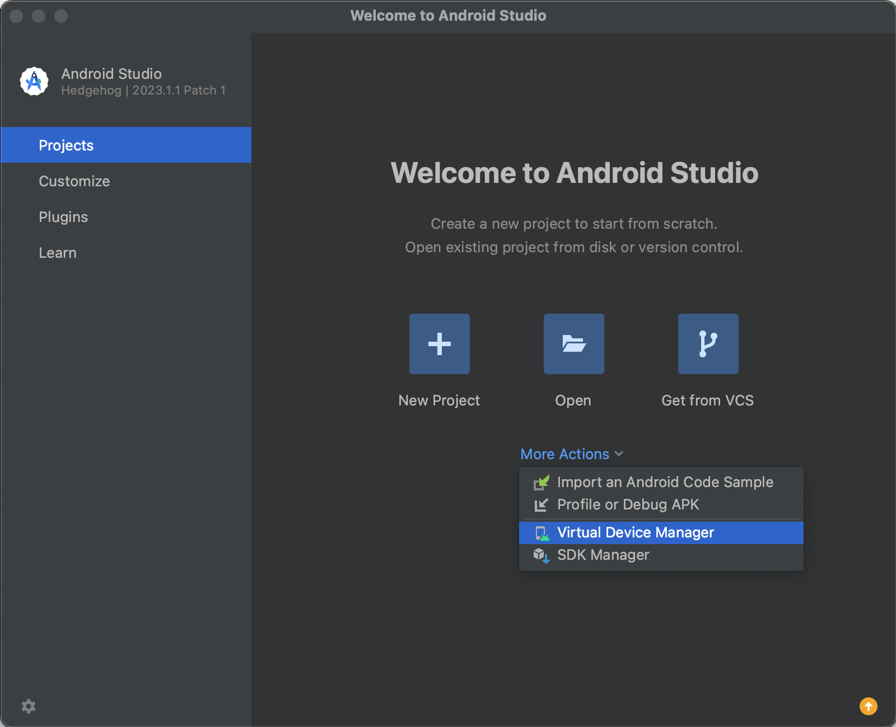
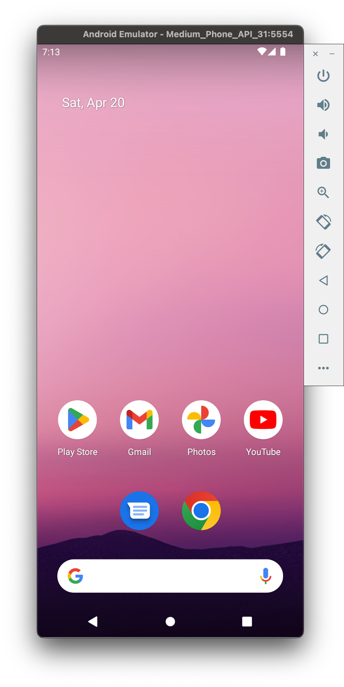
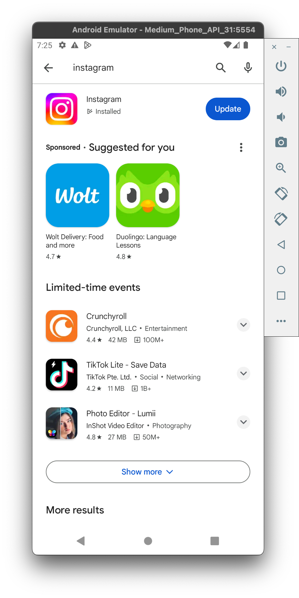
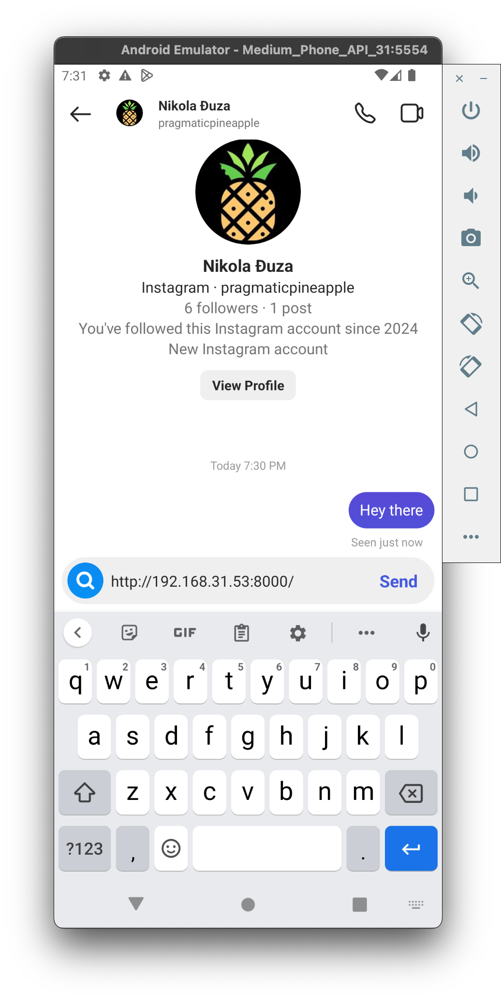
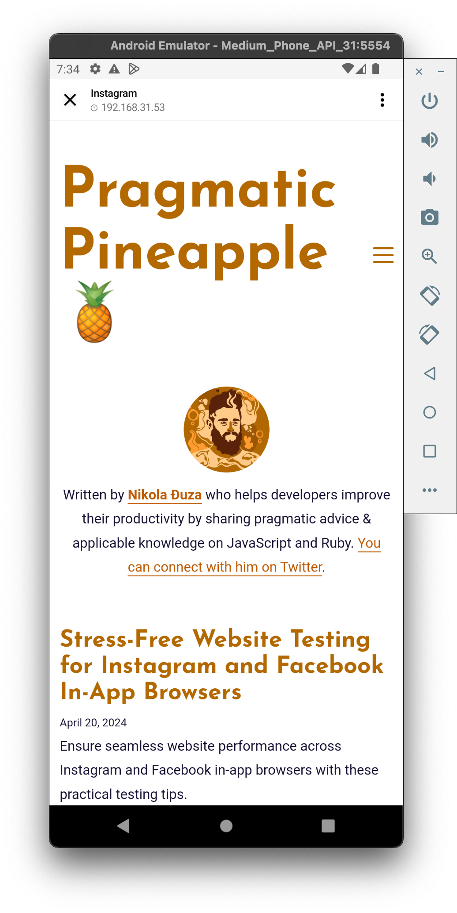

As a web developer, you encounter many challenges during website development. Often, we need to ensure our code works in a bunch of browsers and that the website users are having a great experience. Some of those browsers are straightforward and have excellent documentation, and you can easily open your website with them. Unfortunately, browsers coming from Meta, more specifically Facebook and Instagram in-app browsers, are a mystery to us all.

In-app browsers, in general, are a mystery. There is little documentation to know what works and what does not. The best way to find out what works and does not in that scenario is to test and preview the website directly. For that reason, I'm writing this blog post. I want to shed more light on in-app browsers like Facebook and Instagram. So buckle up. We're going on an exciting drive through the in-app browser scenic drive.

Also, Meta (and others using in-app browsers), if you're reading this, can you shine more light on how these browsers work? It will help us all build better experiences on the web if we know what works and what does not. Thank you 🥰

## Approaches

Welcome! We're going to take two approaches to test and preview a website in the in-app browsers:

1. Directly from our phones
2. In an emulator

The 1st approach might be kind of obvious for some folks (it wasn't for me at first 😂). The idea is to install Instagram and Facebook apps on your phone. In this example, we'll use Instagram. In the app, you need to log in. If you don't have an account, you will need to sign up for these services. Don't worry. You don't need to use the app regularly.

### 1. Run in-app browser on the phone directly

Once logged in to Instagram, you can view your website easily by sending a link to your website to any of your friends. If you don't want to spam your friends, send links to the Pragmatic Pineapple Instagram: https://www.instagram.com/pragmaticpineapple. Here's how that looks:

In the GIF, I start with a direct message with an account [Pragmatic Pineapple](https://www.instagram.com/pragmaticpineapple), and I send a link to my blog. The link is from a local development machine, where I'm simulating a typical development experience and environment where you'd preview the website. Ideally, you'll check whether everything is good while developing the website, not in production. I wrote in detail on [how to preview a website on your mobile phone from localhost here](https://pragmaticpineapple.com/how-to-preview-localhost-website-on-mobile-phone/).

Once I send the link to the website, I click on the link to preview it, and the Instagram in-app browser opens. There, you can scroll and click around or verify the functionality you want.

And that's it! You can send different links to verify their behavior. Here's the process in short:

1. Download Instagram
2. Log in/Sign up
   3 .Send a link to a website you want to test to a friend or [Pragmatic Pineapple](https://www.instagram.com/pragmaticpineapple).
3. The Instagram in-app browser will open

The process is similar for Facebook and Messenger in-app browsers as well; the only thing is you might have to install two apps. With Facebook, you can create a profile and post links as status updates. That way, they will stay on your profile for quick access. With Messenger, you can send links to friends/pages and open them in the Messenger app.

But what if you want to test it on an older phone? Those also use a different in-app browser (older WebView in some cases). Let's go to the next section, where I'll show you how to run an older Android.

### 2. Run in-app-browser in an Android emulator

For this step, we're going to use Android Studio. You can use any other tool to run an Android emulator. The main goal is to have the Android with a way to install Instagram or Facebook. Here are the steps:

1. Install [Android Studio](https://developer.android.com/studio)
2. Open the Android studio and open Virtual Device Manager
   

3. Create a new device

   - Select Hardware - keep it default
   - Download Android 12 - this is what worked for me to easily install apps via Google Play Store
   - Android Virtual Device (AVD) - keep it default
   - Click Show Advanced Settings → Memory and Settings and increase memory and storage if needed
   - Click Finish

4. Once virtual device is done setting up, click the Play button to run it. Once loaded, you should see a Android home screen like below
   

5. Open Google Play and search for Instagram
   

6. Download and then open Instagram. Log in with the account or create a new one.
7. Go to [Pragmatic Pineapple page](https://www.instagram.com/pragmaticpineapple) and send a link to your website there or to a friend (you might have to wait for me or your friend to approve the request to chat)
   

8. Open the link you sent, and you should be able to test out the website.
   

And that's it! Congrats!

> If you check, I sent a local IP address in chat, so I can preview the localhost website. If you're interested in [how to preview localhost on your mobile phone, I wrote a blog post on it here](https://pragmaticpineapple.com/how-to-preview-localhost-website-on-mobile-phone/). You can do the same with any website.

You can follow the same process for Facebook in-app browser; install Facebook and Messenger instead of Instagram and follow the same steps. On Facebook, you can share links in the feed and open them from there. In Messenger, you can send links to your friends/pages and open them there.

## Summing Up

Testing websites in in-app browsers can be painful, but not anymore with the new learnings you gained reading this post. For now, you're good with previewing and checking whether the functionality works properly. To sum up, you can either:

1. Download Instagram/Facebook/Messenger on your phone directly and share links there, or
2. Run an Android emulator where you can install Instagram/Facebook/Messenger on your phone directly and share links there

In the next one on this topic, we can review how to debug websites that run inside in-app browsers. But for that, be sure to [subscribe to the newsletter](/newsletter) to get notified when a new post is out.

Thanks for reading, and I'll catch you in the next one; cheers!
