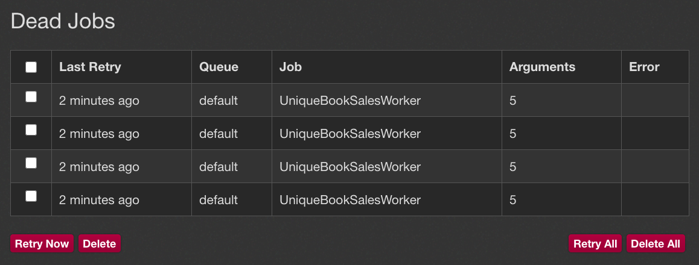
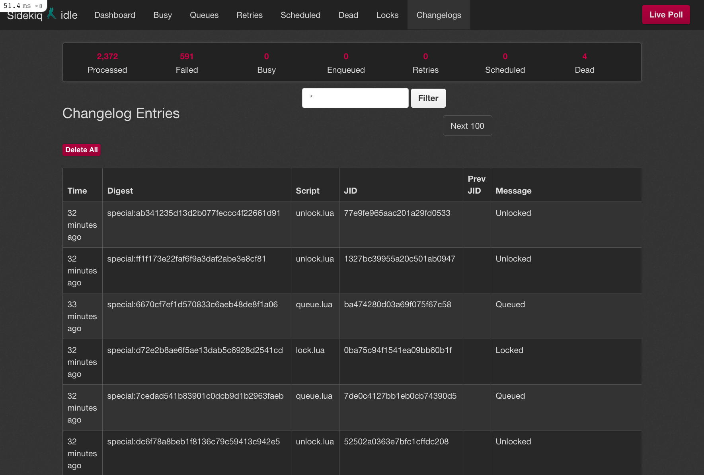

<figcaption class="photo-caption">
Photo from <a href="https://blog.appsignal.com/2021/05/12/three-ways-to-avoid-duplicate-sidekiq-jobs.html">AppSignal's Blog</a>
</figcaption>

Chances are, if you are writing Ruby code, you are using Sidekiq to handle
background processing. If you are coming from `ActiveJob` or some other
background, stay tuned, some of the tips covered can be applied there as well.

Folks utilize (Sidekiq) background jobs for different cases. Some crunch
numbers, some dispatch welcome emails to users, and some schedule data syncing.
Whatever your case may be, you might eventually run into a requirement to avoid
duplicate jobs. By duplicate jobs, I envision two jobs that do the exact same
thing. Let’s dive in on that a bit.

## Why De-Duplicate Jobs?

Imagine a scenario where your job looks like the following:

```rb
class BookSalesWorker
  include Sidekiq::Worker

  def perform(book_id)
    crunch_some_numbers(book_id)

    upload_to_s3
  end

  ...
end
```

The `BookSalesWorker` always does the same thing — queries the DB for a book
based on the `book_id` and fetches the latest sales data to calculate some
numbers. Then, it uploads them to a storage service. Keep in mind that every
time a book is sold on your website, you will have this job enqueued.

Now, what if you got 100 sales at once? You’d have 100 of these jobs doing the
exact same thing. Maybe you are fine with that. You don’t care about S3 writes
that much, and your queues aren’t as congested, so you can handle the load.
But, “does it scale?"™️

Well, definitely not. If you start receiving more sales for more books, your
queue will quickly pile up with unnecessary work. If you have 100 jobs that do
the same thing for a single book, and you have 10 books selling in parallel,
you are now 1000 jobs deep in your queue, where in reality, you could just
have 10 jobs for each book.

Now, let’s go through a couple of options on how you can prevent duplicate jobs
from piling up your queues.

## 1. DIY Way

If you are not a fan of external dependencies and complex logic, you can go
ahead and add some custom solutions to your codebase. I created a sample repo
to try out our examples first-hand. There will be a link in each approach to
the example.

### 1.1 One Flag Approach

You can add one flag that decides whether to enqueue a job or not. One might
add a `sales_enqueued_at` in their Book table and maintain that one. For example:

```rb
module BookSalesService
  def schedule_with_one_flag(book)
    # Check if the job was enqueued more than 10 minutes ago
    if book.sales_enqueued_at < 10.minutes.ago
      book.update(sales_enqueued_at: Time.current)

      BookSalesWorker.perform_async(book.id)
    end
  end
end
```

That means that no new jobs will be enqueued until 10 minutes have passed from
the time the last job got enqueued. After 10 minutes have passed, we then
update the `sales_enqueued_at` and enqueue a new job.

Another thing you can do is set one flag that is a boolean, e.g.
`crunching_sales`. You set `crunching_sales` to true before the first job is
enqueued. Then, you set it to false once the job is complete. All other jobs
that try to get scheduled will be rejected until `crunching_sales` is false.

You can try this approach
[in the example repo](https://github.com/nikolalsvk/duplicate-sidekiq-jobs#1-one-flag-approach)
I created.

### 1.2 Two Flags Approach

If "locking” a job from being enqueued for 10 minutes sounds too scary, but you
are still fine with extra flags in your code, then the next suggestion might
interest you.

You can add another flag to the existing `sales_enqueued_at` — the
`sales_calculated_at`. Then our code will look something like this:

```rb
module BookSalesService
  def schedule_with_two_flags(book)
    # Check if sales are being calculated right now
    if book.sales_enqueued_at <= book.sales_calculated_at
      book.update(sales_enqueued_at: Time.current)

      BookSalesWorker.perform_async(book.id)
    end
  end
end

class BookSalesWorker
  include Sidekiq::Worker

  def perform(book_id)
    crunch_some_numbers(book_id)

    upload_to_s3

    # New adition
    book.update(sales_calculated_at: Time.current)
  end

  ...
end
```

To try it out, check out the [instructions in the example repo](https://github.com/nikolalsvk/duplicate-sidekiq-jobs#2-two-flag-approach).

Now we control a portion of the time between when a job is enqueued and
finished. In that portion of time, no job can be enqueued. While the job is
running, the `sales_enqueued_at` will be larger than `sales_calculated_at`. When
the job finishes running, the `sales_calculated_at` will be larger (more recent)
than the `sales_enqueued_at` and a new job will get enqueued.

Using two flags might be interesting, so you could show the last time those
sales numbers got updated in the UI. Then the users that read them can have an
idea of how recent the data is. A win-win situation.

### Flag Sum Up

It might be tempting to create solutions like these in times of need, but to
me, they look a bit clumsy, and they add some overhead. I would recommend using
this if your use case is simple, but as soon as it proves complex or not
enough, I’d urge you to try out other options.

A huge con with the flag approach is that you will lose all the jobs that tried
to enqueue during those 10 minutes. A huge pro is that you are not bringing in
dependencies, and it will alleviate the job number in queues pretty quickly.

### 1.3 Traversing The Queue

Another approach you can take is to create a custom locking mechanism to
prevent the same jobs from enqueueing. We will check the Sidekiq queue we are
interested in and see if the job (worker) is already there. The code will look
something like this:

```rb
module BookSalesService
  def schedule_unique_across_queue(book)
    queue = Sidekiq::Queue.new('default')

    queue.each do |job|
      return if job.klass == BookSalesWorker.to_s &&
        job.args.join('') == book.id.to_s
    end

    BookSalesWorker.perform_async(book.id)
  end
end

class BookSalesWorker
  include Sidekiq::Worker

  def perform(book_id)
    crunch_some_numbers(book_id)

    upload_to_s3
  end

  ...
end
```

In the example above we are checking whether the `'default'` queue has a job with
the class name of `BookSalesWorker`. We are also checking if the job arguments
match the book ID. If the `BookSalesWorker` job with the same Book ID is in the
queue, we will return early and not schedule another one.

Note that some of them might get scheduled if you schedule jobs too fast
because the queue is empty. The exact thing happened to me when testing it
locally with:

```rb
100.times { BookSalesService.schedule_unique_across_queue(book) }
```

You can try it out in the [example repo](https://github.com/nikolalsvk/duplicate-sidekiq-jobs#3-traverse-sidekiq-queue-approach).

The good thing about this approach is that you can traverse all queues to
search for an existing job if you need it. The con is that you can still have
duplicate jobs if your queue is empty and you schedule a lot of them at once.
Also, you are potentially traversing through all the jobs in the queue before
scheduling one, so that might be costly depending on the size of your queue.

## 2. Upgrading to Sidekiq Enterprise

If you or your organization has some money lying around, you can upgrade to the
Enterprise version of Sidekiq. It starts at \$179 per month, and it has a cool
feature that helps you avoid duplicate jobs. Unfortunately, I don’t have
Sidekiq Enterprise, but I believe [their documentation](https://github.com/mperham/sidekiq/wiki/Ent-Unique-Jobs)
is sufficient. You can easily have unique (non-duplicated) jobs with the
following code:

```rb
class BookSalesWorker
  include Sidekiq::Worker
  sidekiq_options unique_for: 10.minutes

  def perform(book_id)
    crunch_some_numbers(book_id)

    upload_to_s3
  end

  ...
end
```

And that’s it. You have a similar job implementation to what we described in
the [‘One Flag Approach’](#one-flag-approach) section. The job will be unique
for 10 minutes, meaning that no other job with the same arguments can be
scheduled in that time period.

Pretty cool one-liner, huh? Well, if you have Enterprise Sidekiq and you just
found out about this feature, I am truly glad I helped. Most of us are not
going to use it, so let’s jump into the next solution.

## 3. sidekiq-unique-jobs To The Rescue

Yes, I know we are about to mention a gem. And yes, it has some Lua files in it
which might put some people off. But bear with me, it’s a really sweet deal you
are getting with it. The [sidekiq-unique-job](https://github.com/mhenrixon/sidekiq-unique-jobs)
gem comes with a lot of locking and other configuration options — probably more
than you need.

To get started quickly, put `sidekiq-unique-jobs` gem into your Gemfile, do
`bundle` and configure your worker as shown:

```rb
class UniqueBookSalesWorker
  include Sidekiq::Worker

  sidekiq_options lock: :until_executed,
                  on_conflict: :reject

  def perform(book_id)
    book = Book.find(book_id)

    logger.info "I am a Sidekiq Book Sales worker - I started"
    sleep 2
    logger.info "I am a Sidekiq Book Sales worker - I finished"

    book.update(sales_calculated_at: Time.current)
    book.update(crunching_sales: false)
  end
end
```

There are a lot of options, but I decided to simplify and use this one:

```rb
sidekiq_options lock: :until_executed, on_conflict: :reject
```

The `lock: :until_executed` will lock the first `UniqueBookSalesWorker` job until
it is executed. With `on_conflict: :reject`, we are saying that we want all other
jobs that try to get executed to be rejected into the dead queue. What we
achieved here is similar to what we did in our DIY examples in the topics
above.

A slight improvement over those DIY examples is that we have a kind of log of
what happened. To get a sense of how it looks, let’s try the following:

```rb
5.times { UniqueBookSalesWorker.perform_async(Book.last.id) }
```

Only one job will fully execute, and the other four jobs will be sent off to
the dead queue, where you can retry them. This approach differs from our
examples where duplicate jobs were just ignored.



There are a lot of options to choose from when it comes to locking and conflict
resolving. I suggest you consult the [gem's documentation](https://github.com/mhenrixon/sidekiq-unique-jobs)
for your specific use case.

### Great Insights

The great thing about this gem is that you can view the locks and the history
of what went down in your queues. All you need to do is add the following lines
in your `config/routes.rb`:

```
# config/routes.rb
require 'sidekiq_unique_jobs/web'

Rails.application.routes.draw do
  mount Sidekiq::Web, at: '/sidekiq'
end
```

It will include the original Sidekiq client, but it will also give you two more
pages — one for job locks and the other for the changelog. This is how it
looks:



Notice how we have two new pages, “Locks” and “Changelogs”. Pretty cool
feature.

You can try all of this in [the example
project](https://github.com/nikolalsvk/duplicate-sidekiq-jobs#4-using-sidekiq-unique-jobs-gem)
where the gem is installed and ready to go.

### Why Lua?

First of all, I am not the author of the gem, so I’m just assuming things here.
The first time I saw the gem, I wondered: why use Lua inside a Ruby gem? It
might appear odd at first, but Redis supports running Lua scripts. I guess the
author of the gem had this in mind and wanted to do more nimble logic in Lua.

If you look at the
[Lua files in the gem's repo](https://github.com/mhenrixon/sidekiq-unique-jobs/tree/master/lib/sidekiq_unique_jobs/lua),
they aren't that complicated. All of the Lua scripts are called later from
the Ruby code in the
[`SidekiqUniqueJobs::Script::Caller` here](https://github.com/mhenrixon/sidekiq-unique-jobs/blob/master/lib/sidekiq_unique_jobs/script/caller.rb).
Please take a look at the source code, it is interesting to read and figure out how things work.

### Alternative gem

If you use `ActiveJob` extensively, you can try `active-job-uniqueness` gem [right here](https://github.com/veeqo/activejob-uniqueness).
The idea is similar, but instead of custom Lua scripts, it uses [Redlock](https://github.com/leandromoreira/redlock-rb) to
lock items in Redis.

To have a unique job using this gem, you can imagine a job like this one:

```rb
class BookSalesJob < ActiveJob::Base
  unique :until_executed

  def perform
    ...
  end
end
```

The syntax is less verbose but very similar to the `sidekiq-unique-jobs` gem.
It might solve your case if you highly rely on `ActiveJob`.

## Final Thoughts

I hope you gained some knowledge in how to deal with duplicate jobs in your
app. I definitely had fun researching and playing around with different
solutions. If you didn’t end up finding what you were looking for, I hope that
some of the examples inspired you to create something of your own.

Here’s the [example project](https://github.com/nikolalsvk/duplicate-sidekiq-jobs)
with all the code snippets.

I will see you in the next one, cheers.
