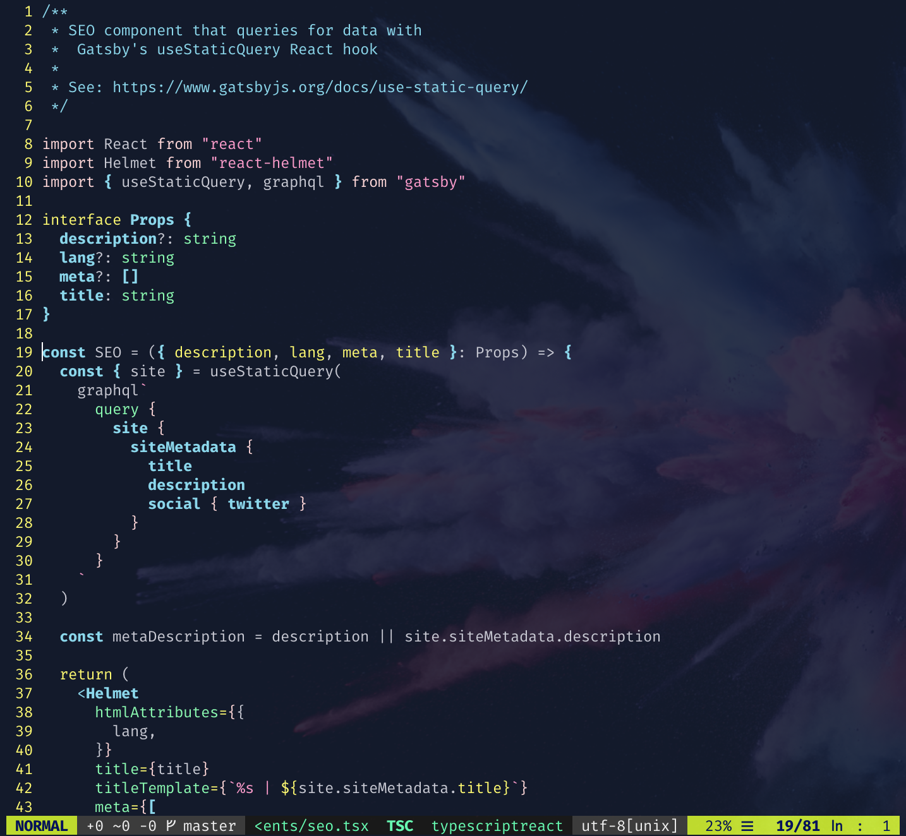
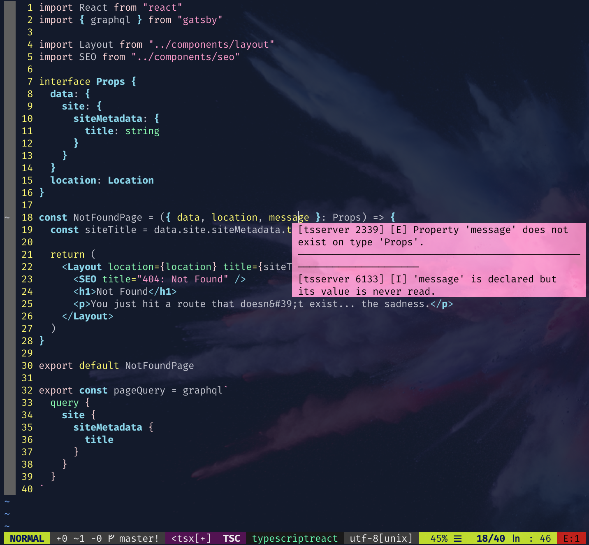
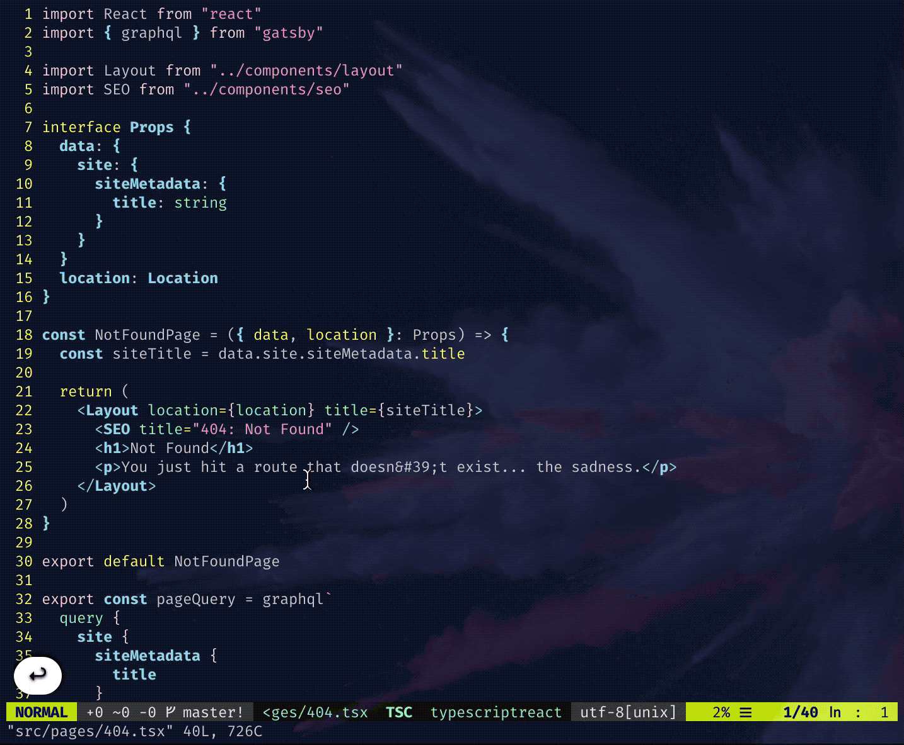
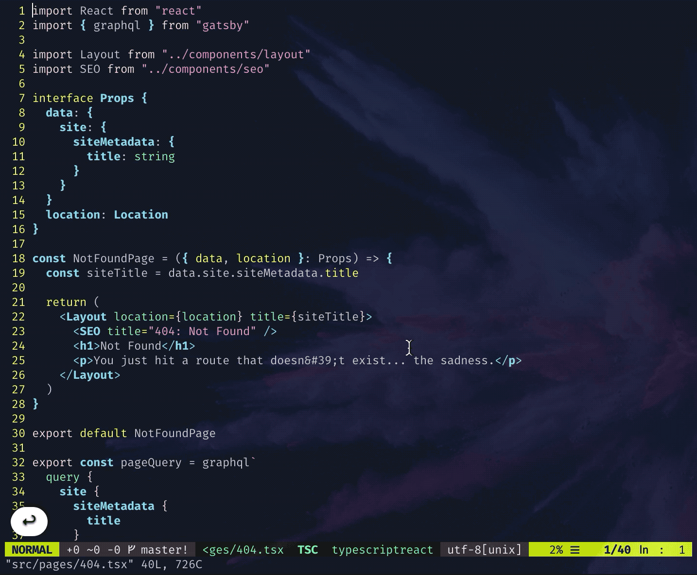

<div class="photo-caption">
Photo by <a href="https://unsplash.com/@pawel_czerwinski?utm_source=unsplash&utm_medium=referral&utm_content=creditCopyText">Paweł Czerwiński</a> on <a href="https://unsplash.com/s/photos/modern-vim?utm_source=unsplash&utm_medium=referral&utm_content=creditCopyText">Unsplash</a>
</div>

Vim is great. I have been using different text editors and IDEs through years,
and Vim stuck with me through all hardships and happy times. Maybe because I
invested much time in learning and fine-tuning it to my needs that it became a
part of me, a bit.

> I love Vim. It's not easy to use. I love Vim anyway.
>
> Maxin Cardamom

With those lines, [one of the best Vim talks on YouTube starts](https://youtu.be/XA2WjJbmmoM?t=50).
And it makes perfect sense. I remember being frustrated and asking why would
anyone use Vim while I was learning it. But all that paid struggle off. If you
are afraid of the Vim learning curve, I found this great
[post](https://thoughtbot.com/blog/the-vim-learning-curve-is-a-myth) that
proclaims you can learn Vim 30 minutes!

One of the main reasons why I use Vim as my editor is speed. And I do not mean
the speed of writing code, which is also excellent. I am thinking of the reading speed
of the code. Did you know that the [ratio of reading versus writing code is 10 to 1](https://www.goodreads.com/quotes/835238-indeed-the-ratio-of-time-spent-reading-versus-writing-is).
That means that you are regularly reading old code to write new code.
And with Vim, **reading** and **finding** old code has been the easiest and
fastest for me!

I will explain in another blog post which plugins and shortcuts I use, so be
sure to [subscribe to the newsletter](/newsletter).

## VSCode vs. Vim

A lot of folks are using [Visual Studio Code](https://code.visualstudio.com/)
for development. I do not blame them. I have used VSCode and [Visual Studio](https://visualstudio.microsoft.com/)
and it is one of the best software that came out of Microsoft!

<blockquote class="twitter-tweet tw-align-center"><p lang="en" dir="ltr">when people ask me to recommend a text editor <a href="https://t.co/ZCbU54tJTb">pic.twitter.com/ZCbU54tJTb</a></p>&mdash; Tim Pope (@tpope) <a href="https://twitter.com/tpope/status/1172743697315835904?ref_src=twsrc%5Etfw">September 14, 2019</a></blockquote> <script async src="https://platform.twitter.com/widgets.js" charset="utf-8"></script>

Most recently, I have been using VSCode for writing (and reading) [TypeScript](https://www.typescriptlang.org/)
code. Why you'd ask? Well, before I made an ultimate Vim TypeScript
setup, I had to use VSCode. The only reason why I used VSCode, was that Vim was
too slow for editing TypeScript files.

Luckily, I have upgraded Vim to [8.2 version](https://www.vim.org/vim-8.2-released.php),
and it started to be blazing fast once again. I ditched VSCode and moved
back to Vim and [my .vimrc](https://github.com/nikolalsvk/dotfiles/blob/master/.vimrc).

If you are thinking about the two, I would say to use Vim, but I am probably biased.
[VSCodeVim](https://github.com/VSCodeVim/Vim) lets you combine the best of two worlds,
and this is what I was using in my Visual Studio Code setup.

Upgrading to the new Vim version meant I could finally savor the sweet ~~fruits~~
plugins of the Vim and TypeScript ecosystem.

## Vim and TypeScript

To get you started with using TypeScript and Vim together, I will show plugins for
syntax highlighting:

- [pangloss/vim-javascript](https://github.com/pangloss/vim-javascript) provides syntax highlight and indentation for JavaScript in general
- [leafgarland/typescript-vim](https://github.com/leafgarland/typescript-vim) provides syntax highlight for TypeScript
- [maxmellon/vim-jsx-pretty](https://github.com/MaxMEllon/vim-jsx-pretty) support for JSX highlighting

These three will suit all of your needs. If you are using GraphQL, there is
[vim-graphql](https://github.com/jparise/vim-graphql) that works nicely for me.

After you add all of these plugins, this is how a React component looks like:



I use [vim-plug](https://github.com/junegunn/vim-plug) to install plugins, but
with new Vim 8.2, you can add plugins to `~/.vim/pack/some-package/` like
described in [vimhelp.org](https://vimhelp.org/repeat.txt.html#packages).

To add these plugins in your `.vimrc` using vim-plug, you can do the following:

```vim
Plug 'pangloss/vim-javascript'    " JavaScript support
Plug 'leafgarland/typescript-vim' " TypeScript syntax
Plug 'maxmellon/vim-jsx-pretty'   " JS and JSX syntax
Plug 'jparise/vim-graphql'        " GraphQL syntax
```

Then, install these plugins with `:PlugInstall` or use this shortcut I use:

```vim
" Source Vim configuration file and install plugins
nnoremap <silent><leader>1 :source ~/.vimrc \| :PlugInstall<CR>
```

You can then press your leader key and number 1 to install and apply all the
changes in your `.vimrc`.

Now, to the coolest part!

## Code completions

Coding in Visual Studio Code was pretty nice, and I got used to having suggestions as I type.
Luckily, there is the same thing for Vim! A plugin called [coc.nvim](https://github.com/neoclide/coc.nvim)
has made my development experience so much better! Conquer of Completion, or
CoC for short, is similar to
[YouCompleteMe](https://github.com/ycm-core/YouCompleteMe) and [deoplete](https://github.com/Shougo/deoplete.nvim) plugins,
but I found it easier to configure.

This of the CoC as a swiss-army knife of a Vim plugin. It is largely inspired
by VSCode and has a full Language Server Protocol support. We can picture the Language Server
Protocol or LSP as a middle-man between the language tooling and
code editors. In other words, you only need to write one protocol for
TypeScript and have it reused for different editors. I best understood the idea
from a diagram below:


To set up `coc.nvim` plugin, you need to include the plugin in your `.vimrc`:

```vim
Plug 'neoclide/coc.nvim', {'branch': 'release'}
```

Having plugin by itself will not be enough for a full-on VSCode-like experience
with TypeScript. To have code completion show up for TypeScript, you need to install
[coc-tsserver](https://github.com/neoclide/coc-tsserver). The reason for this is that CoC
works with extensions. There are many extensions that you can use, and more on why
extensions are needed is [in CoC Wiki](https://github.com/neoclide/coc.nvim/wiki/Using-coc-extensions).

In our case, we will use `coc-tsserver` extension that we can install with `:CocInstall coc-tsserver`. Or, you can put
this line in your `.vimrc` which I find better:

```vim
" CoC extensions
let g:coc_global_extensions = ['coc-tsserver']
```

At this point, you should start seeing language server errors highlighted with
associated icons in the gutter, and cursoring over the errors will show the
error or warning message.



Not only that, but you will be able to do autocomplete and get code fix
suggestions! Similar to VSCode. In the GIF below, I'll try to add a styled
container to the 404 page of my blog.



I am also showing which keys I'm pressing in the bottom left corner of the GIF
so you get a sense of what is going on in Vim. To sum up, I have created a
`Container` variable that is using `styled.div`. After that, I am including
`<Container>` in my code, but the TS Server is complaining that `styled` cannot
be found. Then, I'm using a shortcut to view code fixes, and I choose to import
styled.

I took some of the tricks from [example Vim configuration from the coc.nvim repo](https://github.com/neoclide/coc.nvim#example-vim-configuration)
which you should definitely check out!

One of the shortcuts I used in the GIF above is leader key + ac:

```vim
" Remap keys for applying codeAction to the current line.
nmap <leader>ac  <Plug>(coc-codeaction)
" Apply AutoFix to problem on the current line.
nmap <leader>qf  <Plug>(coc-fix-current)
```

The last one will apply a quick fix immediately by pressing leader + qf.
Besides that, my configuration is pretty simple. I also use the following:

```vim
" Show autocomplete when Tab is pressed
inoremap <silent><expr> <Tab> coc#refresh()


" GoTo code navigation.
nmap <silent> gd <Plug>(coc-definition)
nmap <silent> gy <Plug>(coc-type-definition)
nmap <silent> gi <Plug>(coc-implementation)
nmap <silent> gr <Plug>(coc-references)
```

The `gd`, `gy`, `gi`, `gr` it useful when jumping around the code trying to
figure out where code is being defined and referenced from. This is why I love
Vim and it lets me be fast with writing and reading code! To better illustrate,
here is a GIF of jumping between the definition of the SEO component and where
it is referenced.



That's it, folks! If you want to learn more about Vim and my setup, please
subscribe to the [newsletter](/newsletter) to get the latest blog posts.
Also, my `.vimrc` are available inside my [dotfiles repo](https://github.com/nikolalsvk/dotfiles)

Also, sharing this with friends is an excellent way of spreading knowledge and
making me earn internet points:

<blockquote class="twitter-tweet tw-align-center"><p lang="en" dir="ltr">Vim setup for TypeScript that your government doesn&#39;t want you to know 👇<a href="https://t.co/FbkNIYXPvx">https://t.co/FbkNIYXPvx</a></p>&mdash; Nikola Đuza (@nikolalsvk) <a href="https://twitter.com/nikolalsvk/status/1257611712909500424?ref_src=twsrc%5Etfw">May 5, 2020</a></blockquote> <script async src="https://platform.twitter.com/widgets.js" charset="utf-8"></script>

> 💡 Want to learn Vim quickly and effectively? Then check out
> the [Mastering Vim Quickly](https://jovicailic.org/mastering-vim-quickly/) book. Get 10% off using the unique promo code `ppineapple`.

Cheers!
