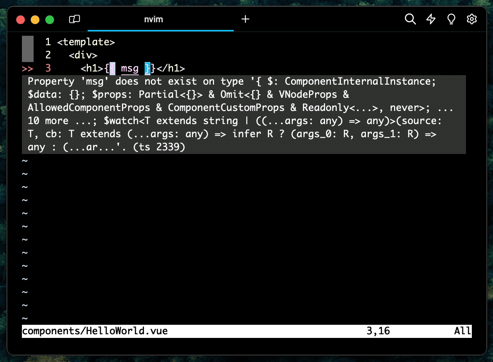

<figure>

<figcaption class="photo-caption">
Photo by <a href="https://unsplash.com/@pawel_czerwinski?utm_content=creditCopyText&utm_medium=referral&utm_source=unsplash">Pawel Czerwinski</a> on <a href="https://unsplash.com/photos/red-and-blue-wallpaper-6lQDFGOB1iw?utm_content=creditCopyText&utm_medium=referral&utm_source=unsplash">Unsplash</a>
</figcaption>
</figure>

I've recently started working with Vue 3 and Nuxt 3 so I had to figure out how to get proper development experience in my favorite editor - Vim. Yes, I could have switched to VSCode or any other modern editor / IDE, but it is hard for me. I am one of those folks who learned Vim early in his career and now I have Vim syndrome - in every editor I go to, I try to make it like home (Vim).

Before, I worked mostly with React and TypeScript, and I have [a popular post on how to configure TypeScript in Vim](/ultimate-vim-typescript-setup). In my current work, the TypeScript stayed but I switched over to the Vue world. I'll write more topics about that in the future, so you can subscribe to the [newsletter](/newsletter) to follow along (it is free).

Vue's been great for these last 6 months, I've gotten to like it and it feels natural. But oh boy, the first couple of weeks were hell. Mostly because I lacked editor support I needed. Yes, I did have [the TypeScript setup](/ultimate-vim-typescript-setup) I mentioned, but it wasn't enough. My colleagues were asking me if I have some kind of a Vue language tool/plugin installed. I was ashamed to answer that, but the truth was I was running in the dark.

One day, I wanted to add a proper setup for Vue, and nothing could stop me. I also must admit I switched to Neovim in the meantime, but I’ll write about that in another post. There are a bunch of advice and setups on the web, but I could never find the one I could follow through easily. That’s the main reason I’m writing this blog post - I came up with a simple way you can get going with Vue. Let’s get started.

## Vue Syntax Highlight in Vim

To get started, we'll need some syntax highlighting. If you're using Neovim, you should already be covered. If you're using the latest Vim (mine is 9.1 at the time of writing) then you'll also have some syntax highlighting.

If that's not working, try a popular plugin for Vue syntax:

- [posva/vim-vue](https://github.com/posva/vim-vue)

I'm using [vim-plug](https://github.com/junegunn/vim-plug) to install plugins, so I have a line like this in my `.vimrc`:

```vim
Plug 'posva/vim-vue'
```

After adding the line, run `:PlugInstall` and you should be good.

For TypeScript syntax, you should be covered. Both Neovim and Vim have out-of-the-box support for it. If not, try to update them.

Cool, let's move on to the most useful part of the setup - code completion and suggestions!

## VSCode-like Setup

Many folks are going to roll their eyes over in this section. Why? Because I will suggest a straightforward solution instead of digging deep and configuring everything yourself. Nothing wrong with any of those approaches. I feel like it is easier to start quickly, rather than slowly.

To achieve an easy and simple start to editing and reading Vue files in Vim, we will use [coc.nvim](https://github.com/neoclide/coc.nvim). CoC is a Swiss-army knife of Vim. It is largely inspired by VSCode and once configured, it probably is. I wouldn't know because I never converted to a full-time VSCode user.

To set up `coc.nvim` plugin, you need to include the plugin in your `.vimrc`:

```vim
Plug 'neoclide/coc.nvim', {'branch': 'release'}
```

And then do `:PlugInstall` so the plugin gets installed.

But wait, there's more. We need to install a Vue language tool to give us completions and documentation in the editor.

### Installing Volar - Vue language tools

Installing CoC is not enough, we need to install Volar - a Vue language tool that will actually help us write code. Luckily, there is a [coc-volar](https://github.com/yaegassy/coc-volar) plugin we can install. It is recommended by the folks who developed the "raw" version of it over at [Vue language tools](https://github.com/vuejs/language-tools). If you're using vim-plug, you can install it as a plugin like so:

```vim
Plug 'yaegassy/coc-volar', { 'do': 'yarn install --frozen-lockfile' }
Plug 'yaegassy/coc-volar-tools', { 'do': 'yarn install --frozen-lockfile' }
```

After you've added these three plugins, go ahead and run `:PlugInstall`. The `coc.nvim` will pickup out-of-the-box `coc-volar` and `coc-volar-tools` if they're installed via vim-plug.

<details>
<summary>An alternative way to install CoC plugins</summary>

You can also install `coc-volar` and `coc-volar-tools` via these commands:

```vim
:CocInstall @yaegassy/coc-volar
```

and

```vim
:CocInstall @yaegassy/coc-volar-tools
```

</details>

Before testing out everything, let's make sure our setup will work well.

### Enabling "Takeover Mode"

To make sure everything works well, let's enable the so-called "Takeover Mode". The "Takeover Mode" is there to improve the performance of the Vue language tools. In short, it disabled the default TypeScript language service and only ran the Vue language service. That's because Volar creates a separate TypeScript language service patched with Vue specifics. So that's why we're turning the default TS language service.

To enable "Takeover Mode", do this:

1. Open one of the `*.vue`, `*.ts`, `*.js`, `*.tsx`, or `*.jsx` file.
2. Run `:CocCommand volar.initializeTakeOverMode`.
3. When prompted by `Enable Take Over Mode? (y/n)?`, enter y
4. The `.vim/coc-settings.json` file will be created in the root of the project.
   - The `"volar.takeOverMode.enabled": true` and `"tsserver.enable": false` settings will be added.
5. `coc.nvim` will restart and the settings will reflect.

You can either commit the `.vim/coc-settings.json` or add it to the `.gitignore` file. In either case, Vim/Neovim will pick up settings from there and make sure only one instance of the TypeScript language service is running and showing errors/suggestions.

Great, now that we got that out of the way, let's see all of this in action!

## Ready, Set, Action

Here's how the described setup works:



We created a simple Vue component `HelloWorld.vue` with two variables and a function that we didn't define. Luckily, Volar showed three errors in the file. We did what Volar suggested and defined one variable and a function. After that, only one error was left, but we left that for another day since this is only a showcase project.

That's it! You're ready to edit and read Vue code with confidence using Vim/Neovim setup. Here's the full list of plugins I showed you:

```vim
" Vue syntax
Plug 'posva/vim-vue'

" coc.nvim
Plug 'neoclide/coc.nvim', {'branch': 'release'}

" Volar - Vue language tools
Plug 'yaegassy/coc-volar', { 'do': 'yarn install --frozen-lockfile' }
Plug 'yaegassy/coc-volar-tools', { 'do': 'yarn install --frozen-lockfile' }
```

As a bonus, I'll share some of the tips you can use.

## BONUS: General tips

I also use Prettier and ESLint for better code hygiene, and I have a couple of lines in my setup to make sure coc.nvim picks them up:

```vim
" Add CoC Prettier if prettier is installed
if isdirectory('./node_modules') && isdirectory('./node_modules/prettier')
  let g:coc_global_extensions += ['coc-prettier']
endif

" Add CoC ESLint if ESLint is installed
if isdirectory('./node_modules') && isdirectory('./node_modules/eslint')
  let g:coc_global_extensions += ['coc-eslint']
endif
```

These lines will check whether the project you're working with has `prettier` and `eslint` installed. If so, coc.nvim will install these plugins.

Then, inside my `coc-settings.json` (you can open it from your editor using `:CocConfig`), I have this:

```json
{
  "coc.preferences.formatOnSave": true,
  "volar.enable": true,
  "eslint.autoFixOnSave": true
}
```

With that in your setup, you will get auto-formatting on save by Prettier and ESLint - how neat!

If you like this, I have more inside [my dotfiles on GitHub](https://github.com/nikolalsvk/dotfiles/blob/master/nvim/init.vim).

## Summing Up

That's all, folks! In this blog post, we showed a couple of things:

1. How to make sure Vue syntax is rendering properly
2. How install coc.nvim and use it
3. Install Volar for Vim and Neovim
4. And as a bonus, how to set up Prettier and ESLint to auto-format your code

I'm pretty pleased with what we've done. In one of the next posts, I will show you how to achieve a similar thing but using Neovim and something that is not coc.nvim. To make sure you're up-to-date, subscribe to the [newsletter](/newsletter), where I will share any new updates. Also, share this post with friends and co-workers if you find it useful.

Thanks for reading, and until next time, cheers!
