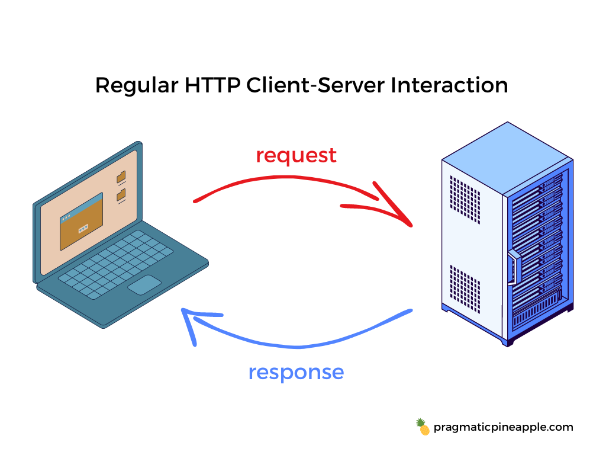
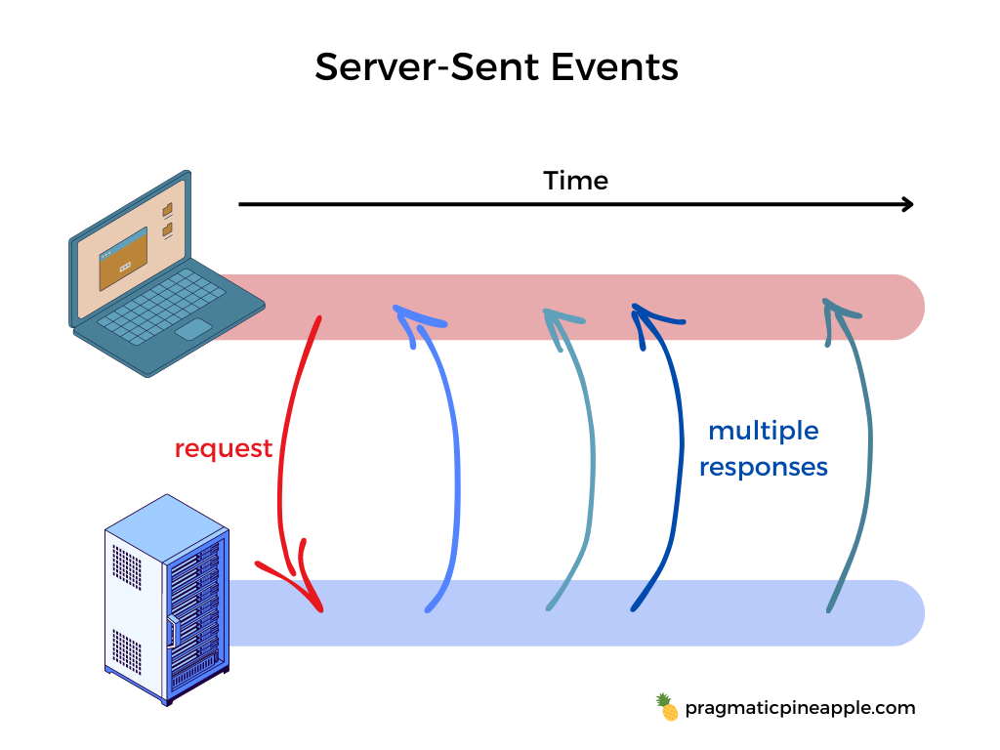
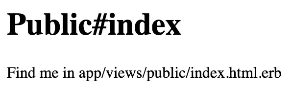
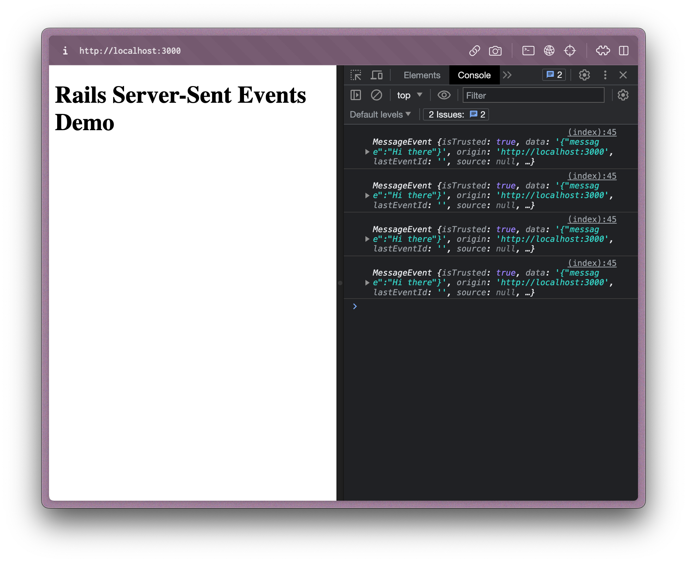
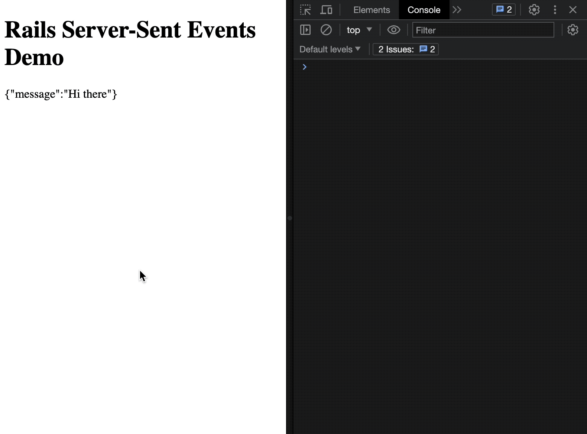
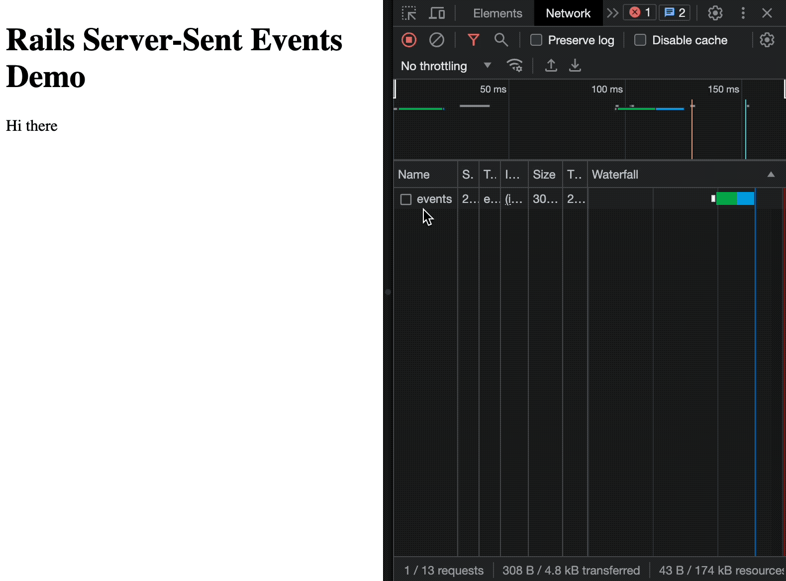
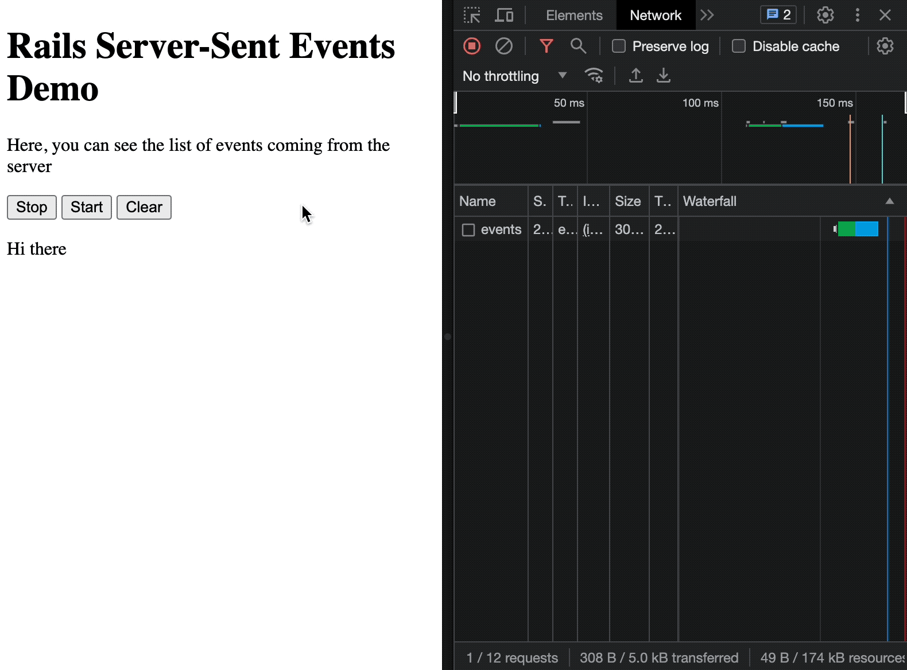

Usually, a page sends a request to the server to receive new data. That is how most of us develop the web nowadays. What if I told you there is another way to get the data to the page? With server-sent events, a server can send new data to a web page at any time by pushing messages to the web page.

We are all used to the classic way of how HTTP works:

1. The client sends a request to the server.
2. Then, the server picks up the request and sends out a response.



Today, we wile show how to use server-sent events (SSE for short) to establish a different type of communication between the client and the server. Here's how SSE works in brief:

1. A client requests a webpage from a server using the regular HTTP we showed before.
2. The client then receives the requested page and executes the JavaScript on the page, which opens a connection to the server.
3. The server sends one or more events to the client when there's new information available. These events can be sent at different times e.g. they can be streamed to the page.

Here's how that looks:



So SSE is designed for a unidirectional data flow. There is no communication from the client to the server other than the initial request.

Cool, now that we covered the basics of how SSE works, we can go on and build something using server-sent events. We'll use Ruby on Rails and a bit of JavaScript to stream data from the server to the client. Let's jump in.

## Setting up

First off, we'll create a new app called `rails-sse`:

```bash
rails new rails-sse
```

I did that with Rails 7.0.6 and Ruby 3.1.1. Now we can enter our app with `cd rails-sse` and generate two controllers:

1. `PublicController` - for hosting our page
2. `EventsController` - for streaming data to the page

We'll do it quickly with these two commands:

```bash
bin/rails generate controller Public index
bin/rails generate controller Events index
```

This will generate controller files, as well as view files - specifically the `app/views/public/index.html.erb` that we'll need later on.

Then, let's quickly edit `config/routes.rb`:

```rb
Rails.application.routes.draw do
  get 'events', to: 'events#index'
  root 'public#index'
end
```

This route definition will target `PublicController` and its `index` action whenever we visit the root of our app. It will also target requests to `/events` to the `EventsController` and its `index` action. We'll leave these controllers empty for now and fill their logic as we proceed.

Great, now, if you run `bin/rails server` and open http://localhost:3000, you should get a page like this:



That's it, let's get to building and streaming our data.

## Subscribing to Events

Great, now let's open `app/views/public/index.html.erb` and add some JavaScript logic to subscribe to our `/events` endpoint we defined previously:

```html
<h1>Rails Server-Sent Events Demo</h1>

<script>
  const eventSource = new EventSource("/events")

  eventSource.addEventListener("message", (event) => {
    console.log(event)
  })
</script>
```

And let's add some logic to our `EventsController`:

```rb
class EventsController < ApplicationController
  include ActionController::Live

  def index
    response.headers['Content-Type'] = 'text/event-stream'
    response.headers['Last-Modified'] = Time.now.httpdate

    sse = SSE.new(response.stream, event: "message")

    sse.write({ message: 'Hi there' })
  ensure
    sse.close
  end
end
```

There's a lot to uncover here, so let's start with the view portion in the `app/views/public/index.html.erb` file. There, the JavaScript code uses the [EventSource API](https://developer.mozilla.org/en-US/docs/Web/API/EventSource) to establish a connection to the server at `/events` endpoint. It sends a request to `/events` and receives [events](https://developer.mozilla.org/en-US/docs/Learn/JavaScript/Building_blocks/Events) in the `text/event-stream` format.

The connection to the server is open until closed by calling `close()` on the event source object. To establish the connection, we instantiate the `EventSource` object. Then, we add a listener for `'message'` to receive an event with the type `'message'` from the server. With those two statements, we are ready to load the client-side code. Before that, let's go through the server part in the controller.

Inside `EventsController` we include [`ActionController::Live` module](https://api.rubyonrails.org/v7.0.5/classes/ActionController/Live.html) that allows it to stream data to the client. That's where we get the `SSE` class from, which we use to build a server-sent event stream. `SSE.new` receives the `response.stream` and the following options:

- `event` - If specified, an event with this name will be dispatched on the browser. Event name can be important if we want to listen to specific events on the client.
- `retry` - The reconnection time in milliseconds used when attempting to send the event.
- `id` - If the connection dies while sending an SSE to the browser, then the server will receive a `Last-Event-ID` header with value equal to `id`.

In our simple example, we'll define one option - `event`. Then, we call `sse.write` that will commit the data and send it to the client. Then, in the `ensure` block, we call `sse.close` to make sure the stream is closed. You must call close on your stream when you're finished. Otherwise, the socket may be left open forever.

Great, if we open up http://localhost:3000 now and open the console in our browser, we should see events logged in the console like so:



If you look closely, we are receiving multiple events, even though we are initiating just one `EventSource` connection. Do you have any clue what's going on? Let's go through it in the next section, where we build on our example.

## Streaming Data from Rails Server

We covered the basics of getting up and running with data streaming in the previous section. Now, let's focus on building our example into a robust solution that can serve in production.

First off, there was a "problem" in our example where multiple requests were made to the `/events` endpoint. That is because we didn't close the `EventStream` connection on the client. Here's a proper way to close the `EventStream` so that it doesn't ping the server constantly:

```html
<h1>Rails Server-Sent Events Demo</h1>

<script>
  const eventSource = new EventSource("/events")

  eventSource.addEventListener("message", (event) => {
    console.log(event)
  })

  eventSource.addEventListener("error", (event) => {
    console.log(event)

    if (event.eventPhase == EventSource.CLOSED) {
      eventSource.close()
      console.log("Event Source Closed")
    }
  })
</script>
```

Here, we added the error listener that checks whether `event.eventPhase` is closed. If so, we call the `eventSource.close()` so that the connection is fully closed between the client and server. This is needed because in our Rails `EventsController`, we ensure `response.stream.close` is called. When we close the stream on the server, the `EventSource` on the client receives an error. If we don't handle that error properly by closing the `EventSource` on the client, it will think a true error had happened, and it will retry to connect to the server, resulting in multiple requests to the server.

All in all, make sure the connection is closed both on the server and on the client!

Cool, now that we got that out of the way and cleared it out, let's make our example render messages sent from the server. For that, we'll build on our existing example:

```html
<h1>Rails Server-Sent Events Demo</h1>

<section id="events"></section>

<script>
  const eventSource = new EventSource("/events")

  eventSource.addEventListener("message", (event) => {
    const events = document.getElementById("events")
    events.innerHTML += `<p>${event.data}</p>`
  })

  eventSource.addEventListener("error", (event) => {
    if (event.eventPhase == EventSource.CLOSED) {
      eventSource.close()
      console.log("Event Source Closed")
    }
  })
</script>
```

And let's stream more data from our server:

```rb
class EventsController < ApplicationController
  include ActionController::Live

  def index
    response.headers['Content-Type'] = 'text/event-stream'
    response.headers['Last-Modified'] = Time.now.httpdate

    sse = SSE.new(response.stream, event: "message")

    sse.write({ message: 'Hi there' })

    sleep 2

    sse.write({ message: 'How are you?' })

    sleep 2

    sse.write({ message: 'I am fine' })
  ensure
    sse.close
  end
end
```

Now, if we open http://localhost:3000 we should see something like this:



As the page renders and connection to `/events` is established, events come one by one, and they get rendered. You can easily debug this as well. If you open the Network tab in your browser (I'm using a Chromium-based browser [Arc](https://arc.net/)) you'll see events coming in like so:



Great, now for the grand finale, let's add a couple of controls to our UI.

## Controlling EventSource on the Client

Let's add three buttons - Start, Stop, and Clear. We'll start with the view part in `app/views/public/index.html.erb`:

```html
<h1>Rails Server-Sent Events Demo</h1>
<p>Here, you can see the list of events coming from the server</p>

<button id="stop">Stop</button>
<button id="start">Start</button>
<button id="clear">Clear</button>

<section id="events"></section>

<script>
  let eventSource

  const start = () => {
    eventSource = new EventSource("/events")

    eventSource.addEventListener("message", (event) => {
      const events = document.getElementById("events")
      events.innerHTML += `<p>${event.data}</p>`
    })

    eventSource.addEventListener("error", (event) => {
      if (event.eventPhase == EventSource.CLOSED) {
        eventSource.close()
        console.log("Event Source Closed")
      }
    })
  }

  start()

  document.getElementById("stop").addEventListener("click", (e) => {
    eventSource.close()
  })

  document.getElementById("start").addEventListener("click", (e) => {
    if (eventSource.readyState == EventSource.CLOSED) {
      start()
    }
  })

  document.getElementById("clear").addEventListener("click", (e) => {
    const events = document.getElementById("events")
    events.innerHTML = ""
  })
</script>
```

And the server will stay the same. Now, we can play around with the buttons and start and stop the streaming or clear the rendered messages from the server. Here's how it looks:



Awesome, that covers the basics of SSE and how to do it in Ruby on Rails with a splash of JavaScript. Before we close this post, let's go through some gotchas of SSE.

## Gotchas

Beware of these situations when using or considering server-sent events.

### Use Over HTTP/2

Beware if you're using server-sent events via HTTP/1. When not used over HTTP/2, SSE suffers from a limitation to the maximum number of open connections, which can be especially painful when opening various tabs as the limit is per browser and set to a very low number (6).

### Keep CORS in Mind

Use the `withCredentials` option in `EventSource` if you're sending a request to another server:

```js
const eventSource = new EventSource("https://my-other-server.com/sse", {
  withCredentials: true,
})
```

If you need to implement CORS in a Ruby on Rails (or any Rack-based) app, check out the [rack-cors gem](https://github.com/cyu/rack-cors).

### One-way Communication

Since SSE is meant for a one-way connection, this means you can't send events from the client to the server. If you need two-way communication, you're probably going to be interested in [WebSockets](https://developer.mozilla.org/en-US/docs/Web/API/WebSockets_API).

### Close The Connection

I've mentioned it before, but I'll do it here - close the SSE connection both on the server and on the client. In Rails:

```rb
def action
  # ...

  sse = new SSE(response.stream)

  # ...
ensure
  sse.close
end
```

In JavaScript:

```js
eventSource = new EventSource("/events")

eventSource.addEventListener("error", (event) => {
  if (event.eventPhase == EventSource.CLOSED) {
    eventSource.close()
  }
})
```

### Built-in Retry Mechanism

By design, you can specify the `retry` option in the events you send from the server. This indicates to the browser the time in milliseconds before it retries to connect in case of a failure. Now, that's a tricky word - failure, which we'll cover in a bit. `EventSource` is not that smart to recognize all situations where communication fails between the client and the server. Also, the criteria is not the same between browsers. So it is best to run your own retry or "keep alive" mechanism in case the connection drops.

If you do decide to rely on the built-in retry of `EventSource`, you should consider the `Last-Event-ID` header. This header is sent when the browser tries to reestablish the connection to the server. Then, on the server, you can read the `Last-Event-ID` and respond with a proper event based on it.

TLDR - you are better off rolling your logic for retrying and reconnecting.

That's it, let's sum up in the next section.

## Summing Up

Here's what Server-Sent Events are in short:

- one-way communication where the server sends data to the client
- a great way to substitute polling for information
- `EventSource` is supported in the majority of browsers - [caniuse.com reference](https://caniuse.com/eventsource)
- easy to get going, especially with Ruby on Rails and `ActionController::Live`

Hope you learned a thing or two and that the post helped you make an informed decision on how to proceed with your task.

In the next post, we can cover how to build a retry mechanism if the connection or something else fails when using SSE. If you liked the post, share it with your friends and/or coworkers.

Thanks for reading and catch you in the next one.
