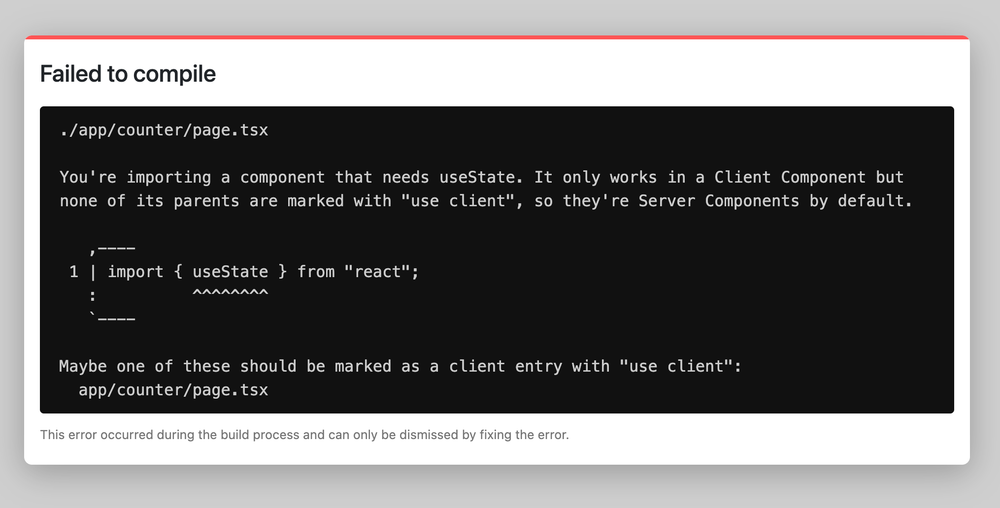

Version 13 of Next.js, a well-established React framework from the Vercel company, was released last week.

The announcement was made at the Next.js Conf and took the community by storm. Developers worldwide spread the news about the features and goodies announced live on October 25th.

Now, as the dust slowly settles, we can go through what's new in Next.js 13.

## `app/` Directory in Next.js 13 (In Beta)

What better way to check out what's new than by building a simple app, right? Jump-start a new Next.js 13 project with this command:

```bash
npx create-next-app@latest --typescript
```

_Note that `--typescript` is optional, you can omit it._

Alright, let's now jump into the layout features in Next.js 13.

Next.js always allowed you to simply create a file in your project and then have Next.js create a route based on it. This makes for a great developer experience. Now, Next.js 13 aims to improve routing and layouts by introducing the `app` directory to the root of your Next.js project.

This feature is still in beta, and it is entirely optional. You can keep your `pages` directory and have it coexist with the `app` directory - or just skip adding `app` dir at all.

One thing you have to do is tell Next you will use it by adding the following to `next.config.js`:

```js
// next.config.js

const nextConfig = {
  // ...
  experimental: { appDir: true },
}

// ...
```

Then, you can create the app directory with a `page.tsx` file like so:

```tsx
// app/page.tsx
// This file maps to the index route (/)
export default function Page() {
  return <h1>Hello, I am Page!</h1>
}
```

Of course, if you have `pages/index.tsx`, you have to either rename or delete it. You'll have to make up your mind here, as you can't have both. When you deal with `pages/index.tsx`, the running Next.js server will create `app/layout.tsx` - how thoughtful, thanks, Next.js!

    Your page app/page.tsx did not have a root layout, we created app/layout.tsx for you.

Now the `app/layout.tsx` has been created for us, let's look at layouts in Next.js.

## Layouts in Next.js 13

Layouts in Next.js make it easier to extract shared code between multiple pages. `layout.tsx` accepts another layout or a page as a child. Here's how it looks:

```tsx
// app/layout.tsx

export default function RootLayout({
  children,
}: {
  children: React.ReactNode
}) {
  return (
    <html>
      <head></head>
      <body>{children}</body>
    </html>
  )
}
```

Now, with `app/page.tsx` and `app.layout.tsx` in your project, you can rock and roll. To get a bit of styling, copy the boilerplate CSS from `pages/globals.css` to `app/global.css`. Then include it in `app/layout.tsx` like so:

```tsx
import "./global.css"

export default function RootLayout({
  children,
}: {
  children: React.ReactNode
}) {
  return (
    <html>
      <head></head>
      <body>{children}</body>
    </html>
  )
}
```

And then, when you run `npm run dev` and visit [http://localhost:3000/](http://localhost:3000/) you should see something like this:


Of course, you can create another page like `app/product/page.tsx` with a layout for products - `app/product/layout.tsx`.

Let's see what else is new.

## React Server Components

If you use Server Components in Next.js, you can reduce the amount of JavaScript sent to the client, enabling faster initial page loads. We touched a bit on this subject when [React 18 came out](https://blog.appsignal.com/2022/04/13/whats-new-in-react-18.html).

And what is great in Next.js 13 is that all components inside the [app directory](https://beta.nextjs.org/docs/routing/fundamentals#the-app-directory) are React Server Components by default, including [special files](https://beta.nextjs.org/docs/routing/fundamentals#special-files) and [colocated components](https://beta.nextjs.org/docs/routing/fundamentals#colocation) (tests, styles, other components, etc.). That way, you are set up to achieve performance gains without doing any work or rewriting your components.

When a page is loaded, the Next.js and React runtime will load, which is cacheable and predictable in size. This runtime remains the same size as your application grows. Additional JavaScript will only be added as client-side interactivity is needed in your application through the use of [Client Components](https://beta.nextjs.org/docs/rendering/server-and-client-components#client-components).

You can use Client Components by specifying a `"use client"` directive at the top of the component meant for the client. Let's create a new file under `app/counter/page.tsx`:

```tsx
"use client"

import { useState } from "react"

export default function Counter() {
  const [count, setCount] = useState(0)

  return (
    <div>
      <p>You clicked the Count++ button {count} times</p>
      <button onClick={() => setCount(count + 1)}>Count++</button>
    </div>
  )
}
```

You should add `"use client"` when:

- using `useState` or `useEffect` client hooks from React
- you depend on certain browser APIs
- you want to add certain event listeners

In other cases, when you don't need things from the client, it is best to leave components as they are and let them be rendered as Server Components by Next.js. That will help ensure the smallest amount of client-side JavaScript code.

If you decide to utilize `useState` or any other client hooks, Next.js will fail to render and show an error like so:



I wonder why `"use client"` does not happen automatically. But anyway, there you go - it is hard to make a mistake because Next.js really made the developer experience great.

On that note, there's an even greater goodie when it comes to developer experience: data fetching and showing loading states. Let's jump into it!

## Streaming and Data Fetching

In Next.js 13, you can now easily stream parts of the UI to the client with React Suspense. For example, if data fetching is waiting to complete, you can show a loading state to the user. Then when the data fetching is complete, new info will be streamed to the page in place of the previously shown loading state.

The API to fetch data has been simplified, and the old APIs [getServerSideProps](https://nextjs.org/docs/basic-features/data-fetching/get-server-side-props), [getStaticProps](https://nextjs.org/docs/basic-features/data-fetching/get-static-props), and [getInitialProps](https://nextjs.org/docs/api-reference/data-fetching/get-initial-props) are not supported in the new `app` directory.

It is recommended that you fetch data inside Server Components (the ones we touched on in the above section). That way, fetching and rendering happen in the same environment, reducing the back and forth between client and server and, ultimately, the work done in the browser.

You can fetch data anywhere in the `app` directory, but because of the way Streaming and Suspense work in React, you should adopt a new mental model when fetching data. Namely, you should fetch data directly in the components that use it, even if you need to request the data in multiple components. Behind the scenes, React and Next.js will [cache and dedupe](https://beta.nextjs.org/docs/data-fetching/fundamentals#automatic-fetch-request-deduping) requests to avoid the same data being fetched more than once.

### Streaming and Fetching in Server Components

What's great about the new Next.js release is that you can show a loading state simply by creating a `loading.tsx` file. In this example, we made `app/dashboard/loading.tsx` like so:

```tsx
export default function Loading() {
  return <p>Loading the Dashboard...</p>
}
```

And in `app/dashboard/page.tsx` we have the following code:

```tsx
async function getData() {
  // You would usually fetch data from an API here.
  // const res = await fetch("https://api.github.com/");

  // But, here we just wait for 3 seconds.
  await new Promise((res) => setTimeout(res, 3000))

  // You would usually return data from an API here.
  // return res.json();
  return "Dashboard data"
}

export default async function Page() {
  const name = await getData()

  return <p>🤩 Hello {name}!</p>
}
```

If we try to load `http://localhost:3000/dashboard`, there will first be a loading screen and then the dashboard will show up.


You can dig deeper and use React's Suspense to further break down the UI. You can make sure the layout renders while a specific component in the layout waits for data to be fetched.

Being able to utilize async/await in Server Components is great and is part of [React's RFC to add first-class support for Promises](https://github.com/acdlite/rfcs/blob/first-class-promises/text/0000-first-class-support-for-promises.md). It allows us to do what we just did in `app/dashboard/page.tsx`:

```tsx
export default async function Page() {
  const name = await getData()

  return <p>🤩 Hello {name}!</p>
}
```

But we can't use async/await in this manner in Client Components. Let's see how we can fetch data there in the next section.

### Streaming and Fetching in Client Components

The example above showed how to display a loading screen while data is prepared for rendering in Server Components. But if you want to do a similar thing on the client, you have to utilize the `use` hook.

Let's change our example to make sure it's rendered properly as a Client Component. We will create `app/dashboard-client/loading.tsx` - it will be the same, but with different copy:

```tsx
export default function Loading() {
  return <p>Loading the Dashboard in Client Components...</p>
}
```

Then use the `app/dashboard-client/page.tsx` with the `use` hook from React like so:

```tsx
"use client"

import { use } from "react"

async function getData() {
  // You would usually fetch data from an API here.
  // const res = await fetch("https://api.github.com/");

  // But, here we just wait for 3 seconds.
  await new Promise((res) => setTimeout(res, 3000))

  // You would usually return data from an API here.
  // return res.json();
  return "Dashboard data in Client Components"
}

export default function Page() {
  const name = use(getData())

  return <p>🤩 Hello {name}!</p>
}
```

Notice how we call `use(getData())`. This is because use is a new React function that accepts a promise and is conceptually similar to await. We need `use` because it handles the promise returned by a function in a way compatible with components, hooks, and Suspense. The `use` hook is a part of the [React RFC](https://github.com/acdlite/rfcs/blob/first-class-promises/text/0000-first-class-support-for-promises.md#usepromise) we mentioned earlier.

If we visit [http://localhost:3000/dashboard-client](http://localhost:3000/dashboard-client), we should see a similar thing as before. The loading state shows briefly until the actual dashboard appears.


### Caching with Fetch

The `fetch()` function is a Web API that gets remote resources and returns a promise. React extends `fetch` to provide [automatic request deduping](https://beta.nextjs.org/docs/data-fetching/fundamentals#automatic-fetch-request-deduping), and Next.js extends the fetch options object so each request can set its own [caching and revalidating](https://beta.nextjs.org/docs/data-fetching/caching).

So React and Next.js take the `fetch` browser API and put some sprinkles on top. Now in Next.js 13, you can specify how you want requests to be cached (or if you don't want them to be cached at all):

```js
// This request should be cached until manually invalidated.
// Similar to `getStaticProps` from Next.js 12.
// `force-cache` is the default and can be omitted for brevity.
// This is called static data in Next.js world
fetch(URL, { cache: "force-cache" })

// This request should be refetched on every request.
// Similar to `getServerSideProps`.
// Here we have loading of dynamic data in Next.js world.
fetch(URL, { cache: "no-store" })

// This request should be cached with a lifetime of 10 seconds.
// Similar to `getStaticProps` with the `revalidate` option.
fetch(URL, { next: { revalidate: 10 } })
```

And that's it as far as streaming and fetching goes. You can read more about it in [Next.js' official docs here](https://beta.nextjs.org/docs/data-fetching/fundamentals).

Now let's go into something which drew a lot of attention from the frontend world - a 700 times faster bundler, Turbopack.

## Turbopack

[Turbopack](https://turbo.build/pack) is branded as an "up to 700x faster Rust-based Webpack replacement". It even features a small letter to the public from the Webpack creator himself - Tobias Koppers. Tobias is leading the initiative and the project, which can only mean good news for the whole frontend community.

Right now, you can use Turbopack with Next.js 13 if you run `next dev --turbo` (or, if you're running it via npm in the project we generated at the beginning - `npm run dev --turbo`).

It supports Server Components, TypeScript, JSX, CSS, and more. As the project is in alpha state, many of the features are not yet supported. We can only hope for a stable release to speed up projects across the world.

## `next/image` Improvements

The new Image component in Next.js comes with less client-side JavaScript, is easier to style and configure, and more accessible (requiring alt tags by default).

In terms of code changes, the `next/image` import has been renamed to `next/legacy/image`, and the `next/future/image` import renamed to `next/image`. There's [a codemod](https://github.com/vercel/next.js/blob/canary/docs/advanced-features/codemods.md#next-image-to-legacy-image) to help you migrate quickly.

If you were not using `width` and `height` on non-static images (or images without the `fill` property), you will now have to set them. The same goes with the `alt` prop, though it is not required and can be left as an empty string.

[Here's a guide on migrating to the new `next/image`](https://github.com/vercel/next.js/blob/canary/docs/api-reference/next/image.md#migration).

## `@next/font`

The new `@next/font` lets you use Google Fonts (or any custom font) without sending any requests from the browser. CSS and font files are downloaded at build time with the rest of the static assets.

To try it out, you need to install the package:

```bash
npm install @next/font
```

Then, you can use it like this:

```tsx
import { Montserrat } from "@next/font/google"

const montserrat = Montserrat()

// This file maps to the index route (/)
export default function Page() {
  return (
    <article>
      <h1>Hello, I am Page!</h1>

      <p className={montserrat.className}>I am using Montserrat font</p>
    </article>
  )
}
```

[Read more about custom font loading and font optimization in the Next.js official docs](https://nextjs.org/docs/basic-features/font-optimization).

## `next/link` Improvement

You no longer have to include the `<a>` tag when using `next/link`.

```tsx
import Link from 'next/link'

// Next.js 12: `<a>` has to be nested otherwise, it's excluded
<Link href="/dashboard">
  <a>Dashboard</a>
</Link>

// Next.js 13: `<Link>` always renders `<a>`
<Link href="/dashboard">
  Dashboard
</Link>
```

There is also [a codemod](https://nextjs.org/docs/advanced-features/codemods#new-link) to help you remove any extra `<a>` tags you may have in your existing project.

## Generating OG Images with `@vercel/og`

A new `@vercel/og` library allows you to generate open graph (OG) images. It's well known that OG images can increase the engagement rate for links you share.

Vercel and Next.js have been discussing this topic for some time, providing you with docs to generate OG images via functions. But now there is a new guide that shows how you can utilize the new [Edge Runtime](https://vercel.com/docs/concepts/functions/edge-functions/edge-functions-api) together with the `@vercel/og` library.

## Middleware API Changes

Next.js 13 improves the [Middleware](https://nextjs.org/docs/advanced-features/middleware) feature. Vercel's Middleware is code that executes before a request is processed on a site. There, you can modify an incoming request and add some logic before the request is processed.

Now it is easier to set headers in the middleware. Plus, you can directly return a response from the middleware, without needing to `rewrite` or `redirect`. But for this, you need to enable the `experimental.allowMiddlewareResponseBody` configuration option inside `next.config.js`.

To get started, you need to have `middleware.js` or `middleware.ts` at the root of your Next.js project. We'll use the TypeScript version and show how you can set a header to an incoming request:

```ts
// middleware.ts

import { NextResponse } from "next/server"
import type { NextRequest } from "next/server"

export function middleware(request: NextRequest) {
  // Clone the request headers and set a new header
  // that will be sent to the server `header-for-the-server`
  const requestHeaders = new Headers(request.headers)
  requestHeaders.set("header-for-the-server", "hello server")

  // You can also set request headers in NextResponse.rewrite
  const response = NextResponse.next({
    request: {
      // New request headers
      headers: requestHeaders,
    },
  })

  // Set a new response header that you can inspect in the browser
  // `header-for-the-client`
  response.headers.set("header-for-the-client", "hello client")
  return response
}
```

You can do the same in the project we were using from the beginning and inspect the headers of [http://localhost:3000/](http://localhost:3000/) in the browser. There, you should see the `header-for-the-client` header in the Network tab.

## Telemetry

I am not sure if this was there before, but when I ran `npm run dev` (or `next dev`) after upgrading, I got this message:

```
Attention: Next.js now collects completely anonymous telemetry regarding usage.
This information is used to shape Next.js' roadmap and prioritize features.
You can learn more, including how to opt-out if you'd not like to participate in this anonymous program, by visiting the following URL:
https://nextjs.org/telemetry
```

It might be that this is just the first time I noticed it, and I can't find written proof of when Next.js started collecting anonymous usage reports.

Anyway, you can easily opt-out by running:

```bash
npx next telemetry disable
```

You can also quickly check if this is disabled or enabled for you:

```bash
npx next telemetry status
```

In any case, I feel that collecting usage data should be optional and not turned on by default.

## Wrapping Up: Next.js 13 Brings Great New Features

That's all, folks! We have gone through all the updates in Next.js 13. I hope this version is exciting for you. Jump in and explore the new features!

I pushed the [code examples in this post into a GitHub repo](https://github.com/nikolalsvk/next-the-13th). There's also a [live demo](https://next-the-13th.vercel.app/) you can play with.

You can [check out the official Next.js announcement](https://nextjs.org/blog/next-13), which also covers breaking changes.

Thanks for reading, and see you in the next one!

```

```
