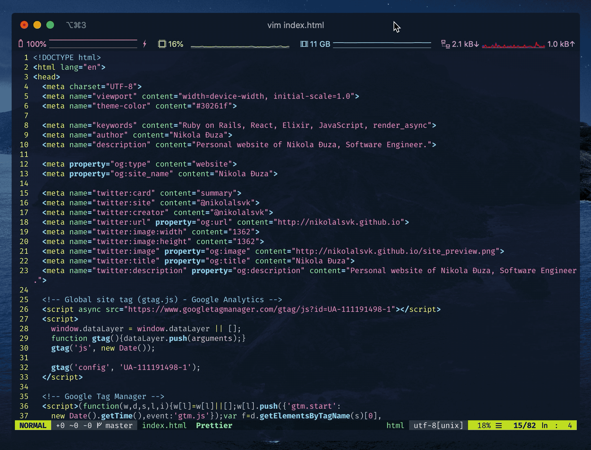

  Photo by <a href="https://unsplash.com/@aleksdahlberg?utm_source=unsplash&amp;utm_medium=referral&amp;utm_content=creditCopyText">Aleks Dahlberg</a> on <a href="https://unsplash.com/s/photos/old-vs-new?utm_source=unsplash&amp;utm_medium=referral&amp;utm_content=creditCopyText">Unsplash</a>

Ah, yes, Vim, the powerful text-editor that is everywhere and a place where
even the wisest can't quit. You had to hear about it at least once. Or you
might have considered learning or trying it. But why do it now? It’s 2020,
doesn’t everyone use VSCode already? Let's dive in and figure why someone would
still learn Vim.

## From Mode to Mode

What Vim is excellent at is navigating, making some changes, and repeating the
process. The process most call editing (not to be confused with writing). Most
developers tend to overlook this fact, but this is one of the strong selling
points of Vim. Developers are more prone to reading code, jumping from file to
file, making small incisions in the code, and writing code all the time.

Most of the editors work in one mode. You don’t explicitly switch from one to
another. For example, you might jump to a file, then select some lines, edit or
copy some of them while being in the “same” mode. Vim is different, and it
strongly differentiates modes. Maybe this is why most
[people get stuck in it from time to time](https://stackoverflow.com/questions/11828270/how-do-i-exit-the-vim-editor)

Vim achieves all of this because it supports different modes:

- **NORMAL** mode
  - _How to get there?_ Press `Esc` key in any mode.
  - _What is it about?_ Swiftly navigate through code and enter any of the modes below.
- **INSERT** mode
  - _How to get there?_ Press `i` (insert), `a` (append), or other keys from the Normal mode.
  - _What is it about?_ Change and insert characters, similar to most editors nowadays.
- **VISUAL** mode -
  - _How to get there?_ Press `v`, `V`, or `<Ctrl-V>` or other keys from the Normal mode.
  - _What is it about?_ Highlight areas of text, indent large pieces of code,
- Command-line mode
  - _How to get there?_ Starts by typing `:` in Normal or Visual mode
  - _What is it about?_ A door to a Vim and outside world

There are [other modes](<https://en.wikipedia.org/wiki/Vim_(text_editor)#Modes>), a total of 12 of them.
Six of them are a variation of other 6, but I won't get into details about them here.
You can [read them here](http://vimdoc.sourceforge.net/htmldoc/intro.html#vim-modes-intro).

### But Should I Care About Modes?

I'd say you shouldn't care about all six modes and their variants, the essential
thing as someone who is figuring out whether to use Vim in 2020 is the NORMAL
and INSERT mode. As your needs grow stronger, you will explore other possibilities.

For example, one of my life-saver features is the ability to edit columns of
text like this:

Notice how quickly you can select characters along a column. Please let me
know if there is a way to do this as quickly and painlessly in other editors.
To do this in Vim, press `CTRL+v` - now you can select columns. The following
command is `8j`, letting Vim know that I want to go eight lines down. Then, I press
`s` to substitute a character, and I type in the character `t`, which I want to
put there. Finally, I press `Esc` twice, and the whole column is changed. You can see
that I then press `u` to undo my changes.

I didn't know this initially, nor did I learn it in the first two years. I
learned it when I needed it. So don't get bothered if you feel overwhelmed by this
vast world of Vim, everything will come with time. And that is another great
thing with Vim, the constant learning - you can always uncover more great ways
to do things.

## The Need for Speed

No, this isn't about the popular racing game series, it is still about editing
files in Vim - which is super fast. But don't let **me** fool you, editing is super
fast when you get the hang of it, which can also happen pretty quick. It is not a
mere coincidence that most popular websites (Facebook, Twitter, Gmail,
Tumblr) allow you to move around with `h`, `j`, `k`, and `l` around the
feed. Try navigating through tweets on Twitter by pressing `j` and `k` next time.

Instead of having to use your mouse, you can use a combination of key presses
that let you jump around the file with ease. For example:

- `gg` - jump at the top of the file
- `G` - jump at the bottom of the file
- `{` - move up between empty space or code blocks in your file
- `}` - move down between empty space or code blocks in your file
- `(` - move back onto the previous sentence
- `)` - move forward onto the next sentence

These are just the basic movement tips you can try out in your next Vim
session. I will not go into details on how to move around, and how you should
disable arrow keys on the start (you probably should), there are many
resources for that on the internet. I will just leave you with these couple of
navigation shortcuts for you to try out.

Also, you can compose commands as you go. In the previous section, I used `8j`
to move eight lines down. Navigating like that is a typical example,
but combining commands is where Vim shines when you get the hang of it.
Combining is a great addition to already speedy commands you can use. But, of
course, there is a more pragmatic reason to learn it. Read on to find out.

## Getting Closer to the Metal

Learning Vim also means learning about what is in your Terminal and your
machine. To better paint the picture of what I mean, I’ll approach it from the
other side and give you an example of what you usually do with an IDE. When you
use an IDE-like experience, you don’t need to tinker and configure stuff much.
You get a theme or a plugin manager, you search for a plugin there, click
install and voilà, you just got yourself full support for TypeScript.

But, [setting up full TypeScript support](/ultimate-vim-typescript-setup) is a bit different in Vim.
Yes, you have a sea of plugins and a vast community of folks contributing to
it. But you can get deep into configuration and figuring out how
everything works by customizing your Vim experience. Some plugin has some pros
and works well with others. Some are so good with fitting into your current
configuration, but you have to do a lot of manual configuration yourself.
By tuning Vim, you are learning more about what you have in your development
environment and how it works.

For example, to search for text occurrences, I used
[ack-grep](http://manpages.ubuntu.com/manpages/trusty/man1/ack-grep.1p.html).
Later on, I found that there is a faster approach using [ag](https://github.com/ggreer/the_silver_searcher). Then, there is
an even faster alternative called [ripgrep](https://github.com/BurntSushi/ripgrep).
Of course, I stopped at the `ag`, but my point is that you are encouraged to
learn more about what you have on your machine, and thus have more confidence
and knowledge about what is happening. Learning all of this getting you closer to the
metal (machine) as possible, instead of mindlessly installing plugins from the
IDE's marketplace.

If you want to get a glance an what it takes to have
[Vim and TypeScript together, check out this blog post](/ultimate-vim-typescript-setup).

## Some Cons to All of This

One of the biggest con is the learning curve, I'd say. Many people get put off
by it, and it seems it is not easy to handle. Instead of switching to Vim entirely,
try doing it bit by bit. A great way to do this is to install Vim mode in your
favorite editor and start with simple commands as I showed you in
[the navigation part](#the-need-for-speed).

Keeping your favorite editor close to you is an excellent way to overcome Vim’s
learning curve slowly. Imagine it as swimming lessons where you swim close to
the edge of the pool. Anytime you panic or don’t know how to do something, you
can grab the edge - or in your case, your editor of choice.

A con can be that Vim is not an IDE. It can’t do all the fancy stuff your IDE
can do out of the box. You can try to configure Vim to behave like that, but
that’s not Vim anymore. There’s no debugger, no plugin marketplace, no
auto-complete. If you want some of the things, you are encouraged to search for
a plugin or write your own.

Having such freedom of what to add to Vim is a pro for me, but I understand
that most folks see this as a con. I just find it fun to play around and
configure the primary tool I use every day.

## Final Thoughts

Thanks for reading this far, I appreciate it. If you are still wondering
whether to start learning Vim or not, I'd say give it a try. You never know
when you might need it, or you even fully switch to using Vim.

At the end of the day, it's the matter of finding the proper editor
(tool) that makes you do what you do even better.

If you like the blog post, you can share it with your friends and coworkers below:

<blockquote class="twitter-tweet tw-align-center">
I published a new blog post about Vim 🎉  Check out why should you still learn Vim below 👇<a href="https://t.co/p6OhsB5AeZ">https://t.co/p6OhsB5AeZ</a>
&mdash; Nikola Đuza (@nikolalsvk) <a href="https://twitter.com/nikolalsvk/status/1290954571318165504?ref_src=twsrc%5Etfw">August 5, 2020</a></blockquote> 

Consider subscribing to my [newsletter](/newsletter), where you will get
similar blog posts like this one when they get out, for free.

If you are interested in my Vim configuration, check out [my dotfiles](https://github.com/nikolalsvk/dotfiles).

Catch you in the next one, cheers 🍻
